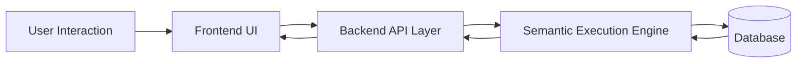
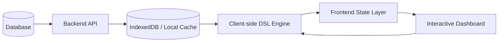

# Analytics Semantic Execution Model

# Most dashboards are not visualization problems.

They are semantic execution problems.

As the anytics product evolved into a more operationally dense coordination platform, the architecture discussion gradually shifted away from UI concerns and toward a deeper systems question:

> Where should semantic computation actually execute?

Every interaction in the platform carried hidden computational consequences:

* filtering
* aggregation
* grouping
* state synchronization
* cross-module visibility
* derived metrics
* workflow-specific logic
* temporal constraints

At small scale, these look like ordinary dashboard interactions.

At operational scale, they become distributed systems decisions.

---

# The Original Architectural Question

The core debate inside the analytics system was deceptively simple:

## Option 1 — Backend-Centric Semantic Execution

Every interaction triggers a backend query.

The backend owns:

* filtering
* aggregation
* authorization boundaries
* semantic evaluation
* derived computations
* dataset transformations

The frontend becomes a relatively thin interaction layer.

### Advantages

* Centralized semantic consistency
* Easier invalidation strategies
* Stronger scalability characteristics
* Smaller frontend memory footprint
* Reduced client-side computational complexity
* Cleaner auditability boundaries

### Risks

* Increased interaction latency
* Repeated orchestration overhead
* High API chatter under dense interactions
* Greater backend load amplification
* Reduced perceived responsiveness

---

## Option 2 — Frontend-Local Semantic Execution

The backend sends a constrained dataset upfront.

The frontend then becomes responsible for:

* filtering
* aggregation
* semantic querying
* local state transitions
* interaction orchestration
* view recalculation

We explored this through:

* IndexedDB-backed persistence
* in-memory execution layers
* client-side DSL-driven querying
* dynamic frontend aggregation pipelines

This effectively pushed semantic computation toward the edge.

### Advantages

* Near-instant interaction responsiveness
* Reduced repeated backend calls
* Lower interaction latency
* More fluid dashboard experiences
* Offline-adjacent interaction capabilities

### Risks

* Client-side synchronization complexity
* Dataset size limitations
* Harder invalidation semantics
* Memory pressure on low-resource devices
* Increased frontend architectural complexity
* Potential semantic drift risks

---

# The Hidden Shift

The important realization was this:

The problem was never really frontend vs backend.

It was:

> Where should the semantic layer live?

That distinction fundamentally changed the architecture conversation.

Instead of discussing APIs and rendering pipelines, the discussion became about:

* semantic ownership
* execution locality
* consistency boundaries
* orchestration cost
* synchronization guarantees
* interaction density
* computational distribution

The system stopped being “a dashboard system.”

It became a distributed semantic execution problem.

---

# Architecture Model — Backend Semantic Execution



In this model:

* every interaction becomes a roundtrip
* the backend owns semantic truth
* the frontend remains operationally lightweight
* scalability is primarily handled centrally

This architecture generally scales better organizationally because semantic rules remain centralized.

However, highly interactive systems begin paying increasing coordination costs.

Every filter change becomes infrastructure activity.

---

# Architecture Model — Frontend Semantic Execution



In this model:

* datasets are transferred upfront
* semantic execution shifts toward the client
* interactions avoid repeated backend roundtrips
* responsiveness improves dramatically

The frontend stops behaving like a presentation layer.

It starts behaving like a localized execution environment.

That changes everything.

---

# Why IndexedDB Became Important

Without local persistence, frontend semantic execution becomes fragile.

Memory-only approaches collapse under:

* page refreshes
* large interaction chains
* session continuity requirements
* cached recomputation needs

IndexedDB introduced a local operational substrate.

The system could:

* cache constrained datasets
* preserve interaction state
* minimize repeated fetches
* support richer client-side querying
* maintain responsive interaction flows

The browser effectively became a lightweight semantic runtime.

---

# The Role of the DSL

A major architectural component was the introduction of a frontend query DSL.

Instead of hardcoding dashboard behaviors, interactions could be translated into semantic query structures.

Conceptually:

```ts
{
  filters: [
    {
      field: "status",
      operator: "equals",
      value: "open"
    }
  ],
  groupBy: ["project"],
  aggregate: {
    field: "duration",
    method: "avg"
  }
}
```

This allowed the frontend to:

* dynamically compose interactions
* evaluate semantic conditions locally
* reduce API dependency chains
* support highly interactive analytical flows

The frontend became partially query-aware.

---

# Why I Initially Preferred Backend Execution

From a scalability perspective, backend-centric execution was the safer long-term architecture.

The reasons were operational, not ideological.

## Centralized Systems Age Better

Centralized semantic layers:

* scale more predictably
* reduce synchronization ambiguity
* simplify auditability
* prevent semantic divergence
* create clearer ownership boundaries

Once semantics become distributed, operational complexity increases significantly.

Especially when:

* multiple dashboards evolve independently
* filters become composable
* datasets grow unpredictably
* authorization logic expands
* caching behavior becomes layered

Frontend semantic systems are extremely fast.

But they are also easier to fracture over time.

---

# Why Management Ultimately Chose Frontend Execution

The decision was driven by product behavior patterns.

Dashboards were intentionally constrained:

* limited dataset sizes
* focused operational contexts
* bounded interaction domains
* relatively predictable filtering patterns

Under those constraints, frontend-local execution produced a dramatically better user experience.

Interactions became:

* immediate
* fluid
* interruption-free
* operationally lightweight

The architecture accepted bounded scalability tradeoffs in exchange for interaction density and responsiveness.

That tradeoff was reasonable within the product constraints.

And importantly:

> Architecture decisions are only correct relative to constraints.

There is no universally superior model.

Only systems optimized for different failure modes.

---

# The Real Engineering Lesson

The most important insight from the analytics system was not about frontend frameworks or database optimization.

It was this:

> Every sufficiently interactive platform eventually becomes a question of semantic ownership.

At some point, systems must decide:

* where truth lives
* where computation executes
* where synchronization happens
* where orchestration costs accumulate
* where consistency boundaries are enforced

Those decisions shape the system far more deeply than the technology stack itself.

---

# Distributed Semantics as a Broader Pattern

What we explored is part of a larger architectural movement.

Modern systems increasingly push computation toward the edge:

* client-side querying
* local-first systems
* offline-capable architectures
* distributed caching layers
* edge execution runtimes
* browser-local semantic computation

The browser is no longer just a rendering target.

It is gradually becoming a constrained distributed compute environment.

This system represented a small-scale version of that broader shift.

---

# Final Reflection

The interesting part of the analytics system was never the dashboard.

It was the realization that even simple operational interfaces eventually force deep architectural decisions about:

* semantic execution
* distributed state
* synchronization boundaries
* computational locality
* operational scalability

Once interaction density increases, software stops being screens and APIs.

It becomes coordination.
