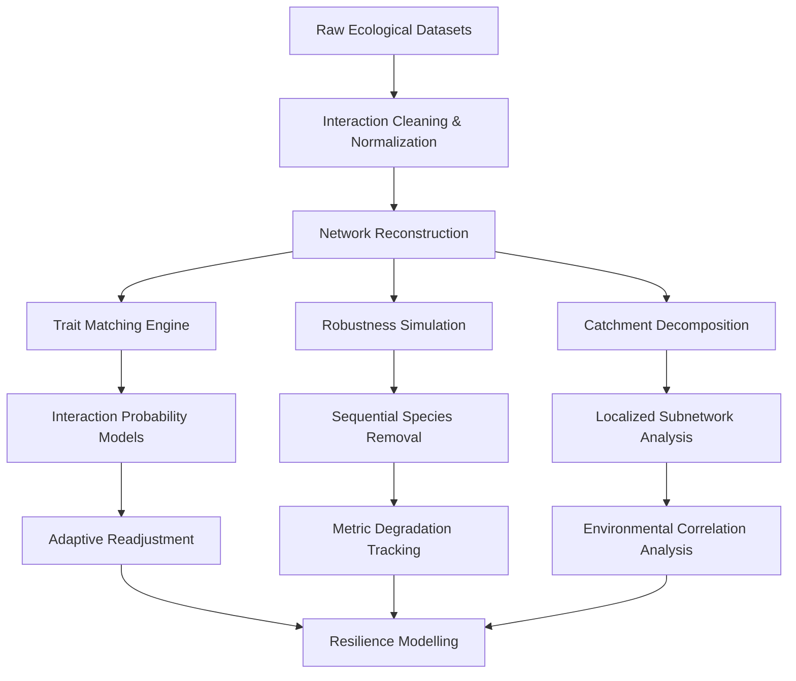
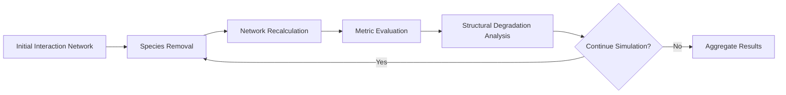
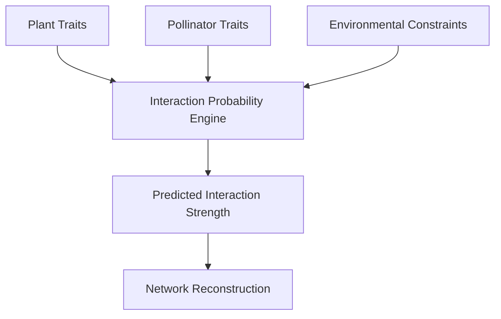
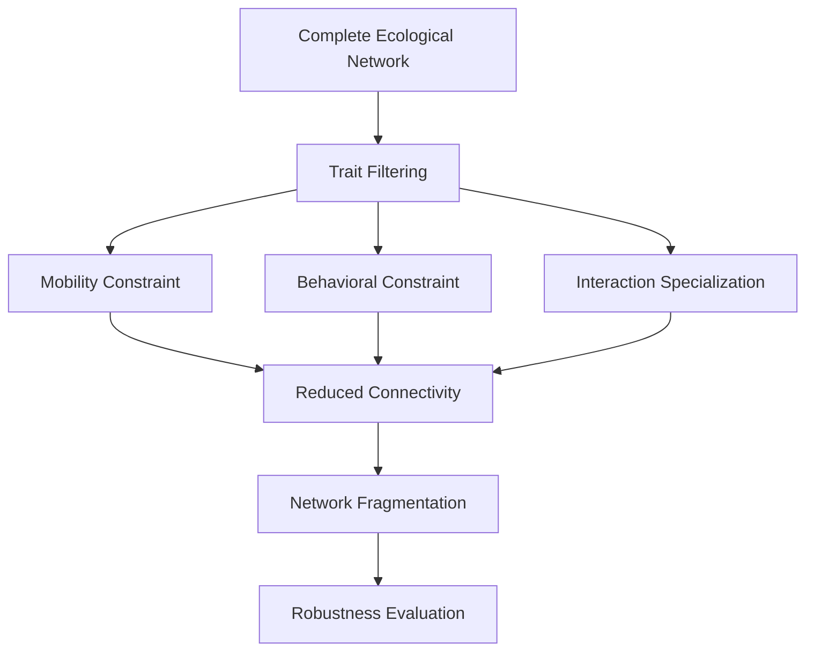

# Ecological Network Resilience

Large-scale computational analysis of plant-pollinator interaction networks under stochastic disruption and trait-constrained fragmentation.

This research explored how ecological systems reorganize, fracture, and adapt under pressure. Using interaction networks reconstructed from ecological datasets, the work examined robustness degradation, trait-constrained interaction dynamics, and catchment-level resilience across multiple environmental scales.

Rather than treating ecosystems as static biological structures, the project approached them as distributed interaction systems — shaped by mobility, adaptation, topology, and coordination constraints.

---

## Research Focus

The work centered around five major analytical directions:

* Robustness analysis through sequential species removal
* Trait matching and interaction probability modelling
* Adaptive species readjustment prediction
* Catchment-level subnetwork decomposition
* Multi-scale resilience and trait-fragmentation analysis

Together, these formed a computational framework for studying how ecological interaction networks respond to disruption and environmental constraint.

---

# System Architecture

---

# Robustness Analysis

Robustness analysis was conducted through systematic species removal simulations across reconstructed ecological networks.

Each simulation progressively removed species from the interaction graph while continuously monitoring structural and functional degradation metrics.

The goal was not merely to observe collapse, but to understand:

* which nodes acted as stabilizing anchors,
* how interaction structures reorganized under pressure,
* and how resilience varied across ecological conditions.

---

## Simulation Strategy

### Random Removal

In random removal simulations, species were eliminated without predefined ordering.

Because stochastic removal introduces high variance in network behavior, simulations were repeated across large execution batches to generate statistically meaningful aggregate behavior.

This enabled the analysis of:

* average degradation trajectories,
* robustness variance,
* resilience confidence intervals,
* and instability thresholds.

---

## Core Metrics

The simulations continuously tracked structural metrics including:

| Metric              | Purpose                                                  |
| ------------------- | -------------------------------------------------------- |
| Connectance         | Measures interaction density across the network          |
| Modularity          | Detects community segmentation and structural clustering |
| Degree Distribution | Evaluates node interaction concentration                 |
| Nestedness          | Measures interaction hierarchy and ecological redundancy |
| Centrality          | Identifies structurally influential species              |
| Fragmentation Index | Tracks network disconnection under stress                |

---

# Species Removal Pipeline

---

# Trait Matching Modelling

Trait matching algorithms were developed to model interaction likelihood between plants and pollinators.

The system analyzed how biological and behavioral traits influence ecological compatibility and interaction probability.

This included traits such as:

* mobility patterns,
* foraging behavior,
* body size,
* interaction specialization,
* and environmental constraints.

The objective was to move beyond static interaction observations and infer the structural logic behind ecological relationships.

---

## Trait Interaction Framework

---

# Adaptive Species Readjustment

One of the later stages of the research explored ecological readjustment behavior after disruption.

Instead of assuming permanent interaction loss after species removal, the models examined whether surviving species could reorganize their interaction patterns and establish alternative ecological pathways.

This introduced a dynamic adaptation layer into the network simulations.

The resulting analysis provided insight into:

* resilience through interaction substitution,
* adaptive ecological recovery,
* and post-fragmentation stabilization behavior.

---

# Catchment-Level Subnetwork Analysis

The research later evolved from global interaction modelling into geographically localized subnetwork decomposition.

Using ecological presence data, interaction networks were reconstructed independently at catchment scale.

This enabled the study of how environmental context influences network robustness.

Each catchment effectively behaved as its own localized interaction system.

---

## Catchment Variables

The analysis explored correlations between robustness metrics and environmental variables including:

* catchment size,
* altitude,
* biodiversity density,
* species richness,
* interaction concentration,
* and ecological distribution patterns.

This transformed the research from pure interaction analysis into a multi-scale systems investigation.

---

# Multi-Scale Fragmentation Analysis

A major component of the work examined how ecological systems respond when specific behavioral or mobility traits are progressively constrained.

Instead of removing random species alone, the simulations selectively fragmented the network through trait elimination strategies.

Examples included:

* migratory vs localized species,
* solitary vs group behavior,
* restricted mobility patterns,
* and specialized vs generalized interaction profiles.

This revealed how resilience changes when ecological flexibility decreases.

---

# Trait-Constrained Collapse Model

---

# Computational Workflows

The project relied heavily on computational batch execution and iterative simulation workflows.

The analytical pipeline included:

* graph reconstruction,
* stochastic simulations,
* repeated robustness execution batches,
* exploratory data analysis,
* metric aggregation,
* and comparative subnetwork evaluation.

The scale of repeated simulation execution required efficient data handling and structured analytical workflows.

---

# Key Themes

Although rooted in ecology, the research ultimately became an exploration of distributed resilience systems.

The work repeatedly converged on broader systems questions:

* How do interconnected structures degrade?
* Which nodes stabilize complex systems?
* How does adaptation emerge after disruption?
* What forms of fragmentation produce irreversible collapse?
* How does local context reshape systemic resilience?

These questions extend far beyond ecological networks.

---

# Research Presentation

## Biology'24 — Swiss Conference in Organismal Biology

Parts of this research were presented at Biology'24, the annual Swiss conference in organismal biology.

The presentation focused on ecological robustness modelling, network degradation dynamics, and trait-constrained resilience analysis.

> Poster presentation and supporting visualizations available upon request.

---

# Closing Notes

This work fundamentally shaped how I think about systems.

Ecological networks, distributed software systems, organizational structures, and information architectures all share similar underlying dynamics:

* coordination,
* dependency,
* adaptation,
* fragmentation,
* and resilience under pressure.

The domain may change.

The systems questions rarely do.
