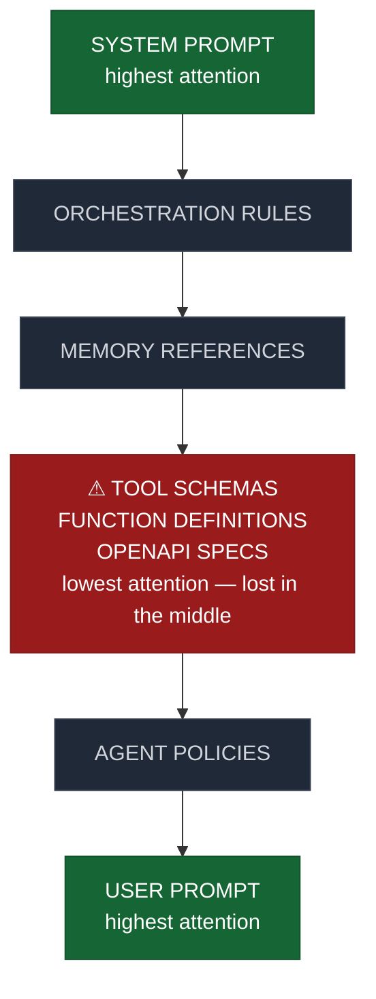

# Context Rot in Tool Protocols

> "The first casualty of unlimited connectivity is attention"

## Introduction: The New Gold Rush

The AI industry is currently obsessed with one idea: give the model more tools. More integrations, more APIs, more connectors, more plugins, more retrieval layers, more agent chains, more orchestration. This is the era of the AI Operating System, and at the center of this movement sits one of the most important infrastructure concepts to emerge in modern AI systems: the Model Context Protocol.

### Model Context Protocol (MCP)

MCP is not just another plugin framework. It is an attempt to standardize how Large Language Models interact with external systems, tools, memory layers, APIs, databases, applications, and execution environments. In simpler terms, MCP attempts to turn LLMs from isolated reasoning engines into connected computational ecosystems. This is an enormous leap — it transforms the model from "a chatbot" into "an orchestration layer for digital cognition."

<Callout type="warning">
  And yet, beneath the excitement lies a growing architectural problem that almost nobody is discussing seriously enough: the model is drowning before the conversation even begins.
</Callout>

## T-Minus Zero: The Moment the Context Starts Rotting

Most people think context degradation happens during long conversations. That is only partially true. A more dangerous phenomenon is emerging — Context Rot at T-Minus Zero — where degradation begins *before the user sends the first meaningful prompt.* The culprit is tool schema inflation: modern agentic systems increasingly preload massive quantities of information into the context window before the user ever types a word, including tool descriptions, OpenAPI specifications, JSON schemas, authentication structures, routing metadata, agent instructions, memory references, system orchestration prompts, retry logic, planner constraints, chain-of-thought scaffolding, and execution policies.

<Observation n={1}>
  In many systems, the model begins inference already carrying thousands, sometimes tens of thousands, of tokens unrelated to the user's actual task. This creates what can only be described as cognitive pollution.
</Observation>

## MCP is Powerful — But Physics Still Exists

One of the most dangerous misconceptions in modern AI engineering is this: "If the context window is large enough, context stops mattering." That is false — completely false. Increasing context length does **not** eliminate attention economics; it merely changes the scale at which the economics fail.

<Callout type="constraint">
  Transformer models still operate under finite attention budgets. Even architectures optimized for long-context inference suffer from signal dilution, retrieval ambiguity, attention fragmentation, positional decay, and competing token salience.
</Callout>

The model does not "understand everything equally." It allocates probabilistic attention across token relationships, which means every additional token is competing for representational importance. This is not a software problem — it is a computational physics problem.

## The Transformer Reality Most People Ignore

To understand Context Rot, we need to understand one uncomfortable truth about transformers: **attention is not memory.** Attention is prioritization. A transformer does not "store" context in the human sense — it continuously computes token relationships across an attention graph. This creates several hard constraints.

### 1. Attention Dilution

As context grows, token competition increases, and important information becomes statistically less dominant. The model's internal signal-to-noise ratio worsens. This means critical instructions weaken, reasoning chains become less coherent, constraint adherence drops, and hallucination probability rises.

### 2. Positional Fragility

Even with modern positional encoding improvements — RoPE scaling, ALiBi, YaRN, extended rotary interpolation — models still exhibit positional instability. Not all tokens are treated equally across long sequences. This leads directly into one of the most important papers in modern LLM research.

## Lost in the Middle — The Paper Everyone Quotes But Few Internalize

The 2023 paper *Lost in the Middle: How Language Models Use Long Contexts*, by Liu et al., demonstrated something deeply important:

> Models perform worst when critical information is buried in the middle of long contexts.

Not the beginning. Not the end. The middle. This has terrifying implications for agentic systems, because where do massive tool schemas usually live? Right in the middle. A typical inference stack now looks something like this:

```text
[SYSTEM PROMPT]

[ORCHESTRATION RULES]

[MEMORY REFERENCES]

[TOOL SCHEMAS]

[FUNCTION DEFINITIONS]

[OPENAPI SPECS]

[AGENT POLICIES]

[USER PROMPT]
```

<Figure n={1} title="Attention Allocation Across the Inference Stack" caption="Tool schemas, function definitions, and OpenAPI specs sit in the statistically weakest position in the context window — buried in the middle, between the high-attention system prompt and the high-attention user prompt.">



</Figure>

The actual human intent is often competing against middleware instructions, orchestration metadata, execution frameworks, and irrelevant tools. The user is no longer speaking directly to the model — they are speaking through a fog of infrastructure.

## MCP Creates a New Class of Failure

This is where things become interesting. MCP solves a real problem: interoperability, standardized tool access, modular orchestration, and agent portability. But it also introduces a dangerous emergent property: universal connectivity creates universal distraction.

An AI connected to GitHub, Slack, Jira, Notion, databases, browsers, terminals, vector stores, CRMs, cloud systems, email systems, and analytics engines is theoretically powerful. But practical intelligence is not determined by access alone — it is determined by relevance, prioritization, context compression, and retrieval precision. Without those, the model becomes, as the saying goes, "connected to everything, capable of nothing."

## Context Windows Are Becoming Junk Drawers

The industry currently treats larger context windows as brute-force solutions. Need more tools? Increase context. Need more memory? Increase context. Need more instructions? Increase context. Need to pass through API specifications? Increase context. Need to provide execution policies? Increase context.

<Callout type="note">
  At some point routing matters more than capacity, pruning matters more than retention, and architecture matters more than scale. The future bottleneck is not context length — it is context governance.
</Callout>

## The Hidden Cost of Tool Availability

Every available tool imposes latent cognitive overhead, even if unused. Why? Because the model must evaluate applicability, consider invocation probability, weigh execution pathways, compare competing tools, track constraints, and maintain schema awareness. This creates what we might call Latent Cognitive Load.

The human analogy: imagine trying to answer a simple math question while simultaneously staring at a legal library, a DevOps dashboard, a stock terminal, and a chemistry book. Even if irrelevant, they consume attentional real estate. LLMs experience a computational analogue of this phenomenon.

## Why Agentic Workflows Quietly Degrade Reasoning

A brutal observation: many "AI agents" today are becoming worse at reasoning as they become more architecturally sophisticated. This happens because complexity itself consumes context budget. Every orchestration layer introduces more prompts, more routing logic, more metadata, more planning structures, and more execution traces.

<Callout type="failure">
  This creates recursive context contamination. The model spends increasing energy understanding the system around the task rather than the task itself. Eventually the architecture becomes self-defeating.
</Callout>

## The Industry is Optimizing for Capability Demos, Not Cognitive Efficiency

Current benchmarks reward tool use, API integration, multi-step execution, and workflow completion. Very few benchmarks evaluate attentional efficiency, schema overload resistance, context contamination, or reasoning degradation under orchestration density. That is a massive blind spot, because the future challenge is no longer "Can the model use tools?" It is "Can the model remain intelligent while surrounded by tools?" These are completely different engineering problems.

## Active Context Management — The Missing Discipline

This is where the industry needs to evolve. The future is not infinite context, universal preload, or always-on tools. The future is Active Context Management (ACM) — a discipline focused on maintaining signal clarity, attentional efficiency, contextual relevance, and reasoning integrity.

### Principles of Active Context Management

#### 1. Dynamic Tool Discovery

Do not preload every tool. Load tools *only when semantically relevant.* The model should discover capability progressively, not carry the entire universe upfront. This mirrors operating systems: lazy loading, dynamic linking, demand paging. AI systems will inevitably evolve similarly.

<Process>
  <Step n={1} title="Phase 1: Intent Discovery">
    The agent queries a lightweight registry with intent keywords or embeddings and receives only a minified candidate list — name plus a one-line description — rather than full schemas for every tool in the system.
  </Step>
  <Step n={2} title="Phase 2: Dynamic Binding">
    Once the agent selects a specific tool, it receives that tool's full JSON input schema and nothing else, keeping the rest of the tool universe out of the context window entirely.
  </Step>
  <Step n={3} title="Phase 3: Execution">
    The agent invokes the bound tool with validated arguments, having carried only the schema it actually needed for that turn.
  </Step>
</Process>

<Decision n={1} status="accepted">
  Treat "discover then bind" as the concrete implementation of Dynamic Tool Discovery: replace static, monolithic tool manifests with a two-phase discover/bind registry lookup so the model is never forced to carry the entire tool universe just to use one tool.
</Decision>

<Tradeoff
  gain="Eliminates the bulk of tool-schema-driven context rot and improves tool invocation accuracy by shrinking the candidate set the model has to reason over."
  cost="Adds a discovery round-trip when the agent encounters an unfamiliar intent category, trading a small latency cost for a large attentional saving."
/>

#### 2. Semantic Tool Pruning

Most tools are irrelevant to most prompts. If the user asks "Explain Fourier transforms," the model should not carry GitHub schemas, Slack APIs, browser execution tools, or CRM functions. Tool availability should shrink intelligently, not expand infinitely.

#### 3. Hierarchical Context Routing

Context should not exist as a flat token soup. Future systems will require layered memory, active retrieval graphs, scoped attention domains, and ephemeral execution buffers. In other words, AI systems need information architecture.

#### 4. Attention-Aware Middleware

Middleware cannot remain context-blind. Every injected token has a cognitive cost. Future orchestration frameworks must become attention-sensitive, token-economical, and reasoning-aware — the middleware itself must optimize for model cognition, not just developer convenience.

## The Coming Shift: From Bigger Contexts to Smarter Contexts

The current era resembles early database engineering, when everyone was obsessed with storage volumes. Eventually the industry learns that indexing matters, query planning matters, retrieval strategy matters, caching matters, and normalization matters. LLMs are heading toward the same realization.

Raw context length is becoming the least interesting metric. The real differentiator will become Context Intelligence: systems that preserve signal, suppress noise, route selectively, and protect reasoning bandwidth will outperform systems that simply expose infinite capability.

## MCP Is Not the Problem

This is important: MCP itself is not flawed. In fact, standardized interoperability is probably necessary for the future of AI systems. The issue is architectural immaturity around context economics. The industry is currently behaving as though every tool should always be visible, every schema should always exist in-memory, and every capability should always remain available. That assumption is unsustainable.

<Callout type="important">
  The future will belong to systems that understand: capability without attentional discipline becomes self-sabotage.
</Callout>

## The Final Paradox

The AI industry believed connectivity creates intelligence. But beyond a certain threshold, connectivity begins eroding cognition itself. This creates the central paradox:

> The more connected the model becomes, the more aggressively context must be controlled.

Otherwise orchestration overwhelms reasoning, infrastructure overwhelms intent, and capability overwhelms intelligence.

## Conclusion — The Real Bottleneck Has Changed

For years, the bottleneck was model size, training data, compute, and inference speed. Tomorrow's bottleneck may be something entirely different: attentional survivability. Not "Can the model access everything?" But: "Can the model stay coherent while surrounded by everything?" That is the next frontier, and the teams who solve it will define the architecture of the agentic era.

---

## Addendum — The Industry Already Knows This

*A response to the obvious counter-question: "Surely OpenAI, Anthropic, Google, and the framework creators already know Context Rot exists?"*

Short answer: yes, absolutely. In fact, what we are calling "Context Rot" is rapidly becoming one of the central systems-engineering problems in agentic AI. The important nuance, however, is that different companies are solving different layers of the problem. Some attack it at the transformer architecture layer, some at the orchestration layer, some at the middleware layer, some at the retrieval layer, and others at the UX abstraction layer. The industry has not converged on a single solution because nobody actually knows the ideal architecture yet — we are still in the "early distributed systems" era of agentic AI.

## OpenAI — Context Hierarchies and Hidden Orchestration

OpenAI's recent direction strongly suggests they understand several critical realities: raw context stuffing does not scale, universal tool exposure is dangerous, orchestration itself consumes cognition, and middleware abstraction is becoming necessary. (Official documentation: [platform.openai.com/docs](https://platform.openai.com/docs))

### Function Calling Evolution

Early tool calling systems worked almost like brute-force schema injection — the model received tool descriptions, parameter schemas, execution rules, and massive serialized metadata. Modern systems are evolving toward selective tool relevance, implicit routing, capability grouping, and managed execution layers. This is an important shift: the model is increasingly being asked "Which capability domain matters?" rather than "Choose from 700 globally available functions." That distinction matters enormously for attentional efficiency.

### Responses API and Managed Agents

A major architectural clue is OpenAI's move toward server-side orchestration, hidden reasoning layers, stateful execution systems, and managed tools. This likely exists partly because exposing every orchestration detail directly inside the model context is unsustainable.

<Callout type="note">
  One way to reduce Context Rot is to stop forcing the model to carry infrastructure awareness. Instead, middleware handles orchestration, external systems maintain state, and only locally relevant information reaches inference.
</Callout>

This effectively creates hierarchical cognition layers — very similar to operating system process isolation, memory paging, cache hierarchies, and virtualized execution environments. The model becomes less like "one giant brain carrying everything" and more like "a reasoning engine interacting with scoped cognitive surfaces."

## Anthropic — Attention Stability and Constitutional Reasoning

Anthropic appears deeply focused on attention behavior, interpretability, long-context coherence, and instruction hierarchy preservation. (Research: [anthropic.com/research](https://www.anthropic.com/research))

Claude's extremely large context windows are not merely marketing flexes — they are part of a broader research question: "Can models maintain coherent reasoning under extreme context expansion?" Anthropic appears acutely aware that larger context does not equal preserved cognition, token accessibility does not equal token salience, and retrieval does not equal understanding.

### Constitutional AI as Reasoning Stabilization

Constitutional AI is usually framed as an alignment methodology. But technically, it also behaves like reasoning regularization. In overloaded contexts, models can drift, fragment, prioritize inconsistently, or collapse into contradictory internal states. Constitutional frameworks help preserve instruction stability, behavioral consistency, and reasoning coherence — that becomes increasingly important as orchestration complexity grows.

### Long Context Research

Anthropic has repeatedly explored retrieval degradation, hallucination under long sequences, context prioritization, and instruction retention. This directly overlaps with the "Lost in the Middle" phenomenon.

<Evidence n={1}>
  A 200k-token context is meaningless if critical instructions become statistically diluted, attention quality collapses, or important information loses salience. This is the hidden challenge behind modern long-context systems.
</Evidence>

## Google DeepMind — Retrieval Architecture and Sparse Cognition

Google's philosophy appears structurally different. DeepMind increasingly seems to favor retrieval systems, modular cognition, sparse attention, and distributed reasoning architectures. (Publications: [deepmind.google/research/publications](https://deepmind.google/research/publications/))

Rather than "put everything into the context window," Google often appears closer to "retrieve only what matters at the moment of reasoning." That is a fundamentally different architectural worldview.

### Retrieval-Augmented Generation (RAG)

Google has heavily invested in semantic retrieval, indexed memory systems, chunk prioritization, and retrieval-aware generation. Why? Because retrieval is computationally cheaper than permanent attentional occupancy. This creates a model where information exists externally, relevance is computed dynamically, and only active context enters inference — effectively, externalized cognition.

### Sparse Attention Research

DeepMind researchers have explored sparse transformers, mixture-of-experts systems, selective routing architectures, and locality-sensitive attention mechanisms. These approaches attempt to solve a core problem: not every token deserves equal attention. This becomes increasingly important as context grows. The future likely requires selective activation, attention routing, and dynamic prioritization — not universal token equality.

## Microsoft AutoGen — Distributed Cognition

AutoGen reveals another major industry realization: one giant context blob is often inefficient. (Official project: [microsoft.github.io/autogen](https://microsoft.github.io/autogen/))

Instead of forcing one agent to reason, plan, retrieve, code, verify, browse, and execute simultaneously, AutoGen distributes cognition across specialized agents. This is essentially modularized reasoning.

### Why Multi-Agent Systems Exist

Not merely for novelty, but because scoped contexts reason better, specialization reduces noise, local attention improves coherence, and cognitive isolation preserves signal quality. A coding agent should not simultaneously carry CRM schemas, browser policies, accounting APIs, image generation instructions, and unrelated execution traces. Smaller attentional surfaces often produce stronger reasoning.

### The Tradeoff

Multi-agent systems introduce new problems: orchestration overhead, synchronization complexity, inter-agent communication costs, memory fragmentation, and execution latency. This mirrors classic distributed systems engineering.

<Tradeoff
  gain="Scoped, specialized agents reason with less noise and preserve signal quality by never carrying unrelated schemas or execution traces."
  cost="Orchestration overhead, synchronization complexity, inter-agent communication costs, memory fragmentation, and execution latency — the industry is rediscovering that cognition scaling introduces coordination scaling."
/>

## LangChain, CrewAI, Agno, Semantic Kernel

The framework ecosystem has already started evolving in response to Context Rot. Most modern frameworks are shifting toward tool registries, semantic capability routing, scoped memory, execution graphs, selective tool activation, and dynamic context assembly. Because early agent frameworks exposed a brutal truth: naively exposing everything makes agents worse. The industry is slowly converging on selective capability exposure, not universal availability.

## The Real Shift Happening Right Now

The AI industry is quietly transitioning from "How do we give models more tools?" to "How do we determine what the model should ignore?" That is an enormously important shift, because intelligence is not merely capability acquisition, memory accumulation, or access expansion. It is also prioritization, abstraction, suppression, filtering, and relevance computation. Human cognition survives because it ignores almost everything. Future AI systems will likely require the same property.

## The Actual Frontier Problem: Dynamic Relevance Computation

The next great systems challenge is probably not larger context windows, more tools, or more memory. It is dynamic relevance computation — meaning what matters, when it matters, how strongly it matters, and what should disappear entirely. This is still largely unsolved, and it may become one of the defining AI architecture problems of the next decade.

## My Strong Suspicion About the Future

The future probably does not look like one giant omniscient super-agent carrying infinite context. It probably looks more like an attentional operating system: dynamic context paging, semantic memory hierarchies, ephemeral tool activation, scoped reasoning domains, active relevance pruning, and attention-aware orchestration.

AI systems will increasingly resemble operating systems, distributed schedulers, database query planners, and information routing engines — not just chatbots. And once you see that, much of the industry's direction suddenly becomes clearer. The AI ecosystem is slowly rediscovering decades of operating systems theory, distributed systems design, database indexing, compiler optimization, caching strategies, and information retrieval research — just through the lens of transformers instead of CPUs.

## Final Thought

MCP itself is not the problem. Standardized interoperability is probably necessary for the future of AI systems. The problem is architectural immaturity around context economics. The industry initially assumed every tool should always remain visible, every schema should remain active, and every capability should remain globally available. That assumption is beginning to collapse.

<Callout type="historical">
  The future belongs to systems that understand: capability without attentional discipline becomes self-sabotage. And that realization may define the next era of AI architecture.
</Callout>

## Related Notes

- [The Silicon Ceiling](./the-silicon-ceiling) — the broader argument about why transformer-based AI may face fundamental limits on the path to AGI
- [Transformer Scaling Laws vs Quantum State Superposition](./transformer-vs-qubit) — the physics and hardware constraints underpinning why attention budgets are finite and scaling is not free
