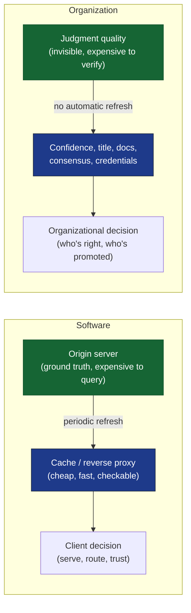

# Organizations Run on Proxies
*Judgment quality is invisible. Everything an organization does is an attempt to infer it anyway*

<Callout type="important">
  No organization can observe judgment quality directly. It infers judgment quality from signals that correlate with it — confidence, seniority, documentation, consensus, credentials — and every one of those signals can be produced without the judgment behind it. The gap between the signal and the thing it signals is where most "irrational" organizational behavior actually lives.
</Callout>

## A Cockpit, a Gap, and a Fix That Generalizes

On December 28, 1978, United Airlines Flight 173 circled above Portland, Oregon, while its captain worked a landing-gear indicator problem. The gear light hadn't confirmed down-and-locked, and he wanted certainty before committing to landing. Two junior crew members watched the fuel gauges fall and tried to raise the alarm — first indirectly, then more directly — but never with the force the situation required. The aircraft ran its tanks dry and crashed short of the airport. The National Transportation Safety Board's investigation concluded that the flight engineer and first officer had, in substance, been right: fuel state should have overridden the gear question. What failed wasn't their judgment. It was the mechanism for letting correct-but-junior judgment outrank confident-but-senior judgment inside a cockpit built, like most hierarchies, to resolve disagreement by rank rather than by who happened to be correct.

United 173 became one of several accidents — alongside the 1977 Tenerife runway collision two years earlier — that pushed commercial aviation toward Crew Resource Management (CRM), a deliberate redesign of cockpit communication protocols, workload distribution, and authority gradients. CRM didn't try to make captains less senior. It tried to change *which signal* the cockpit deferred to when something had to be decided under time pressure, so that outcome would track correctness rather than rank.

That premise generalizes well beyond aviation. Every organization repeatedly faces the same underlying problem: someone has to act on a judgment call, multiple people hold different judgments, and there is no direct instrument for reading judgment quality off a person the way a fuel gauge reads fuel. So organizations infer it from whatever is observable and treat that as a stand-in — confidence, seniority, title, consensus, documentation, credentials, responsiveness, how well someone presents. None of these *are* good judgment. They are **proxies** for it: correlated with it often enough to be useful, and divergent from it often enough to matter.

## Naming the Proxy Hierarchy

Call the specific, usually unwritten ranking of which signals an organization defers to — when it needs to decide who is right and cannot check directly — the **proxy hierarchy**. It is not one universal ordering. A hospital, a courtroom, a fast-growing startup, and a software engineering team each weight these signals differently, and the specific weighting is itself a design fact about the organization, whether or not anyone designed it on purpose. In one company the order might run Title > Confidence > Documentation > Track Record. In a flatter one it might run Documentation > Consensus > Confidence > Title. Nobody writes this ranking down as policy, but it is almost always inferable empirically, simply by watching which kinds of arguments actually win disputes over a few months.

This framing borrows from — and sits comfortably beside — two older ideas in organizational theory. Herbert Simon's concept of **bounded rationality** observes that real decision-makers, lacking the time, information, or cognitive capacity to evaluate every option fully, don't optimize; they *satisfice*, settling for the first option that clears a good-enough bar using whatever heuristics are cheaply available. A proxy hierarchy is what bounded rationality looks like at the organizational level: a standing set of heuristics an organization reaches for by default because fully verifying judgment quality every time is not a realistic option at any scale beyond a single expert working alone.

The second is **signaling theory**, formalized by the economist Michael Spence in the context of labor markets: when a quality (like a worker's underlying productivity) is not directly observable, market participants rely on costly, observable signals correlated with that quality (like a degree) instead. A credential doesn't cause competence, but if it's expensive enough to fake, it's a reasonable bet in the absence of anything better. Proxy hierarchies apply the same logic beyond hiring, to every moment an organization needs to settle who is right and can't check.

Proxies exist for good reasons, not through some organizational failure of nerve. Confidence often does correlate with competence. Consensus often does pool real, partial knowledge into something better than any single view. Credentials often do compress a genuine track record into something checkable in five seconds instead of five years. None of these are irrational things for an organization to reach for under time pressure. The failure isn't using proxies — it's forgetting that a proxy and the thing it stands in for are two different variables, correlated but not identical, and that the gap between them is exactly where the interesting organizational failures live.

## The Same Problem, in Software

Software architecture has its own, more literal version of this idea, and it's worth making the analogy explicit because it clarifies what's actually happening when an organizational proxy goes stale. A reverse proxy or a cache sits between a client and an origin server precisely because consulting the origin for every request is too slow or too expensive. The cache *represents* the origin's true state; it does not *contain* it. Under normal conditions the two stay close enough that the difference doesn't matter. The entire discipline of cache invalidation exists because "close enough" is a claim that decays over time, silently, with no alarm that fires when it crosses into "no longer true."

<Figure n={1} title="The Proxy Pattern, Organizational and Technical" caption="Both versions interpose a cheap, checkable signal between a decision and an expensive-to-verify ground truth — and both require an explicit refresh mechanism, or the signal quietly decouples from what it once tracked.">

</Figure>

The asymmetry matters: software systems generally build the invalidation mechanism in from the start, because a stale cache produces an error loud enough to get noticed — a broken page, a failed deploy, a customer complaint. Organizational proxy hierarchies almost never get an equivalent mechanism, because a stale proxy for judgment quality produces an error that is slow, diffuse, and easy to misattribute to something else entirely — a "culture problem," a "communication problem," a person quietly being "difficult." The origin drifts from the cache and nothing pages anyone.

## Proxy: Organizational Memory

One place the proxy hierarchy operates constantly is in how organizations decide, after the fact, whose reasoning to trust. No organization has a shared brain. Nobody outside a specific meeting three months ago has direct access to why a call was made, unless something outlasted the meeting. When the question resurfaces, the organization doesn't re-derive the original reasoning from scratch — that would require reassembling context nobody retained. It reaches for whatever record survived and treats that record as authoritative, because it is the only artifact still available to consult.

This is a specific instance of what the anthropologist and political scientist James C. Scott, in a different context, called **legibility**: the tendency of large systems to act on whatever has been rendered visible and checkable to them, rather than on the messier reality that legibility only partially captures. A written decision memo is legible in a way that "reasoned well in a meeting nobody wrote down" is not, and organizations reliably act on the legible version.

It's worth pausing on why Simon, Spence, and Scott all show up here, because it isn't three borrowed citations decorating one argument — it's one structural fact, independently rediscovered from three different vantage points. Simon was describing how a single bounded mind copes with more decisions than it can fully evaluate. Spence was describing how a market copes with a quality it cannot observe in a counterparty. Scott was describing how a state copes with a society too complex to govern directly. None of them were writing about each other, or about organizational hierarchy at all. What they converged on — from economics, from labor markets, from political administration — is the same move: when the thing that actually matters is too expensive or too inaccessible to check, any system substitutes something cheaper and checkable, and treats the substitute as the original. The proxy hierarchy just names that move at a level general enough to hold all three.

This creates an asymmetry worth naming precisely: documentation functions as a proxy for having reasoned well, and it is frequently a *stronger* proxy than the reasoning itself, because it is the only one still legible later. Two people can each have been right about equally many calls; the one whose reasoning left a written trail will tend to win the retroactive argument more often, independent of whose calls actually held up over time. This is worth separating from a second, related question — whether the resulting outcome is *legitimate*, in the sense of being accepted and acted on without further dispute, versus whether it reflects the *higher-quality* reasoning. Organizations frequently optimize for the former even at real cost to the latter, because legitimacy is what lets a decision stick and a team move forward, and a decision that is technically correct but perpetually contested is often more costly to an organization than one that is slightly worse but settled.

<Observation n={1}>
  This is not a claim that documentation is bad, or that organizations should stop documenting decisions. It is a claim that documentation is a *proxy for* good reasoning, not a *guarantee of* it — and that the two diverge specifically for people whose good judgment happens not to produce a paper trail, which correlates uncomfortably well with who has time to write memos versus who is heads-down doing the work the memo would be about.
</Observation>

A related failure shows up when neither side documents anything, and the resolution still doesn't track judgment quality — it tracks how much agreement accumulated in the room, because agreement is cheap to produce and functions as a stand-in for evidence, especially for whoever has to rule on something they can't personally verify. Consensus is a genuinely strong proxy much of the time; groups often do converge on better answers than individuals, a finding with real empirical support under the right conditions (independence of judgments, diversity of perspective, aggregation rather than groupthink). It tends to be weakest exactly where the better answer is unfamiliar or non-obvious enough that only one person in the room actually holds it — which is precisely the situation where a mechanism dependent on the room's *existing* understanding will fail to surface the room's *best* understanding.

## Proxy: Authority Under Uncertainty

A second version of the same problem shows up whenever whoever holds final authority over a decision lacks the expertise to evaluate its substance directly. This is closer to the ordinary condition of organizations than the exception: a hospital administrator without clinical training approving a protocol change, a jury weighing dueling expert testimony, a non-technical founder settling an architecture dispute, a product manager arbitrating between two engineers who disagree about a systems design. In each case the authority still has to rule — declining to decide is itself a decision, and few organizations can run indefinitely on unresolved disagreement — so they reach for whatever's actually available to someone who can't check the substance directly: confidence, composure, a track record in some other domain, how well an argument compresses into something they can repeat to someone else afterward.

This is the structural core of what economists call the **principal-agent problem**: a principal (the decision-maker with authority) depends on an agent (the person with domain expertise) who holds information the principal cannot fully verify. The classic version of the problem is about incentives — agents might act against principals' interests. The version relevant here is narrower and more basic: even a perfectly well-intentioned agent's *correct* input can fail to be recognized as correct by a principal who has no independent way to evaluate it, and the principal's incentive is then to fall back on the cheapest available signal, which is rarely the signal most correlated with being right.

It's worth separating two things that get collapsed here: genuine uncertainty, where even the domain expert doesn't yet know the answer, from ignorance, where an answer exists and is knowable but is inaccessible to the person who has to decide. Proxies do different work in each case. Under real uncertainty, deferring to confidence or consensus may be close to the best available strategy, because there is no hidden correct answer being overridden — everyone is genuinely guessing, and a proxy that correlates with good guessing under uncertainty (calibrated confidence, a track record of well-calibrated past guesses) is doing legitimate work. Under ignorance, the same proxies can override a genuinely available better answer simply because it was never translated into a form the decision-maker could act on.

<Callout type="constraint">
  A decision-maker without domain expertise faces a hard constraint, not a failure of effort: they cannot verify substance directly, so whatever they use instead of substance will be a proxy by definition. The only lever available to them is *which* proxy — and how deliberately they choose it.
</Callout>

That's the sharper implication: better judgment that hasn't been translated into a form the decision-maker can act on — a scoped tradeoff, a stated cost, a consequence they can picture — tends to lose to visible confidence. This rarely reflects bad faith on anyone's part. Invisible reasoning simply has no way to compete with a visible proxy in the moment a call has to be made, because the decision-maker is not weighing "correct versus incorrect." They are weighing "legible versus illegible," and legibility, not correctness, is the axis their proxy hierarchy actually measures.

## When the Proxy Becomes the Target

There is a well-documented failure mode one step beyond simple miscalibration, and it deserves its own treatment because it explains why proxy hierarchies don't just drift passively — they get actively gamed. The sociologist Donald T. Campbell observed in 1976 that "the more any quantitative social indicator is used for social decision-making, the more subject it will be to corruption pressures and the more it will tend to distort and corrupt the social processes it is intended to monitor." A decade later, the anthropologist Marilyn Strathern gave the same idea its now-famous shorthand, commonly cited as **Goodhart's Law** (after the economist Charles Goodhart, whose original point was narrower and about monetary policy): *"when a measure becomes a target, it ceases to be a good measure."*

This matters here because a proxy hierarchy, once it becomes known and stable inside an organization, stops being merely descriptive of what the organization values and starts being *prescriptive* for how to succeed inside it. If documentation reliably wins retroactive disputes, people learn to over-document defensively rather than to reason better. If confidence reliably beats correctness in front of a non-expert authority, people learn to project confidence regardless of their actual certainty. The proxy hasn't just decoupled from the thing it measures through neglect — it has been actively pulled away from it, by rational actors responding to the incentive the proxy hierarchy itself created.

<Decision n={1} status="accepted">
  **Treat proxy hierarchies as measurement instruments, not as neutral background.** Any signal an organization visibly rewards when inferring judgment quality will attract effort aimed at producing the signal, independent of whether that effort also produces the underlying judgment. This is not a claim that people are acting in bad faith — it is a structural consequence of publicizing which proxy wins.
</Decision>

## Proxy Drift

Proxy hierarchies don't stay calibrated on their own, even without active gaming. A signal that once correlated well with good judgment — a credential earned under one set of standards, a person's historical track record in a role the organization no longer operates the same way, a job title assigned years before responsibilities shifted — can keep being trusted long after it has stopped tracking anything, simply because *updating* a proxy hierarchy is organizationally harder than *establishing* one. Nobody schedules a recurring review of whether "this person's title still predicts good calls." The ranking just persists, inherited by whoever is new to the room, until it is calibrated to a version of the organization that no longer exists.

The software analogy is instructive again here. A cache with no time-to-live and no invalidation trigger doesn't fail loudly; it serves stale data indefinitely, correctly, right up until something downstream breaks in a way that takes real effort to trace back to the stale cache as the root cause. Proxy drift in organizations behaves the same way — not as a dramatic failure but as a slow accumulation of small, individually defensible decisions made against an increasingly wrong signal, each one look fine in isolation.

| Feedback property | Fast-calibrating proxy | Slow-calibrating proxy |
| --- | --- | --- |
| Time from signal to outcome | Minutes to hours (triage vitals → patient trajectory) | Months to years (credential → career-long judgment quality) |
| Who observes the mismatch | The same person who used the signal | Someone several steps removed, if anyone |
| Cost of being wrong | Immediate and attributable | Diffuse and easily misattributed |
| Incentive to recalibrate | Constant, built into the workflow | Requires deliberate, unscheduled effort |

This is also where proxies work exceptionally well, and it's worth holding onto as the counterweight to everything above. In fast-moving emergency medicine, triage nurses routinely make life-or-death prioritization calls using almost nothing but a handful of fast, learnable proxies — vital signs, visible distress, presentation — because there is no time for deeper diagnosis, and because those proxies have been rigorously calibrated against outcomes over decades of clinical data. That's a proxy hierarchy that stayed accurate because it was continuously, structurally checked against reality: every triage call is followed, quickly, by an outcome that can be compared against the call that was made. The table above is really describing why triage escapes drift and titles don't — not because medicine is a more serious domain, but because its feedback loop is short, direct, and built into the job, while most organizational proxies get none of the three.

## Where This Doesn't Apply

None of this describes situations where better judgment can be checked directly. When whoever is deciding has the expertise to evaluate a claim on its substance, proxies matter far less, because the real signal is available and doesn't need inferring — an experienced structural engineer reviewing another engineer's calculation is not relying on the second engineer's confidence, because the calculation itself is checkable. And it's worth being honest that plenty of disputes marketed as "who has better judgment" are actually genuine tradeoffs with no single better answer waiting to be discovered. In those cases a proxy hierarchy isn't distorting anything, because there is nothing underneath it to distort — the disagreement is real and irreducible, not a symptom of hidden judgment nobody can see.

<Tradeoff
  gain="A well-calibrated, explicit proxy hierarchy lets an organization make fast, defensible decisions at a scale where verifying every judgment call directly is impossible — which is the ordinary condition of any organization beyond a handful of people."
  cost="The same hierarchy will misjudge every case where the correlation between the proxy and actual judgment quality happens to fail — systematically disadvantaging people whose good judgment doesn't happen to produce the organization's preferred signal, for reasons that have nothing to do with the judgment itself."
/>

## Proxies, Architecture, and Who Gets to Decide

The proxy hierarchy has a direct analogue in how technical decisions get made inside organizations, and it's worth drawing out because the mechanism is the same even though the vocabulary differs. In [most architectural decisions are really organizational decisions](/writing/field-notes/architectural-decisions-are-organizational-decisions), the observation is that a "purely technical" disagreement about system boundaries is often a proxy fight over organizational ownership — who gets paged, whose roadmap bends to whose. That argument and this one are describing the same underlying structure from two different entry points. There, Conway's Law explains *why* the architecture ends up matching the org chart regardless of what the diagram says it should be. Here, the proxy hierarchy explains *how* that outcome gets decided in the room: whoever's argument best matches the organization's currently trusted signals — seniority, confidence, a cleaner-looking diagram, more polished documentation — wins the review, whether or not their argument better predicts which boundary will actually hold up under real coordination costs eighteen months later.

Put the two together and a familiar pattern gets a sharper name: an architecture review is a site where an organization's proxy hierarchy gets applied to a technical question it was never calibrated to answer, because the proxies in play (confidence, seniority, presentation quality) were built for adjudicating *organizational* trust, not for adjudicating whether a service boundary will hold. This is not an argument that architecture reviews should be run differently in every case — sometimes the technically correct boundary and the organizationally legible one coincide, and no correction is needed. It is an argument that when the two diverge, the review will default to resolving in favor of whichever side's argument the room's proxy hierarchy already favors, and that the resulting decision will read, afterward, as a technical conclusion rather than what it actually was.

## The Proxy Hierarchy, Revisited

The instinct here is to reach for a fix — document more, translate technical arguments better, build a longer track record. Those help at the margin, but they are moves *within* a given proxy hierarchy, not a way out of having one; every one of them is itself a proxy, subject to the same drift and the same gaming pressure described above. There is no version of an organization, at any scale beyond a single person working entirely alone, that operates without proxies for judgment quality. The relevant question was never whether to use them.

The more useful move is to make an organization's proxy hierarchy explicit — to actually ask, out loud, what order of signals a given team or company defers to when it can't check something directly — and then to calibrate that ordering deliberately against outcomes, the way triage medicine does and most organizational hierarchies of authority do not. Not eliminate proxies, which is not a real option. Calibrate them: notice which ones have stopped correlating with anything, weight more heavily the ones that still do, and build in something closer to a feedback loop, so the gap between the proxy and the thing it stands in for gets caught before it compounds into a decision nobody can trace back to its actual cause. The ranking itself is a design choice. Most organizations just haven't recognized yet that they've already made it.
