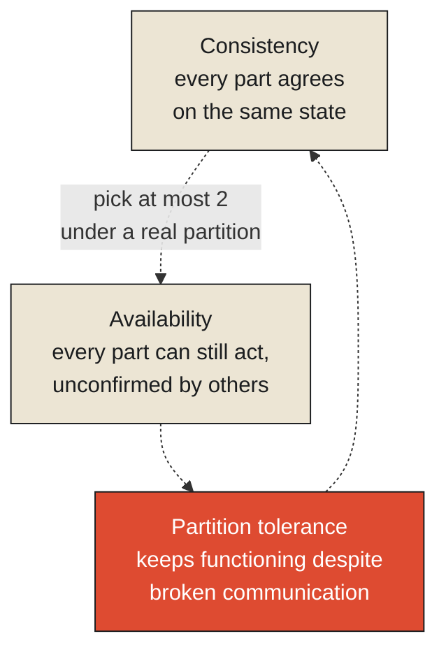

When India's Constituent Assembly first convened in December 1946, the scale of what it needed to reconcile was staggering by almost any historical measure. Beyond the British provinces directly under colonial administration, the subcontinent held more than 560 nominally sovereign princely states, each with its own ruler, its own degree of internal autonomy, and no automatic obligation to join whatever new nation might emerge. Partition — the concurrent, wrenching creation of two separate nations rather than one — was unfolding in real time alongside the drafting process itself, not resolved beforehand. Multiple major religious communities, dozens of languages, and sharply different regional legal traditions all needed some form of durable accommodation within a single founding document. The Assembly worked for nearly three years, debating, drafting, and redrafting, before the Constitution was finally adopted on November 26, 1949, and came into force on January 26, 1950.

**This is consensus at a scale and complexity that makes almost any distributed computing system's coordination problem look modest by comparison, and it's worth using it to state this chapter's central claim as sharply as the history allows: genuine consensus among independent parties, each with real interests and real ability to simply refuse, is never free. It costs time, it costs compromise that satisfies no single party completely, and in enough real cases, it doesn't fully succeed at all — some parties never agree voluntarily, and something other than pure negotiated consensus has to fill the resulting gap.**

<Callout type="architectural-tension">
Consensus is not merely slow. It is a genuine, structural tradeoff against two other properties any coordinating system might want simultaneously: staying available for action while consensus is still being negotiated, and staying fully consistent across every party in the meantime. A system — political or computational — can get at most two of the three, and choosing which two to prioritize is a real design decision, not a detail that resolves itself.
</Callout>

## Choosing between moving and agreeing

During the transition period, individual princely states faced a genuine version of the tradeoff computer science later formalized as the [CAP theorem](#cap-theorem) — the finding, proven rigorously by Eric Brewer and later Seth Gilbert and Nancy Lynch, that a distributed system experiencing a network partition can guarantee at most two of three properties simultaneously: consistency (every part of the system agreeing on the same state), availability (every part remaining able to act, even without confirmation from the others), and partition tolerance (continuing to function despite some parts being unable to communicate with others). A princely state could act unilaterally — declare its own path forward, remain independent, negotiate bilaterally — trading consistency with the eventual unified nation for the ability to keep acting in the meantime. Or it could wait for full, negotiated integration into the new constitutional framework — trading the ability to act unilaterally for eventual, genuine consistency with everyone else. Very few states, in practice, could have both at once: acting independently right now while also being fully, immediately reconciled with a national consensus that, by definition, hadn't finished forming yet.

The actual mechanics of how large, independent groups reach binding agreement despite this tradeoff is exactly what distributed computing's consensus algorithms were later built to formalize, and it's worth naming the two most influential directly. [Paxos](#quorum), developed by Leslie Lamport and first described in the late 1980s, is a rigorous, if notoriously difficult to fully grasp, protocol for getting a distributed set of nodes to agree on a single value even when some nodes fail or messages are delayed, using multiple rounds of proposal and acknowledgment specifically engineered to guarantee that once a value is chosen, it stays chosen, regardless of whatever failures happen afterward. Raft, developed by Diego Ongaro and John Ousterhout in 2014 explicitly as a more understandable alternative to Paxos, achieves broadly the same guarantee through a clearer, more approachable structure built around electing a temporary leader who coordinates agreement on behalf of the group, with well-defined mechanisms for replacing that leader if it fails. Both protocols, despite their real technical differences, are solving the identical underlying problem the Constituent Assembly faced organizationally: how do you get a coordinating body to converge on one agreed outcome, reliably, even when some participants are slow, absent, or actively resistant, without the whole process either stalling forever or splitting into incompatible, competing versions of the truth.

## What happens when a participant simply won't agree

It's worth being honest about the limits of even the best-designed consensus mechanism, because both the historical record and the theoretical computer science converge on an uncomfortable, shared conclusion. A small number of princely states — Hyderabad and Junagadh among the most prominent, and Jammu and Kashmir under its own distinct and considerably more complex circumstances — did not join the new nation through the same voluntary, negotiated process the large majority of states went through, and their integration involved measures well outside ordinary constitutional negotiation.[^1] This is not a footnote to the story of Indian consensus-building. It is a direct, historical instance of a formal result computer science later proved rigorously: the [FLP impossibility result](#flp), established by Michael Fischer, Nancy Lynch, and Michael Paterson in 1985, which shows that in a fully asynchronous distributed system — one where messages can be delayed arbitrarily and there's no reliable way to distinguish a slow participant from a failed one — no consensus protocol can guarantee agreement will be reached in bounded time, even if every single participant is honestly willing to cooperate. Real-world consensus efforts rarely have the luxury of assuming every participant is honestly willing to cooperate at all — and where that assumption breaks down entirely, as it did in a handful of these specific cases, something other than negotiated agreement — in distributed systems, often an external timeout or a forced leader election; historically, in these particular instances, other decisive measures — ends up resolving what pure consensus alone could not.

<Callout type="unresolved">
Consensus protocols, however well designed, are not guaranteed to succeed on any fixed timeline, and in the presence of a genuinely unwilling participant, may not succeed through negotiation at all. This is not a flaw specific to any one protocol or any one historical process. It's a proven, structural limit on what pure agreement-seeking can accomplish under real conditions, and every well-functioning coordinating system, political or computational, eventually needs some answer for what happens when consensus simply doesn't arrive.
</Callout>

## What the Assembly's cost actually bought

It's worth closing on what nearly three years of genuinely difficult negotiation actually purchased, because the cost, however real, was not paid for nothing. A constitution reached through broad, if imperfect and incomplete, consensus among an extraordinarily diverse set of parties carries a kind of durability that a constitution imposed unilaterally on an unwilling population generally does not — the parties who negotiated it, however reluctantly in places, have some real stake in the outcome having gone through them rather than around them. This is the actual payoff consensus protocols are built to deliver in computing systems as well: a value agreed upon through Paxos or Raft's formal process carries a durability — every node that participated in reaching it has verifiably committed to it — that a value simply asserted by whichever node happened to act fastest never could. The cost of consensus, in both cases, buys something a faster, unilateral alternative structurally cannot: an outcome multiple independent parties can actually be trusted to hold to, because they were genuinely part of producing it.

This leaves an important question the Constituent Assembly's history, and the CAP theorem underneath it, both surface but don't fully resolve. Reaching agreement is one problem, expensive and sometimes impossible as this chapter has shown. A separate, equally difficult problem sits downstream of it: once many independent parts of a system are coordinating, and something eventually goes wrong somewhere in that coordination, how do you actually trace the failure back to its cause, across a web of dependencies too large for any single participant to see in full? That is the subject of the next chapter, and it begins with a blackout that took down power for fifty million people across two countries, traced back, eventually, to a single overgrown tree.

<Figure n={1} title="Pick Two" caption="Under a network partition, a system cannot hold all three corners at once. Every real distributed system, and every real coordinating body, sits closer to one edge of this triangle than to the center.">

</Figure>

<FormalNote>

**The CAP theorem.** Stated formally: no distributed data store can simultaneously guarantee
Consistency, Availability, and Partition tolerance; under an actual network partition, a system must
choose to sacrifice at least one. Concretely, this forces a binary choice at the exact moment a
partition occurs — either refuse requests on the minority side until it can rejoin and reconcile
(favoring C over A), or keep serving requests on both sides and reconcile the resulting divergence
later (favoring A over C). A princely state acting unilaterally during Partition was choosing A over
C; a state waiting for full constitutional integration was choosing C over A. Partition tolerance
itself, $P$, was never optional in either case — a subcontinent mid-transition and a network
experiencing real message loss both *are* partitioned, whether or not anyone would prefer otherwise.

**Quorum-based agreement.** Paxos and Raft both avoid needing every node to respond by requiring only
a majority quorum — for $n$ nodes, agreement needs

$$q = \left\lfloor \frac{n}{2} \right\rfloor + 1$$

nodes to agree before a value is considered chosen. This is what lets the protocols tolerate up to
$n - q$ simultaneous node failures or delays while still reaching a binding decision: any two quorums
of size $q$ out of $n$ nodes must overlap in at least one node, by the pigeonhole principle, which is
exactly what prevents two different values from both being "chosen" by two disjoint majorities at
once.

**The FLP impossibility result.** In a fully asynchronous system — no bound on message delay, no way
to distinguish a slow node from a crashed one — no deterministic consensus protocol can guarantee
termination (reaching a decision) in bounded time, even with only one faulty node and full honest
cooperation from everyone else. This is not a statement that consensus is merely hard; it's a proof
that a *guarantee* of both safety (never choosing two different values) and bounded-time termination
is structurally unattainable under pure asynchrony — every real protocol, Paxos and Raft included,
buys termination by adding some assumption FLP's model doesn't have: a timeout, a leader election, a
partial synchrony bound on how late a message can actually arrive.
</FormalNote>

## Elsewhere in this series

<Callout type="note">
The CAP theorem is the same three-way tradeoff shape as
[What Time Means in Distributed Systems](../../reality/time/time-in-distributed-systems)'s absence of
a shared "now" — both are impossibility results, not engineering shortfalls to someday close. The
quorum's overlap guarantee is a more adversarial cousin of the majority-vote logic underneath
[Observability Is a Budget](../../reality/observations/observability-is-a-budget)'s precision/recall
tradeoff. The next chapter,
[The Cost of Knowing Why](./the-cost-of-knowing-why), takes up what happens once agreement has been
reached and something in the coordinated result still goes wrong.
</Callout>

---

[^1]: This is a brief, general reference to a genuinely complex and, in places, still politically sensitive period of Indian and South Asian history. Specific details, sequencing, and characterization of these integration processes should be verified carefully against reputable historical sources before publication, and this article does not attempt to adjudicate any ongoing political disputes connected to this history.