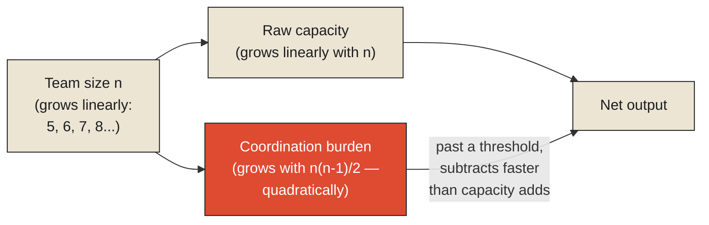

In 1975, the computer scientist Fred Brooks published a book, *The Mythical Man-Month*, drawing on his own experience managing IBM's OS/360 operating system project — a project that was badly behind schedule, and that Brooks and his colleagues tried to rescue by doing the obvious thing: adding more programmers. The project fell further behind. Brooks's explanation, since formalized into what's generally called Brooks's Law, is one of the most quoted and least intuitively obvious findings in the entire discipline of software engineering: adding people to a late software project makes it later, not sooner, because the work involved in coordinating a larger team — explaining context to newcomers, resolving conflicting changes, holding meetings to keep everyone aligned — grows faster than the additional raw capacity those new people bring, past a certain point actually outpacing it entirely.

This is worth taking as a precise, general claim rather than a piece of engineering folklore, because it's the exact fact this chapter is named for. **A system does not scale simply by adding more capacity to it — more workers, more machines, more processing power. It scales, or fails to scale, based on how well the added capacity can actually be coordinated with everything already there. Past a certain point, in enough real systems, the coordination cost of integrating additional capacity exceeds the value that capacity adds, and a system can genuinely become slower, not faster, from being given more resources.**

<Callout type="architectural-tension">
Raw capacity and coordinated capacity are not the same quantity, and confusing them is exactly the mistake Brooks's Law exists to name. Ten workers who cannot efficiently divide, track, and integrate their work can accomplish less, not more, than a smaller team that can — because the tenth worker's marginal contribution has to be weighed against the marginal coordination burden their presence adds to everyone else.
</Callout>

## Why the coordination cost grows the way it does

It's worth being precise about the actual mathematics underneath Brooks's observation, because it explains why the effect gets worse, not just present, as a team or system grows. If every pair of workers on a team potentially needs to communicate and coordinate with each other, the [number of such pairs grows roughly with the square of the team's size](#pairwise-overhead) — doubling a team from five people to ten doesn't double the coordination burden, it roughly quadruples the number of pairwise relationships that might need managing. A large enough team, even one whose members are all individually excellent, can spend a genuinely dominant share of its total effort simply coordinating with itself, leaving a shrinking fraction of total capacity actually available for the underlying work the team exists to do.

This is precisely the terrain [distributed optimization](#distributed-optimization) exists to formalize and improve on: the mathematics of getting many independent agents — workers, machines, processing units — to jointly work toward a shared goal while minimizing exactly this coordination overhead, rather than assuming coordination is free or automatic simply because more capacity has been added to the pool. A well-designed distributed optimization scheme doesn't eliminate coordination cost — Brooks's underlying insight holds regardless of how cleverly a system is engineered, because some coordination is genuinely unavoidable whenever multiple independent parts need to produce one coherent result. What good distributed optimization does is minimize how much coordination a given amount of added capacity actually requires, often by deliberately limiting how much any one part needs to know about, or communicate with, every other part — trading some global efficiency for a coordination burden that scales far more gently than the naive, everyone-talks-to-everyone assumption Brooks's original project effectively fell victim to.

## Why this problem was never really about computation

It's worth stating plainly why this chapter opens a monograph titled Coordination rather than one titled Scale, because the distinction matters for everything that follows. It would be easy to assume that a system struggling under load simply needs more computational capacity — faster processors, more servers, more workers — and that framing isn't wrong exactly, but it's dangerously incomplete. Brooks's project had, in a narrow sense, more computational capacity available with each new programmer added. What it lacked was the coordination structure to actually convert that added capacity into finished, working software faster than the coordination overhead consumed it. This is the general shape of nearly every scalability failure this monograph will go on to examine: not a shortage of raw capacity, but a coordination structure that couldn't keep pace with the capacity being asked to pass through it.

<Callout type="unresolved">
Adding capacity to a system without also addressing how that capacity will be coordinated is not a neutral action. It can make the system's actual output worse, not merely fail to improve it — because the added capacity still has to be integrated, tracked, and reconciled with everything else, and that integration cost is paid by the system regardless of whether the capacity ends up producing anything useful.
</Callout>

## What has to be true for coordination to actually pay off

None of this is an argument against scaling systems by adding capacity — it's an argument for taking the coordination cost of doing so as seriously as the capacity gain itself, rather than assuming the gain is free simply because more resources were made available. The organizations, and the engineered systems, that actually do scale well are the ones that have found ways to keep coordination overhead from growing as fast as the number of parts being coordinated — through clear boundaries of responsibility, through structures that limit how much any one part needs to know about every other part, through mechanisms, formal or informal, for reaching agreement quickly rather than letting every added participant renegotiate everything from scratch.

This raises the sharpest and most immediate question this monograph exists to pursue, and it's the one every distributed system, every large organization, and every multi-party negotiation eventually has to confront directly: if coordination is genuinely necessary, and genuinely costly, what does the actual mechanism of reaching binding agreement among many independent parties cost, specifically — and is there any way to know, in advance, how much that cost will be before you've already paid it? That is the subject of the next chapter, and it begins with one of the most complicated acts of multi-party consensus ever successfully completed by any nation, anywhere.

<Figure n={1} title="Capacity Grows Linearly. Coordination Doesn't." caption="Every added worker brings one more unit of raw capacity, but one more potential coordination relationship with every worker already present — the two quantities grow at fundamentally different rates.">

</Figure>

<FormalNote>

**Pairwise coordination overhead.** If every one of $n$ workers potentially needs to coordinate with
every other, the number of pairwise relationships is the number of ways to choose 2 people from $n$:

$$\binom{n}{2} = \frac{n(n-1)}{2}$$

This is quadratic in $n$, while the raw capacity added by each new worker is linear — one more unit
of capacity, added on top of $n-1$ new potential coordination relationships. Doubling team size from
5 to 10 takes the pair count from $\binom{5}{2}=10$ to $\binom{10}{2}=45$ — capacity doubled;
coordination relationships more than quadrupled. There is some $n$ beyond which each additional
worker's single unit of capacity is outweighed by the $n-1$ new coordination relationships they
introduce, and past that point, adding people provably subtracts net output rather than adding it,
independent of how skilled the new hire is.

**Distributed optimization.** Rather than accepting the full $\binom{n}{2}$ overhead, a distributed
optimization scheme deliberately restricts *who talks to whom* — organizing $n$ agents into a sparser
communication graph, so that each agent coordinates directly with only a small, bounded number of
neighbors $k \ll n-1$, and reaches agreement with the rest only indirectly, through those neighbors.
The overhead this actually pays is closer to $O(nk)$ than $O(n^2)$ — a real, structural reduction, at
the honest cost of some loss in how quickly information from a distant part of the system reaches any
given agent, and how globally optimal the resulting coordination can be.
</FormalNote>

## Elsewhere in this series

<Callout type="note">
The overhead this chapter names in a team is the same overhead
[Every Queue Is a Negotiation with Time](../../reality/time/queue-time-negotiation) names for a
buffer, and [Observability Is a Budget](../../reality/observations/observability-is-a-budget) names
for a monitoring system — a quantity that doesn't vanish, only relocates, in the sense
[Complexity Never Disappears](../../reality/reality/complexity-never-disappears) makes explicit for
every abstraction this series has examined. The next chapter,
[Consensus Is Expensive](./consensus-is-expensive), takes up the specific, formal cost of the exact
mechanism — reaching binding agreement — that all this coordination overhead is ultimately spent on.
</Callout>