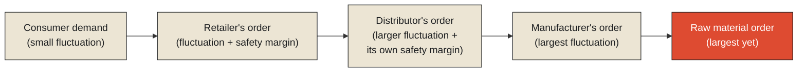

In the 1960s, the MIT researcher Jay Forrester documented a pattern in supply chains that has since been observed, repeatedly and reliably, across industries ranging from consumer goods to semiconductors: a small, ordinary fluctuation in end-consumer demand — a slightly busier week at retail, nothing dramatic — tends to produce a considerably larger fluctuation in the retailer's orders to their distributor, a larger fluctuation still in the distributor's orders to the manufacturer, and a larger fluctuation yet in the manufacturer's orders to their own raw material suppliers. This amplification, now generally called the [bullwhip effect](#bullwhip), happens even when every single party along the chain is behaving rationally, using reasonable forecasting and reasonable safety margins — the amplification isn't the result of anyone acting foolishly. It emerges from the structure of the chain itself: each party, reacting to the fluctuation in the orders they see from the party immediately below them, adds its own margin of caution on top, and that added margin becomes part of the fluctuation the next party up the chain has to react to in turn.

**This is the phenomenon this chapter's title is naming, and it's worth being precise about exactly what "contiguous" means here, because the word is doing real, specific work. Each stage of the supply chain sits directly adjacent to the next — contiguous, in the literal sense of touching, bordering, connected without a gap — and it's precisely that unbroken adjacency that lets a small disturbance at one end propagate all the way to the other, growing at each contiguous handoff rather than dissipating. A delay or a fluctuation doesn't need to travel through empty space to reach the far end of a coordinated system. It only needs a chain of directly touching, mutually reactive parts — which is exactly what makes it, in the end, contagious as well: the amplification spreads specifically because the chain has no gaps for it to lose momentum in.**

<Callout type="architectural-tension">
A tightly coordinated system, where every part reacts directly and immediately to the part next to it, is exactly the structure that lets a small disturbance amplify rather than dampen as it travels. The same tight coupling that makes coordination efficient under normal conditions is what makes a disturbance's growth almost frictionless once something does go wrong — there's no gap in the chain for the disturbance to lose energy crossing.
</Callout>

## Why rational behavior at every step still produces an irrational result

It's worth dwelling on the specific mechanism that makes the bullwhip effect so counterintuitive, because it isn't a story about bad decision-making anywhere along the chain. A retailer seeing demand tick up slightly doesn't just order slightly more — they also increase their safety stock a little, reasonably hedging against the possibility that the uptick continues or accelerates. Their distributor, seeing that larger-than-demand order arrive, reasonably increases their own safety stock further, on top of an order that was already inflated relative to the true underlying signal. By the time this reasonable, individually rational caution has compounded across several tiers of a supply chain, the manufacturer at the far end may be seeing order volume swings many times larger than the actual, original fluctuation in consumer demand that started the whole chain reacting — a genuinely large, costly signal, built entirely out of small, individually sensible decisions, each one made with only a local, contiguous view of the single link immediately below it, and no visibility into the true, much smaller signal all the way at the other end.

This connects directly to the previous chapter's most important lesson. The bullwhip effect isn't a failure anyone would necessarily notice while it's happening — no single link in the chain is doing anything wrong, and every individual order looks like a perfectly reasonable response to the order that triggered it. It's the systemic, cumulative consequence of many individually correct local decisions, made without global visibility, compounding through a tightly coupled, contiguous chain — precisely the kind of silent, structural cost that doesn't announce itself the way a crash or a blackout does, and is often only recognized, if it's recognized at all, once someone with visibility across the entire chain steps back and compares the far ends against each other.

<Callout type="unresolved">
No single party in a chain like this necessarily has enough visibility to recognize that amplification is happening at all — each one only sees the orders directly adjacent to them, coming from the link immediately below and going to the link immediately above. The amplification is only visible from a vantage point spanning the whole chain, a vantage point that, by the nature of how the chain is structured, none of its individual participants actually occupy.
</Callout>

## Where the same shape shows up beyond supply chains

The identical structural pattern — contiguous, reactive links, each one amplifying rather than absorbing whatever disturbance arrives from its neighbor — is exactly what turned a single sagging transmission line in Ohio into a blackout affecting fifty million people, examined two chapters earlier in this monograph. Each substation and transmission line in that grid reacted, reasonably, to the load being pushed onto it by its immediate neighbors, and those reasonable individual reactions compounded, contiguously, into a cascade that outran any single operator's ability to intervene — the bullwhip effect, running through electrical load instead of purchase orders, with the same underlying cause: tightly coupled, directly adjacent parts, each reacting locally, with no single participant holding a view broad enough to see the amplification building until it had already grown large enough to be catastrophic.

This is the general lesson worth carrying forward, and it's a harder one than "avoid tight coupling," because tight coupling — contiguous, directly reactive connections between parts of a system — is often exactly what makes ordinary, everyday coordination efficient. A supply chain where every tier reacts quickly to the tier below it is, under normal conditions, more responsive and less wasteful than one with long, sluggish delays between tiers. The same tight coupling that produces this everyday efficiency is precisely what removes the friction that would otherwise dampen a disturbance before it could grow large — there is no design that gets the responsiveness of tight coupling for free, without also inheriting some version of its amplification risk, and the genuinely difficult engineering and organizational problem is finding the right amount of deliberate slack — buffers, delayed reactions, information shared further up the chain than the immediately adjacent link — to dampen amplification without sacrificing so much responsiveness that the system becomes sluggish under entirely ordinary conditions.

## Where this leaves the monograph's final question

Every chapter in this monograph so far has examined coordination and its failures at the scale of an organization, a nation-building process, a firm, a regional power grid — large, but still bounded, systems with identifiable edges. This raises the natural, final question this monograph exists to close on: does any of this — the coordination cost, the consensus tradeoffs, the attribution difficulty, the silent failures, the contiguous amplification — actually hold at a scale larger than any single organization could ever be, in a system nobody designed as a single coherent whole at all, but that nonetheless has to coordinate, continuously, whether or not anyone is in charge of making sure it does? That is the subject of this monograph's final chapter, and there is no better place to look for the answer than the streets, pipes, and wires of an ordinary city.

<Figure n={1} title="Amplification, Tier by Tier" caption="Each tier's added safety margin becomes part of the signal the tier above has to react to — the amplitude grows with every contiguous handoff, even though every single reaction along the way was individually reasonable.">

</Figure>

<FormalNote>

**The bullwhip effect.** Order-variance amplification has an actual, derivable magnitude, not just a
qualitative direction. For a retailer forecasting demand with a simple moving average over $T$
periods, and a replenishment lead time of $L$ periods, the variance of the retailer's orders relative
to the variance of true end-consumer demand is bounded below by:

$$\frac{\mathrm{Var}(q)}{\mathrm{Var}(d)} \;\geq\; 1 + \frac{2L}{T} + \frac{2L^2}{T^2}$$

Even with no batching, no price fluctuations, and no other real-world complication layered on top,
this term alone — from demand-signal processing and lead time — guarantees $\mathrm{Var}(q) >
\mathrm{Var}(d)$ whenever $L > 0$: the mere act of forecasting from a finite window, combined with any
nonzero delay between ordering and replenishment, provably amplifies variance, before a single
irrational or malicious decision by anyone in the chain. Stack another tier that forecasts the same
way against the first tier's own already-amplified order stream, and the multiplication compounds —
each contiguous handoff applies its own factor of the same inequality on top of what it inherited.
</FormalNote>

## Elsewhere in this series

<Callout type="note">
This amplification is the same "no gap to lose momentum in" structure
[Every Queue Is a Negotiation with Time](../../reality/time/queue-time-negotiation) names for tightly
bounded queues — the responsiveness that makes tight coupling efficient under normal load is exactly
what removes the slack that would otherwise dampen a disturbance. It's also a variance problem in
the same technical sense as
[Noise Is Not Failure](../../reality/signals/noise-is-not-failiure)'s signal-to-noise ratio, just
compounding forward through a chain instead of being fixed at one sensor. The next chapter,
[The City Is a Distributed System](./the-city-is-a-distributed-system), asks whether this same
amplifying structure holds at the scale of a city nobody designed as a single system at all.
</Callout>