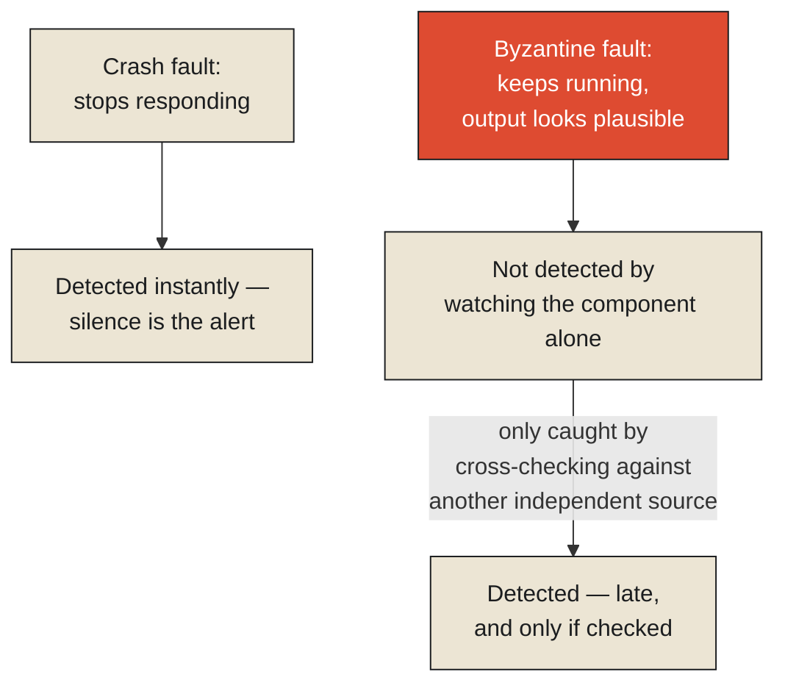

On August 1, 2012, the trading firm Knight Capital deployed new code to its production servers. Due to an error in the deployment process, old, previously retired test code was left active on one of the firm's eight production servers alongside the new code — code that had originally been used years earlier for a feature that was later repurposed, and that, under specific conditions, would trigger a large volume of unintended, rapidly repeating trades. When live market activity that morning happened to trigger those exact conditions, the system began executing an enormous number of erroneous trades, automatically, at high speed, across hundreds of stocks. The system did not crash. It did not throw an error. It did not pause for review. It kept running exactly as designed, confidently and continuously executing trade after trade that nobody at the firm intended, for approximately forty-five minutes, before the problem was identified and stopped — by which point the firm had accumulated losses reported at roughly $440 million, and the incident nearly ended the company entirely.

**This is worth taking as the sharpest possible illustration of why this chapter's title makes the specific, uncomfortable claim it does. A system that crashes announces, immediately and unmistakably, that something has gone wrong — the crash itself is the alert. A system that keeps running while doing the wrong thing announces nothing at all. It looks, from the outside, exactly like a system working correctly, right up until someone notices the accumulated consequences, by which point the damage may already be done at a scale a crash could never have reached, precisely because a crash would have stopped the damage from accumulating in the first place.**

<Callout type="architectural-tension">
A crash is a system failing loudly and immediately, which paradoxically limits the damage — nothing more happens once the system stops. Silent corruption is a system failing quietly while continuing to operate at full speed and full confidence, which means the damage keeps compounding for as long as nobody notices, and the eventual cost is bounded only by how long the silence lasts before someone catches it.
</Callout>

## Why "it's still running" is not the same as "it's still correct"

It's worth naming precisely what went wrong at the level of coordination, since that's the specific lens this monograph is built around. The old test code and the new production code were, in effect, two different processes running on the same infrastructure, each behaving according to its own internal logic, with no mechanism actively checking whether the two were coordinated with each other or in silent conflict. Neither piece of code was, strictly speaking, malfunctioning on its own terms — the old test code did exactly what it had always been built to do, and the new code did exactly what it had been built to do. The corruption existed entirely in the relationship between them: an uncoordinated interaction neither piece of code, examined individually, would ever reveal.

This is precisely the scenario [Byzantine fault tolerance](#byzantine) was formalized to address, though it's worth being careful about the specific analogy. In distributed systems, a "Byzantine" fault refers to a component that doesn't simply stop working — a crash fault, which is comparatively easy to detect and route around — but instead continues operating and producing output that looks superficially plausible while actually being wrong, whether through malicious intent or, as in Knight Capital's case, unintended misconfiguration. Byzantine fault tolerant systems are specifically engineered around the assumption that some components might behave this way — continuing to participate, continuing to produce output, while quietly corrupting the overall result — and defend against it by requiring agreement across multiple independent components rather than trusting any single one's output at face value, precisely because a single component's confident, uninterrupted operation is not, on its own, any evidence at all that its output can be trusted.

<Callout type="unresolved">
The entire discipline of designing for crash faults — redundancy, failover, automatic restarts — assumes the failing component will, at some point, stop and announce that it has stopped. A Byzantine fault violates that assumption at the root: the failing component never stops, never announces anything, and keeps behaving exactly like a healthy participant for as long as nobody independently verifies what it's actually producing.
</Callout>

## Why this failure mode is disproportionately expensive

It's worth being explicit about the actual mathematics of why silent corruption is so much more costly than a crash, on average, across a large number of comparable incidents. A crash bounds its own damage by definition — the system stops, and whatever state existed at the moment of the crash is, roughly, the full extent of the harm done. Silent corruption has no such built-in bound. Its cost accumulates continuously, at whatever rate the corrupted process operates, for exactly as long as the corruption goes undetected — and in a sufficiently fast, sufficiently automated system, that accumulation rate can be extraordinary. Knight Capital's forty-five minutes, at the speed modern automated trading systems operate, was enough time to generate hundreds of millions of dollars in losses; a slower, more visibly malfunctioning system would very likely have been caught, and stopped, at a small fraction of that cost, purely because a visible malfunction gets human attention immediately, while a silent one only gets attention once its consequences have already grown large enough to be undeniable.

This connects directly back to the previous chapter's blackout, where the alarm software's silent failure was the specific link in the causal chain that let a contained, local fault cascade into a continental disaster. The structural lesson is identical in both cases, even though one involved a power grid and the other a trading system: the actual danger in a coordinated system is rarely the failure that announces itself. It's the failure that keeps participating, keeps looking healthy, keeps being trusted by everything downstream of it, for exactly as long as nobody independently checks — and the cost of that unchecked interval is paid, in full, by whoever eventually discovers it, at whatever scale the silence allowed it to grow to.

## What this means for anything designed to run unattended

The uncomfortable, general lesson Knight Capital's incident leaves behind is that a system's continued operation is not, by itself, evidence of correctness, and building monitoring that only alerts on crashes or obvious errors is systematically blind to exactly the failure mode this chapter has been describing. A genuinely well-designed coordinated system needs some mechanism — independent verification, cross-checking between components, sanity limits on how much activity any single process is allowed to generate before triggering a mandatory pause — that doesn't simply assume a running, responsive system is a correctly functioning one. The absence of a crash was never evidence that Knight Capital's system was working. It was simply evidence that nothing had yet forced it to stop.

This leaves an important structural question the next chapter takes up directly, because both the blackout and Knight Capital's incident share a further, unexamined property: once something does go wrong in a tightly coordinated system, the consequences don't stay contained to wherever the original problem occurred. They spread, through the very connections that make the system coordinated in the first place, often accelerating rather than dampening as they travel — a phenomenon with its own well-documented name in supply chains, traffic networks, and, as it happens, power grids as well.

<Figure n={1} title="Crash Fault vs. Byzantine Fault" caption="A crash announces itself by stopping. A Byzantine fault keeps participating, keeps looking healthy, and produces output that has to be independently checked against something else to be caught at all.">

</Figure>

<FormalNote>

**Byzantine fault tolerance.** A crash-fault-tolerant system typically only needs a majority quorum,
$\lfloor n/2 \rfloor + 1$, because a crashed node simply stops participating and cannot vote for a
wrong answer. A Byzantine-fault-tolerant system has to survive nodes that keep participating *and*
actively report wrong information, which is a strictly harder problem: to guarantee agreement despite
up to $f$ Byzantine nodes, the classic result (Lamport, Shostak, and Pease, 1982) requires

$$n \geq 3f + 1$$

The intuition for the $3f+1$, not just $2f+1$: with $f$ Byzantine nodes lying, the honest nodes need
enough of a majority among themselves, even after subtracting the $f$ liars, to still outvote a
second, adversarial group of $f$ nodes that might falsely claim to be the honest majority. At
$n = 3f+1$, removing the $f$ actual liars still leaves $2f+1$ honest nodes — enough to form a
majority against any $f$-sized adversarial coalition, however it lies. Knight Capital's failure was
simpler than an adversarial Byzantine fault — nothing was lying maliciously — but it was structurally
identical: a component producing confident, plausible, wrong output, with no independent check in
place that could catch it before real damage accumulated.
</FormalNote>

## Elsewhere in this series

<Callout type="note">
The quorum arithmetic here is the harder, adversarial sibling of the majority quorum in
[Consensus Is Expensive](./consensus-is-expensive) — Paxos and Raft assume crash faults; Byzantine
fault tolerance assumes some nodes might be actively lying, and the quorum size has to grow to
compensate. The silent-failure danger this chapter names is the same shape as
[Context Decays](../../information/context/context-decays): both describe a system that keeps
looking intact while something load-bearing has already quietly stopped being true. The next chapter,
[Delay Is Contiguous](./delay-is-contiguos), takes up what happens once a failure like this — or even
an entirely ordinary fluctuation — starts propagating through a tightly coupled chain.
</Callout>