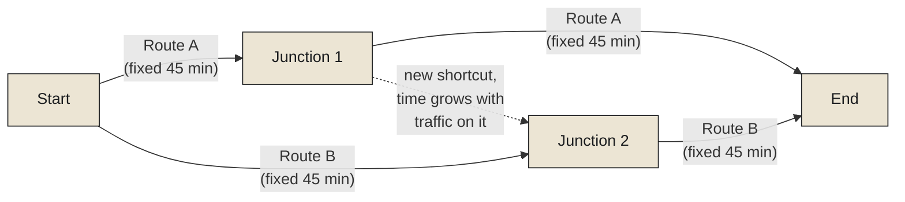

In 2003, the city of Seoul removed an elevated highway running through its downtown, the Cheonggyecheon expressway, restoring the stream it had been built over decades earlier. Conventional intuition says removing a major traffic artery from an already congested city should make congestion worse — less road capacity, the same number of drivers, an obvious recipe for gridlock. Traffic flow in the surrounding area measurably improved instead. This is not a fluke specific to Seoul. It's a real-world instance of a well-established result in traffic mathematics called Braess's paradox, first described by the mathematician Dietrich Braess in 1968: adding a road to a network can, under the right conditions, make overall travel times worse, and removing one can, under the mirror-image conditions, make them better — because every individual driver is making a locally rational choice about their own fastest route, with no visibility into or responsibility for how that choice affects everyone else's travel time, and the sum of everyone's locally rational choices does not automatically add up to the fastest outcome for the city as a whole.

**This is the claim this chapter's title is making directly: a city is a distributed system, not merely by loose metaphor, but in the precise, technical sense this entire monograph has been building toward. It has independent agents — millions of drivers, each making their own decisions with only local information. It has no single, central authority making every routing decision in real time. And it exhibits exactly the coordination failures this monograph has examined in bounded organizations and engineered systems — Braess's paradox is a traffic-network instance of the identical gap between locally rational decisions and globally efficient outcomes that produced the bullwhip effect's amplification in the previous chapter, just running through commuters instead of purchase orders.**

<Callout type="architectural-tension">
A system with no central coordinator is not automatically an uncoordinated system — it is a system whose coordination emerges entirely from the aggregate effect of many independent, locally-optimizing decisions, and that emergent coordination can be measurably, provably worse than what a genuinely centralized coordinator could achieve, even though nobody involved made an individually irrational choice at any point.
</Callout>

## The mathematics of everyone optimizing for themselves

Braess's paradox is a specific, sharp instance of a much broader mathematical framework: [game theory](#nash-equilibrium), the formal study of situations where multiple independent decision-makers, each pursuing their own interest, produce a collective outcome that depends on everyone's choices simultaneously. A driver deciding which route to take is playing a real game against every other driver on the network, whether or not they think of it that way — the travel time on any given route depends not just on that route's physical properties, but on how many other drivers also chose it, which depends in turn on everyone else's choices. The equilibrium this game settles into — the point where no individual driver could improve their own travel time by unilaterally switching routes — is what game theorists call a [Nash equilibrium](#nash-equilibrium), and Braess's paradox demonstrates precisely why a Nash equilibrium, however individually rational at every single point within it, is not guaranteed to be the best outcome available to the group as a whole. Removing the extra road in Seoul changed the structure of the game itself, shifting the equilibrium to a genuinely better one for almost everyone — not because any individual driver became more cooperative, but because the option that had been quietly making everyone's individually rational choices collectively worse was simply no longer available to choose.

## Changing the game instead of removing a road

Braess's paradox offers one lever for improving a distributed system's collective outcome: removing an option that's making the underlying game worse for everyone. It's worth examining a genuinely different lever, applied by a different city with a different tool entirely. Singapore introduced the world's first large-scale urban congestion pricing scheme, the Area Licensing Scheme, in 1975, later evolving into the more granular Electronic Road Pricing system in 1998 — a scheme that charges drivers a variable toll, adjusted by time of day and observed congestion levels, for entering specific zones of the city. Singapore didn't remove any roads. It changed the payoff structure of the underlying game every driver was already playing, by attaching a real, immediate cost to exactly the choice — driving into a congested zone at a congested time — that was contributing most to the city's collective congestion problem.

This is mechanism design, the formal discipline this refers to directly: rather than dictating what any individual driver must do, mechanism design works by re-engineering the incentives surrounding a decision so that when every participant continues acting in their own rational self-interest, as game theory assumes they will, the aggregate result that emerges is closer to the collectively efficient one, rather than further from it. Singapore's pricing scheme didn't need drivers to become more cooperative or more considerate of others' travel times. It simply made the individually rational choice, for a meaningful share of drivers at the margin, shift toward traveling at a different time, taking a different route, or using public transport instead — with the city's overall congestion improving as a direct, measured consequence. London's own congestion charge, introduced in 2003, was explicitly modeled on Singapore's earlier scheme, applying the same underlying mechanism-design logic to a different city's specific traffic patterns decades later.

<Callout type="unresolved">
Braess's paradox and Singapore's pricing scheme solve the same underlying problem — a gap between individually rational choices and collectively efficient outcomes — through two structurally different levers. One removes an option from the game entirely. The other leaves every option available but changes its price. Neither lever requires participants to behave less selfishly than before; both work by changing what selfish behavior, under the new rules, actually looks like.
</Callout>

## What this reveals about coordination without a coordinator

It's worth pulling back to state what these two examples together actually prove about cities as distributed systems, because it's a genuinely important structural claim this monograph has been building toward across every one of its previous chapters. A city has no single entity playing the role Raft's elected leader plays in a distributed database, no formal consensus protocol its millions of residents explicitly vote through before every decision, and no central authority with the visibility or the authority to dictate every individual's route, schedule, or behavior. And yet a city very clearly does coordinate — imperfectly, sometimes inefficiently, sometimes in ways that produce genuine paradoxes like Braess's, but coordinate nonetheless, at a scale and complexity that dwarfs the bounded organizations and engineered systems examined in the rest of this monograph. That coordination emerges, in its entirety, from the aggregate structure of the game every participant is playing — which means the actual lever available to anyone trying to improve a city's coordination isn't commanding better individual behavior. It's changing the structure of the underlying game, through removing an option, through pricing, through redesigned incentives, so that individually rational behavior, unchanged in its basic selfish logic, produces a better collective result simply because the game itself has changed.

## Closing the Coordination monograph

This closes the full arc this monograph has traced, from Brooks's overloaded software project through the Indian Constituent Assembly's expensive, imperfect consensus, through a blackout and a trading firm's silent catastrophe, through a supply chain's amplifying disturbances, to a city's traffic quietly playing out the identical mathematics at civilizational scale. Every one of these, examined closely, turns out to be the same underlying problem, worn differently: independent parts, each with only local visibility, needing to produce a coherent collective result, at a cost that is never zero and sometimes far larger than it first appears — a cost paid in coordination overhead, in the price of consensus, in the difficulty of tracing a failure back through a dependency chain no single party could see in full, in the silence of a corruption nobody detected until it had already compounded, in a disturbance that grew rather than faded as it crossed a chain of tightly coupled hands, and finally, in a city that coordinates itself, imperfectly, out of nothing more than millions of separate people each trying to get where they're going.

The final monograph in this series turns from how systems coordinate to the reason any of this coordination, or any model, memory, context, or observation examined across this entire series, was ever worth building in the first place: to enable an actual decision, made by someone, that changes something real about the world. That is the subject of Decisions, and it closes not just this monograph but the entire series — beginning with the very first claim this series ever made, that information exists to enable action, and asking, finally, exactly what that action costs, what it risks, and what it means to make it well.

<Figure n={1} title="Braess's Paradox, in Miniature" caption="Adding the dashed shortcut gives every driver a locally rational reason to use part of it — and the new Nash equilibrium is slower for everyone than the old one, with no shortcut, ever was.">

</Figure>

<FormalNote>

**Nash equilibrium.** In a game with players $1, \ldots, n$, each choosing a strategy $s_i$, a set of
strategies $(s_1^*, \ldots, s_n^*)$ is a Nash equilibrium if no player can improve their own outcome
by unilaterally switching strategies, given everyone else's choice stays fixed:

$$u_i(s_i^{*}, s_{-i}^{*}) \geq u_i(s_i, s_{-i}^{*}) \quad \text{for every alternative } s_i, \text{ every player } i$$

where $u_i$ is player $i$'s payoff (for a driver, negative travel time) and $s_{-i}^*$ is everyone
else's equilibrium strategy. Braess's classic network makes this concrete: with two fixed-cost routes
only, every driver splits evenly and each takes 45 minutes. Add a free, fast-looking connector between
the two routes' midpoints, and each driver's locally rational move — using part of the connector to
shave a few minutes off their own trip — is still individually correct given what everyone else is
doing, and the network reaches a *new* Nash equilibrium where every driver's travel time is longer
than the old equilibrium's 45 minutes. Nothing about any single driver's reasoning was wrong at any
point in this process.

**Price of Anarchy.** The gap Braess's paradox demonstrates has an exact name and an exact ratio:

$$\text{PoA} = \frac{\text{Cost of the worst Nash equilibrium}}{\text{Cost of the socially optimal outcome}}$$

$\text{PoA} = 1$ means selfish, uncoordinated behavior happens to reach the best possible collective
outcome anyway — no coordinator needed. $\text{PoA} > 1$ means it doesn't, and quantifies by exactly
how much: in some Braess-style networks, PoA can be shown to reach $4/3$ even under mild assumptions
about cost functions, meaning uncoordinated driving can cost a full third more, in aggregate travel
time, than what a genuinely central coordinator routing every car could achieve. Mechanism design —
Singapore's congestion pricing among them — works by reshaping the payoffs $u_i$ so that the resulting
Nash equilibrium moves closer to the social optimum, driving $\text{PoA}$ down toward $1$ without
requiring anyone to become less selfish.
</FormalNote>

## Elsewhere in this series

<Callout type="note">
Price of Anarchy gives this entire monograph's central claim an exact number: coordination cost,
consensus cost, attribution cost, and amplification cost are all, in one sense, contributors to
$\text{PoA} > 1$ — the gap between what a system's independent parts actually achieve and what a
genuinely omniscient coordinator could. Mechanism design's lever — changing the game rather than
commanding better behavior — is the same lever
[Caches Forget on Purpose](../../information/memory/caches-forget-on-purpose) uses when it chooses an
eviction policy: neither forces any component to behave differently, both change what a component's
existing, unchanged logic produces. This closes the Coordination monograph. The next monograph,
Decisions, has not been written yet.
</Callout>