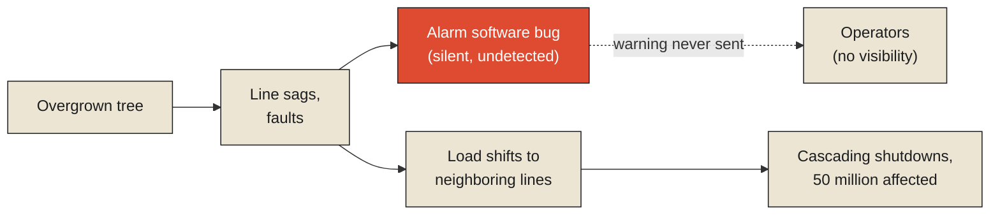

On August 14, 2003, over the course of about nine minutes, roughly fifty million people across the northeastern United States and parts of Canada lost electrical power, in what remains one of the largest blackouts in North American history. The subsequent joint US-Canada investigation, involving hundreds of investigators poring over data from a power grid spanning multiple states, provinces, and utility companies, eventually traced the root cause to a specific transmission line in Ohio that sagged into overgrown trees due to excessive heat load, triggering a fault. Under ordinary circumstances, this kind of localized fault would have been an isolated, manageable event. What turned it into a continental cascade was a second, independent failure: a software bug in the alarm system at the utility responsible for that line meant operators never received the warnings that would have let them respond before the fault propagated outward, triggering successive overloads and automatic shutoffs across an interconnected grid, each one pushing more load onto neighboring lines until the entire regional system began failing in a chain reaction that outran anyone's ability to intervene manually.

**This is worth taking seriously as a genuinely difficult case study in exactly the problem this chapter is named for. The blackout's most visible symptom — fifty million people without power — was instantly, unmistakably obvious. Its actual cause required an enormous, dedicated, months-long investigative effort across two national governments and dozens of separate organizations, sifting through interconnected dependency chains spanning a grid that no single operator, in the moment, could see in full. Knowing that something failed cost almost nothing. Knowing why cost an entire formal inquiry.**

<Callout type="architectural-tension">
In a tightly coordinated system with many interdependent parts, the visibility of a failure and the difficulty of explaining it are almost inversely related. The failure itself — the outage, the crash, the cascading shutdown — is usually immediately, unmistakably obvious to everyone affected. The specific causal chain that produced it, spanning dependencies distributed across parts of the system no single observer could see in full, is often the hardest and most expensive thing in the entire incident to actually establish.
</Callout>

## Why attribution is harder than detection

This series has already introduced causal inference directly, in the History monograph's examination of F1 post-race telemetry review, where the core distinction was correlation versus causation within a single, relatively contained system — one team, one car, one race. The 2003 blackout raises a genuinely harder version of the identical problem, because the causal chain here spans organizational boundaries that no single party has full visibility across. The utility whose line sagged into the trees didn't necessarily have complete visibility into how neighboring utilities' systems would respond to the resulting fault. The alarm software's bug, sitting quietly for who knows how long before that specific afternoon, wasn't something any single team was actively monitoring for, because nothing about its silent malfunction produced any symptom until the exact moment it mattered most. Establishing the true causal chain required reconstructing a dependency graph that crossed dozens of independent operators' boundaries — precisely the kind of provenance graph this series examined in the History monograph, now applied not to legal precedent but to which specific failures, in which specific order, actually caused which subsequent ones, across a system where each individual party could only ever see their own small piece of the whole.

This is the general shape of why attribution costs so much more than detection in any sufficiently coordinated, interdependent system. Detecting that something has gone wrong requires only that some observer, somewhere, notice a deviation from normal — the lights going out is not subtle. Establishing why it went wrong requires reconstructing a causal path through a dependency structure that, by the nature of a distributed system with many independent, loosely coordinated parts, was never fully visible to any single participant at any point in time, including the moment the failure was actually unfolding.

## What made this specific failure so hard to see coming

It's worth being precise about why the alarm software bug made this particular case so much harder than an ordinary equipment failure would have been. In a well-functioning system, a localized fault should produce a localized, visible warning, giving human operators the chance to intervene before consequences cascade outward. The alarm bug removed exactly that warning, silently, which meant the causal chain from the original tree contact to the eventual continental blackout ran, for a critical stretch, through a failure that produced no symptom at all until it was far too late for any single decision to contain it. This connects directly to a theme the next chapter in this monograph will take up in far more depth: a failure that announces itself loudly, the moment it happens, is usually far easier to trace and contain than one that fails silently, leaving no immediate trace, while the consequences of that silence accumulate somewhere else in the system entirely, discovered only once they've already grown large enough to be undeniable.

<Callout type="unresolved">
A dependency chain that runs through a silent failure is disproportionately expensive to reconstruct after the fact, precisely because the silent link in the chain left no trace at the moment it actually mattered. Investigators aren't simply tracing a chain of loud, well-documented events backward — they're often having to infer the existence of a missing link that produced no evidence of its own failure until long after the failure had already done its damage.
</Callout>

## What this costs organizations that never experience a blackout

It's worth generalizing beyond the specific, dramatic scale of a continental power failure, because the identical structural cost shows up, in smaller and less visible form, in essentially every organization running interdependent systems across separate teams. A production outage traced back through several microservices, each maintained by a different team, each with only partial visibility into how the others actually behave under load, faces a smaller-scale version of the identical attribution problem the blackout investigators faced: the outage itself is obvious the moment it happens; the actual causal chain connecting one team's seemingly unrelated change to another team's eventual failure often takes far longer to reconstruct than the outage itself took to occur, and the cost of that reconstruction — the analyst-hours, the cross-team coordination required just to compare notes, the specialized tooling built specifically to trace dependencies across organizational boundaries — is a real, ongoing tax that coordinated systems pay disproportionately as they grow more interdependent, whether or not any single incident is ever as dramatic as fifty million people losing power at once.

This leaves the sharper, more unsettling question the next chapter takes up directly, because the blackout's alarm-software failure was already gesturing at it. A visible failure, however costly to attribute, at least announces that something has gone wrong. What about a failure that never announces itself at all — a system that keeps running, keeps producing output, keeps looking, to every external observer, like it's working correctly, while quietly doing the wrong thing the entire time? That failure mode, it turns out, tends to cost considerably more than any blackout ever has.

<Figure n={1} title="Nobody's Full Dependency Graph" caption="Each party sees only its own edges. The full causal chain — tree, sagging line, silent alarm bug, cascading substations — only exists as a reconstruction assembled after the fact, from pieces no single investigator held at the time.">

</Figure>

## Elsewhere in this series

<Callout type="note">
This chapter doesn't need a new formalism of its own — it's applying two this series has already
built, at harder scale. The provenance graph from
[History Is Not a Database](../../information/history/history-is-not-database) is the exact structure
investigators had to reconstruct across dozens of utilities' boundaries, and the correlation-versus-
causation distinction from
[History Explains; State Executes](../../information/history/history-explains-state-executes) is the
one that separates the blackout's obvious symptom from its actual, dependency-spanning cause. The next
chapter, [The Most Expensive Bug Is the One that Never Crashes](./the-bug-that-never-crashes), takes
up the failure mode the alarm bug already previewed here: a component that keeps participating while
silently wrong.
</Callout>