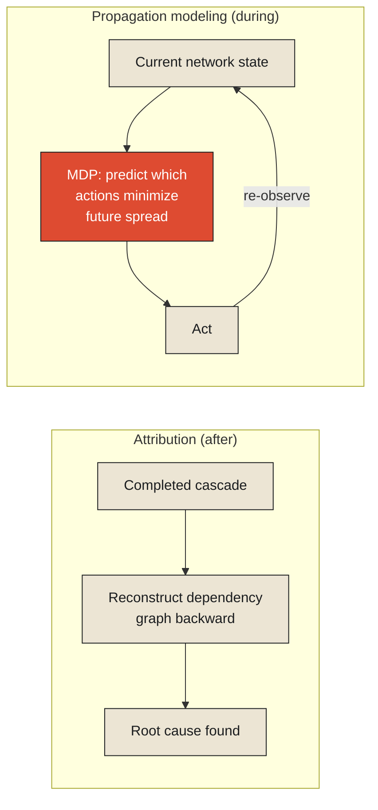

The Coordination monograph, earlier in this series, examined the 2003 Northeast Blackout as a problem of attribution — reconstructing, after fifty million people had already lost power, exactly which sagging transmission line and which silent alarm-system bug had caused the cascade. That examination asked a backward-looking question: given a completed failure, what caused it. This chapter asks the forward-looking counterpart, and it's a genuinely different engineering problem: given a disturbance that is *currently, actively propagating* through a network, how do you model its likely path well enough to intervene before it reaches its worst possible extent, rather than only being able to explain the full cascade once it's already over?

Power grid operators, in the years since 2003, have invested heavily in exactly this kind of forward-looking propagation modeling: real-time simulations that take a grid's current state — which lines are under stress, which substations are near their load limits, how the network's topology routes power around any given failure — and project forward, continuously, to estimate which specific components are at elevated risk of cascading failure if the current disturbance continues to spread, given how the network is actually wired together. This is a meaningfully different tool than the kind of after-the-fact causal reconstruction the earlier chapter examined. **It's not trying to explain a cascade. It's trying to see one coming, early enough that an operator still has a decision left to make about it — precisely the distinction this series drew, several monographs ago, between history that explains and state that executes, now applied specifically to a disturbance that is actively spreading through a network in real time.**

<Callout type="architectural-tension">
Explaining a cascade after it happens and predicting one while it's still unfolding are not the same capability, built from the same data, running at different speeds. They require genuinely different modeling approaches — one reconstructs a completed causal chain with the benefit of hindsight and complete data; the other has to commit to a probabilistic estimate of where a disturbance is heading, using necessarily incomplete, still-arriving information, while there is still time left to act on the estimate.
</Callout>

## Modeling the network as a sequence of decision points

A propagation-forecasting system of this kind is, formally, solving a sequential decision problem, and the mathematical framework built specifically for this structure is a [Markov decision process](#mdp): a model of a system evolving through a sequence of states, where at each step, an agent can take an action that influences which state comes next, and the goal is to choose actions, at each step along the way, that lead to the best overall outcome rather than simply the best immediate one. Applied to a spreading grid disturbance, each moment represents a state — which lines are currently stressed, which are still healthy — and the "action" available to an operator at each step might be rerouting load, shedding a specific portion of demand, or isolating a section of the network before the stress can propagate into it. A well-designed Markov decision process doesn't just estimate the disturbance's most likely single path forward. It estimates, at each decision point, which of the operator's available actions is most likely to lead to the best overall outcome across the range of ways the disturbance might actually continue to spread — a genuinely harder and more useful question than simply forecasting the single most probable trajectory.

This connects directly to [control theory](../../reality/observations/every-observation-is-already-history), the discipline this series has touched on before, formalized around exactly the kind of continuous predict-and-correct loop a propagation model has to run in practice: observe the network's current stressed state, predict how that stress is likely to propagate given the network's topology, take a corrective action based on that prediction, then immediately re-observe the network's new state — now shaped partly by the action just taken — and repeat. This loop never fully closes, for the same structural reason the Apollo guidance computer's predict-correct cycle never closed, examined much earlier in this series: every observation feeding into the model is already slightly stale by the time it's acted on, and the corrective action itself takes real time to have its intended effect, during which the disturbance keeps evolving. A propagation model built without this loop — one that produces a single, static forecast and stops — is solving a fundamentally easier and less useful problem than one built to keep observing, predicting, and correcting continuously as the real disturbance unfolds.

<Callout type="unresolved">
A system that models where a disturbance currently is describes the present. A system that models where a disturbance is heading is doing something the rest of this series has insisted is the actual purpose of any model: predicting, not merely describing — and the entire value of a propagation-forecasting system lives in exactly how much earlier it can flag a likely trajectory than an operator relying only on direct observation of the current state ever could.
</Callout>

## What this requires, that a purely reactive system doesn't

It's worth being explicit about why building a genuine propagation model is a materially harder undertaking than building a system that simply reacts to problems as they become directly visible. A reactive system needs only accurate, timely observation of the network's current state — exactly the discipline this series covered at length under Observations. A propagation model needs that same accurate observation, plus an explicit, validated model of *how disturbances actually spread through this specific network's topology* — which components are structurally positioned to absorb stress, which are positioned to transmit or amplify it, and how quickly that propagation tends to unfold given the network's real, physical connectivity. Building that structural model well is a genuinely separate engineering effort from building good observability, and a system with excellent observability but no propagation model can see a problem clearly the moment it becomes visible and still have no meaningful head start on predicting where it's going next.

*A note on where this chapter currently stands: this treatment draws on general, well-documented practice in grid-cascade modeling to establish the underlying principle. Transit Intelligence, the author's own concrete decision-support system for exactly this class of problem in public transit networks, is expected to generate direct, first-hand findings and methods that will substantially deepen — and in places likely revise — the specific claims made here, once that project has produced results to draw on.*

This raises the next question this monograph needs to answer directly, and it's one a propagation model alone doesn't resolve. Modeling how a disturbance is likely to spread through a network depends entirely on understanding the network's actual structure — which connections matter, which don't, and how information about delay should really be thought of moving through it. That question turns out to have a sharper, more specific answer than "look at the timetable," and it's the subject of the next chapter.

<Figure n={1} title="From Reconstruction to Prediction" caption="Both start from the same observed state. One looks backward through a completed cascade; the other looks forward through a still-open one, re-running the loop every time new observations arrive.">

</Figure>

<FormalNote>

**Markov decision process.** An MDP is defined by a set of states $S$, actions $A$, a transition
function $P(s' \mid s, a)$ giving the probability of landing in state $s'$ after taking action $a$ in
state $s$, and a reward $R(s,a)$. The object being solved for is a policy $\pi(s)$ — which action to
take in each state — that maximizes expected cumulative reward. The value of following the best
possible policy from state $s$ satisfies the Bellman equation:

$$V^{*}(s) = \max_{a} \left[ R(s,a) + \gamma \sum_{s'} P(s' \mid s, a)\, V^{*}(s') \right]$$

$\gamma$ is a discount factor weighing future reward against immediate reward. Read plainly: the best
achievable value of a state is whatever action's immediate reward, plus the discounted value of
wherever that action is likely to lead, is largest. For a spreading grid disturbance, $s$ is which
lines are currently stressed, $a$ is reroute/shed-load/isolate, and solving the Bellman equation
means finding not the single most likely future, but the action that performs best averaged across
every way the disturbance could still evolve.
</FormalNote>

## Elsewhere in this series

<Callout type="note">
The predict-correct loop this chapter names is the Kalman filter's own structure, given its full
formal treatment in
[Every Observation Is Already History](../../reality/observations/every-observation-is-already-history)
— an MDP is that same loop with a decision, not just an estimate, at every step. The backward-looking
attribution problem this chapter deliberately sets aside was the subject of
[The Cost of Knowing Why](../coordination/the-cost-of-knowing-why), two chapters and one monograph
earlier in this series. The next chapter,
[Why Transit Networks Behave Like Graphs, Not Schedules](./why-transit-networks-behave-like-graphs),
takes up the network-structure question an MDP's transition function $P(s'\mid s,a)$ depends on but
doesn't itself supply.
</Callout>