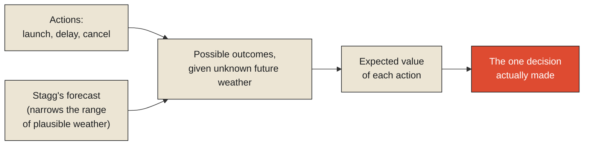

In the first days of June 1944, the Allied invasion of Normandy was scheduled for June 5th, and the weather was wrong. A British meteorological team led by Group Captain James Stagg had been tracking a volatile, unsettled weather pattern across the Atlantic for days, and by June 4th, Stagg reported to General Dwight Eisenhower that conditions on the 5th would be entirely unsuitable for the invasion — high seas, low cloud cover, exactly the conditions that would ground the necessary air support and make an amphibious landing catastrophically dangerous. Eisenhower postponed the invasion by a day, a decision that, given the enormous logistics already in motion — over 150,000 troops, thousands of ships and aircraft, an invasion force that could not simply be held in position indefinitely without the secrecy and readiness of the operation deteriorating — carried its own severe risks.

Stagg's team then delivered a second, harder forecast: a narrow window of marginally improved conditions was likely to open on June 6th, before the weather deteriorated again, and the window was neither long nor certain. Eisenhower had to decide, on the strength of a forecast that even its own authors described with real uncertainty, whether to launch the largest amphibious invasion in history into a break in the weather that might not hold, or delay again into worse logistical and strategic risk with no guarantee the weather would improve at all in the near future. He launched. The invasion proceeded on June 6th, and the weather, as forecast, held just long enough.

**This is worth treating as the sharpest possible illustration of the claim this chapter, and this entire final monograph, is built around: the forecast itself changed nothing about the war. It was not an action. It moved no troops, sank no ships, altered no outcome on any beach. Its entire value, the only value it ever had, was in making Eisenhower's decision — one specific, irreversible commitment of an enormous invasion force to a specific date — better informed than it would otherwise have been. Information that never connects to a decision like this one is not merely less useful. In the fullest sense this series has been building toward, it has not yet done the one thing information exists to do.**

<Callout type="architectural-tension">
A forecast, a measurement, a model, a dashboard — none of these change anything about the world simply by existing, however accurate they are. They exist entirely in service of a decision that has not yet been made, and their value is inseparable from whether that decision, once made, turns out better than it would have been without them. Information with no decision waiting on it is not wrong. It is simply not yet finished doing its job.
</Callout>

## Weighing a decision that cannot wait for certainty

It's worth being precise about the actual structure of Eisenhower's choice, because it's a clean, high-stakes instance of the formal framework decision theory exists to provide: a set of possible actions — launch, delay again, cancel entirely — each with a range of possible outcomes depending on facts not yet known with certainty, here the weather's actual behavior over the following two days, and a decision-maker who has to choose an action now, despite that irreducible uncertainty, because delaying the choice itself carries a real and mounting cost. Decision theory formalizes exactly this structure, and the specific tool for reasoning about it under uncertainty is [expected utility theory](../models/models-predict-more-than-they-describe#decision-theory): weighing each possible action by the value of its possible outcomes, multiplied by how likely each outcome is, and choosing the action with the best expected result overall, rather than the action that happens to look safest against any single, particular fear.

Eisenhower's decision, reconstructed this way, involved genuinely asymmetric stakes on both sides. Launching into weather that deteriorated as badly as the original June 5th forecast predicted risked a catastrophic, possibly war-altering failure on the beaches. Delaying again risked the secrecy of the entire operation collapsing, the invasion force's readiness degrading, and — critically — no guarantee that a better window would open before those risks compounded further. Stagg's forecast didn't remove this asymmetry or resolve the uncertainty. It narrowed the range of what was actually known well enough that Eisenhower's expected-utility calculation, made under real, acknowledged uncertainty, could tilt clearly enough toward one action over the others to actually commit to it — which is the entire, complete function a piece of information can perform in a decision like this. It cannot make the outcome certain. It can only make the choice, given the uncertainty that remains, better than it would have been blind.

## Why description was never the point, here either

This connects directly back to a claim the Models monograph made forcefully: that prediction, not description, is the actual reason models exist, with description serving as a mere byproduct. Stagg's forecast makes the identical point at human stakes rather than mathematical ones. Nobody needed Stagg's team to describe what the weather currently was on June 4th — that was already directly observable by anyone standing outside. What Eisenhower needed, and what the entire apparatus of Second World War meteorology existed to provide at that moment, was a claim about weather that hadn't happened yet, specific enough and reliable enough to inform an action that could not be delayed until the weather simply arrived and became observable on its own. A forecast that only became available once the weather it described was already happening would have been true, complete, and entirely useless — precisely the same failure this series examined, in a different guise, when it looked at dashboards that explain completed events rather than active ones, and models that describe the past more capably than they anticipate the future.

<Callout type="unresolved">
The value of any piece of information can be measured, in principle, by comparing the quality of the decision made with it against the quality of the decision that would have been made without it. This is often the only honest test of whether an information system is actually working — not whether its outputs are accurate in some abstract sense, but whether the decisions downstream of it are measurably better for its having existed.
</Callout>

## What this means for closing the entire series here

This is why the final monograph of this entire series has to end on decisions rather than on models, coordination, or any of the layers examined before it. Every idea this series has built — that reality precedes information, that representation is always lossy, that observation has a cost, that state is a compressed residue of a process, that memory forgets on purpose, that context can decay invisibly, that models are deliberate compressions built for a purpose, that coordination among independent parts is expensive and imperfect — all of it exists, ultimately, in service of the single act Eisenhower performed on the night of June 5th, 1944: a decision, made under real uncertainty, that changed something actually true about the world. Everything this series has examined about how systems capture, hold, and reason about information is, in the end, infrastructure built to make moments exactly like that one slightly less blind than they would otherwise be.

This raises the practical question the rest of this monograph exists to pursue in increasing operational depth. If information's whole purpose is enabling a decision, and a decision like Eisenhower's has to be made once, under pressure, on the available evidence — what does it actually take to build a system specifically designed to support decisions like this continuously, not as a single historic gamble but as an ongoing operational discipline? That is the subject of the next chapter, and it begins with the specific, technical problem of modeling not just where a disruption currently is, but where it's actually heading next.

<Figure n={1} title="The Structure Underneath Eisenhower's Choice" caption="Stagg's forecast didn't remove the uncertainty in the middle column. It narrowed it enough that the expected-value comparison on the right stopped being a coin flip.">

</Figure>

## Elsewhere in this series

<Callout type="note">
Expected utility theory already got its full formal treatment, with the actual $\arg\max$ over
probability-weighted outcomes, in
[Models Predict More than They Describe](../models/models-predict-more-than-they-describe) — this
chapter doesn't need to restate it, only apply it to the highest-stakes example this series uses. The
"prediction over description" claim reprised here closes a loop opened in that same chapter and in
[Every Observation Is Already History](../../reality/observations/every-observation-is-already-history).
The next chapter, [Designing for Delay Propagation Analysis](./designing-for-delay-propagation-analysis),
takes up what it takes to make this kind of decision-support continuous rather than a single wartime
gamble.
</Callout>