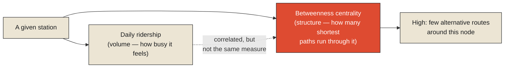

The Delhi Metro's interchange stations — Rajiv Chowk, where the Blue and Yellow lines cross; Kashmere Gate, where the Red, Yellow, and Violet lines meet — are, by the network's own operational necessity, structurally different from an ordinary stop in a way that goes well beyond simply having more platforms. An ordinary station's failure, whether from a technical fault, overcrowding, or an operational disruption, affects riders on one line, over one stretch of track, with alternative stations typically still reachable nearby. A major interchange's failure affects riders trying to move between multiple lines simultaneously, at a specific structural chokepoint the rest of the network has no easy way to route around — precisely because the interchange's entire purpose is being the place where otherwise-separate lines actually connect, which makes it, by the same logic, one of the very few places in the network where that specific connection exists at all.

This asymmetry — some components' failure barely registering at the network level, others' failure threatening to fragment the entire system — is the actual subject this chapter's title is naming, and it deserves a more precise treatment than simply pointing at busy stations and calling them important. **Criticality, in a formal engineering sense, is not the same as volume or usage. A station can carry an enormous number of daily riders and still be relatively non-critical, if the network offers several genuinely comparable alternative routes around it. A much quieter station can be extraordinarily critical, if it happens to be the network's only connection between two otherwise-separate regions — and knowing which is which requires actually measuring the network's structure, not simply looking at which stations feel busiest.**

<Callout type="architectural-tension">
Fragility in a network is a property of structure, not of scale. A component's importance to the network's overall resilience depends on how many alternative paths exist around it if it fails — a question about topology, not about how much traffic that component happens to carry on an ordinary day.
</Callout>

## Measuring criticality directly, rather than guessing at it

Network science offers formal, computable measures specifically built to answer this question rigorously rather than intuitively. [Betweenness centrality](#betweenness), one of the most widely used, measures how many of the shortest paths between all pairs of points in a network actually pass through a given node — a station with high betweenness centrality sits on an unusually large share of the network's most efficient routes, meaning its removal would force a disproportionately large number of journeys onto longer, less efficient alternatives, or in the worst case, onto no viable alternative at all. This is a formal, calculable answer to exactly the question raised above: which stations are structurally critical isn't a matter of intuition or observed daily ridership, it's a property that can be computed directly from the network's actual connective structure, and it frequently surfaces stations that don't feel especially busy on an ordinary day but would cause outsized disruption if removed.

Designing deliberately around this measured criticality is a real, documented practice in transit network engineering, generally grounded in operations research: the discipline of optimizing complex systems under real, binding constraints — budget, physical space, construction feasibility — rather than in an idealized, unconstrained environment. A transit agency identifying its network's highest-criticality interchanges through betweenness centrality or similar measures faces a genuine operations research problem in deciding where to invest limited resilience funding: additional platform capacity, backup power systems, alternative routing options, or entirely new connecting lines specifically designed to give the network a second path around its most structurally critical points — all of it constrained by a budget nowhere near large enough to harden every station equally, which makes correctly identifying the truly critical few, rather than spreading resilience investment evenly across the whole network, the entire point of measuring criticality accurately in the first place.

<Callout type="unresolved">
A network with no measured understanding of its own criticality structure will tend to invest in resilience wherever disruption is most visible or most recently experienced, rather than wherever disruption would actually be most damaging. Visibility and criticality are correlated, but they are not the same thing, and a network optimizing for the wrong one can spend real resilience budget on components that were never the network's true structural weak points.
</Callout>

## Learning which investments actually reduce fragility over time

It's worth noting that identifying critical nodes through network measures like betweenness centrality is only the first half of the problem — the second half is determining which specific interventions, among the many theoretically available, actually reduce a given node's fragility most effectively for the resources available, and that determination is rarely obvious in advance. This is where [reinforcement learning](#reinforcement-learning) offers a genuinely useful framing, distinct from the multi-armed bandit problem examined in the previous chapter's dispatcher decision: rather than a single repeated choice with a fixed set of options, a transit agency's resilience investment strategy unfolds over years, across many different interchange stations, each intervention producing observable results — did adding a backup route at this interchange actually reduce disruption when a later fault occurred there — that inform which kinds of interventions are worth prioritizing at the network's other critical points going forward. An agency that tracks these outcomes systematically is, in effect, running a real, if slow and expensive, reinforcement learning process: learning, from the accumulated evidence of past interventions and their measured effect on actual disruption events, which classes of resilience investment reliably reduce fragility and which, however intuitively appealing, turn out not to move the needle much at all.

*A note on where this chapter currently stands: the Delhi Metro's interchange design and general network-criticality practice establish the underlying principle on well-documented, independent grounds. Transit Intelligence, built to measure and reason about exactly this kind of structural fragility across a transit network's real operational data, is expected to provide direct, first-hand findings and a considerably more precise treatment of these measures once the project has results to draw on.*

<Figure n={1} title="Busy Is Not the Same as Critical" caption="Ridership measures how much a station is used on an ordinary day. Betweenness centrality measures how much of the network's connectivity would break if that station were removed — a structural question a traffic count alone can't answer.">

</Figure>

<FormalNote>

**Betweenness centrality.** For a node $v$, betweenness centrality sums, over every pair of other
nodes $s$ and $t$, the fraction of shortest $s$-$t$ paths that pass through $v$:

$$C_B(v) = \sum_{s \neq v \neq t} \frac{\sigma_{st}(v)}{\sigma_{st}}$$

where $\sigma_{st}$ is the total number of shortest paths between $s$ and $t$, and $\sigma_{st}(v)$
is how many of those pass through $v$. A node with $C_B(v) = 0$ lies on no shortest path between any
other two nodes — removing it changes nothing about how efficiently the rest of the network reaches
itself. A node with high $C_B(v)$ sits on a large share of the network's most efficient routes, so
removing it forces many journeys onto longer paths, or, if $v$ was the only connection between two
regions, onto no path at all. This is computable directly from the network's topology, independent of
how much daily traffic $v$ happens to carry.

**Reinforcement learning.** Where a multi-armed bandit assumes a single, unchanging state, RL
generalizes to the full Markov decision process introduced two chapters earlier: an agent doesn't
know the transition function $P(s'\mid s,a)$ or reward function $R(s,a)$ in advance, and has to learn
a good policy $\pi$ purely from observed outcomes of actions actually taken. A transit agency
deciding where to invest resilience funding, then observing years later whether that investment
actually reduced disruption, is running exactly this loop — learning $R$ empirically, one slow,
expensive intervention at a time, rather than having it specified up front.
</FormalNote>

## Closing the Decisions monograph, and the series it completes

This closes the arc this final monograph has traced, from a single wartime forecast that had to enable one irreversible decision, through a system built to predict where disruption is heading rather than merely explain where it came from, through the structural reason a good enough network stops needing to be consulted as a schedule at all, through the precise anatomy of what happens when that graceful absorption fails, to the formal measurement of exactly which components a network's fragility actually depends on. Every one of these chapters has been circling the same claim from a different angle: information, in every form this series has examined across every monograph, exists to make some specific decision better than it would otherwise have been — and a system's real, measurable quality is inseparable from how well it serves that purpose, under real constraints, with real consequences, for someone who actually has to choose.

This is the final monograph of the series, and it closes with a return to where the entire project began.

## Elsewhere in this series

<Callout type="note">
Betweenness centrality's shortest-path counting reuses the same relaxation machinery introduced in
[Why Transit Networks Behave Like Graphs, Not Schedules](./why-transit-networks-behave-like-graphs#shortest-path)
— criticality and routing are two different questions asked of the identical underlying shortest-path
structure. Reinforcement learning's assumption-free version of an MDP closes the loop opened in
[Designing for Delay Propagation Analysis](./designing-for-delay-propagation-analysis#mdp): one
chapter assumed the transition and reward functions were known: this one asks what happens once they
have to be learned instead. This closes the Decisions monograph and, with it, the Reality, Information,
and Computation tracks in full. The series' closing synthesis, drawing every track together in one
place, is
**[The Physics of Information Systems](./the-physics-of-information-systems)**.
</Callout>