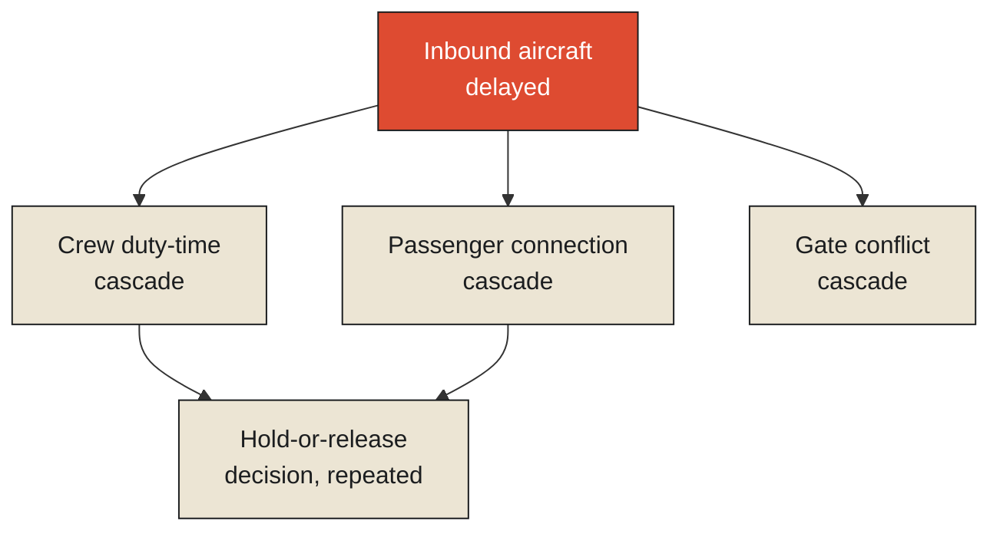

Commercial airlines have a formal, named discipline for exactly the phenomenon this chapter's title asks about: irregular operations, or IROPS, the operational category covering everything that happens once a flight schedule stops running as planned. A single inbound aircraft arriving late — because of weather at its origin, a mechanical delay, air traffic control holding — doesn't stay a single, isolated problem. It's worth dissecting the actual anatomy of what happens next, step by step, because each stage of the cascade is a distinct, identifiable link, and the chain as a whole is a precise, real-world instance of exactly the propagation and coordination failures this series has examined throughout its final two monographs.

The late aircraft's own crew, scheduled for a specific duty period bounded by strict regulatory rest requirements, may now be at risk of reaching their maximum allowed duty time before their next scheduled flight, forcing the airline to find a replacement crew on short notice — often not immediately available, since crew scheduling is itself a tightly optimized system with little slack built in. Passengers booked on connecting flights from that late aircraft may miss their next departure, requiring rebooking onto later flights that may themselves already be full, cascading their disruption onto a second, originally unrelated flight's passenger manifest. The gate the late aircraft was assigned to may now be occupied when the next scheduled aircraft needs it, forcing a gate reassignment that can itself delay the next aircraft's boarding process. **Each of these is a separate, traceable consequence of the original delay, propagating outward through a genuinely different operational dependency — crew scheduling, passenger connections, gate assignment — and the actual cascade an airline experiences on a bad weather day is the accumulated sum of dozens of these individual chains, each one following its own distinct path outward from an original, comparatively small delay.**

<Callout type="architectural-tension">
A missed connection is never a single event. It is the visible symptom of several genuinely separate propagation chains — crew, passengers, aircraft, gates — that happen to share a common root cause, each one following its own distinct dependency structure outward from that shared origin, at its own pace, with its own set of possible interventions available at each step.
</Callout>

## The decision a dispatcher keeps having to make

At the center of this anatomy sits a specific, recurring operational decision that airline dispatchers and gate agents make constantly, often under real time pressure: whether to hold a departing flight briefly for a small number of passengers connecting from a delayed inbound flight, or release it on time and let those passengers miss their connection, to be rebooked. This decision has a genuinely interesting mathematical structure, because it isn't a one-time choice made with complete information — it's a repeated decision, made across many flights, many days, many delay scenarios, where the dispatcher is continuously learning, from the outcomes of past hold-or-release decisions, which situations tend to justify holding and which tend not to.

This is precisely the structure a [multi-armed bandit problem](#bandit) is built to formalize: a decision-maker facing repeated choices between several options with uncertain payoffs, where each choice provides some information about that option's true value, and the decision-maker has to balance exploiting the option that currently looks best against continuing to explore other options in case the current best guess is wrong. A dispatcher deciding whether to hold a flight is weighing a real, immediate cost — delaying an already-boarded planeload of passengers, disrupting the downstream schedule of that aircraft's remaining flights that day — against the benefit of the connecting passengers making their flight and avoiding a costly rebooking and their own downstream disruption. Over many such decisions, a dispatcher — or, increasingly, an algorithmic decision-support system built to formalize this exact tradeoff — refines a sense of which situations, based on the size of the delay, the number of connecting passengers, and the downstream schedule impact, actually justify holding, gradually converging on better decisions specifically because each individual choice, whether it turns out well or poorly, provides real information for the next one.

<Callout type="unresolved">
There is no universally correct answer to whether a given connection should be held, because the right answer depends on a genuine tradeoff between costs that are rarely directly comparable — minutes of delay for one planeload of passengers against a missed connection for a smaller group of others. What a well-designed decision-support system can offer is not a way to eliminate this tradeoff, but a way to make it consistently, using the accumulated evidence of how similar past tradeoffs actually played out.
</Callout>

## Why the anatomy matters more than the symptom

It's worth stating why dissecting the cascade this precisely, rather than simply noting "a delay caused further delays," actually matters operationally. Each distinct propagation chain in this anatomy — crew, passengers, gates — has its own specific point, or points, where intervention is possible, and those points are different from each other. A crew-timeout cascade can sometimes be prevented earlier, by proactively identifying at-risk crew pairings well before the duty-time limit is reached and arranging a relief crew in advance. A passenger-connection cascade is often better managed by rebooking proactively the moment a delay becomes likely to cause a miss, rather than waiting until the connection is actually missed and passengers are already stranded at a gate. A gate-conflict cascade might be resolved simply by reassigning gates further in advance, before the conflict becomes unavoidable. Treating "the delay caused problems" as a single, undifferentiated event, rather than as several genuinely distinct chains each with their own specific intervention points, means missing the chance to act early on whichever specific chain still has time left to be managed before it fully plays out.

*A note on where this chapter currently stands: airline IROPS practice is a real, independently documented operational discipline that establishes this chapter's underlying claims on its own terms. Transit Intelligence, built specifically to trace exactly this kind of multi-chain propagation through public transit networks rather than airline operations, is expected to provide direct, first-hand findings and a more precise account of exactly this anatomy once the project has results to draw on.*

This raises the final operational question this monograph needs to address before it can close the series. If some disruptions cascade into dramatic, multi-chain consequences and others, seemingly similar in size, get absorbed by the network with barely a ripple, what actually determines which components of a network are the ones whose failure genuinely threatens the whole system, and which are safely redundant? That is a question about fragility, specifically, and it deserves a precise, measurable answer rather than an intuitive one.

<Figure n={1} title="One Root Cause, Three Independent Chains" caption="Crew, passengers, and gates don't share a mechanism — they share a trigger. Each chain has its own pace and its own points where an early intervention could still change the outcome.">

</Figure>

<FormalNote>

**Multi-armed bandit.** Each "arm" — hold or release, in this chapter's case — has an unknown true
expected payoff $\mu_i$; a dispatcher wants to maximize cumulative payoff across many repeated
decisions without knowing the $\mu_i$ in advance. Regret, the standard way to score a bandit
strategy, is the gap between what an omniscient dispatcher (always picking the best arm) would have
earned and what the actual strategy earned:

$$\text{Regret}(T) = \sum_{t=1}^{T} \left(\mu^{*} - \mu_{a_t}\right)$$

A common strategy, Upper Confidence Bound (UCB), picks the arm maximizing $\bar{x}_i + \sqrt{2\ln(t)
/n_i}$ at each step — its observed average payoff $\bar{x}_i$ plus a bonus that shrinks as an arm is
tried more ($n_i$ grows) and grows for arms tried rarely, deliberately favoring exploration of
under-tried options early and converging toward the best-known option as evidence accumulates. This
is the exact shape of what a dispatcher, or an algorithmic decision-support system standing in for
one, is doing every time a hold-or-release decision plays out and its outcome updates the running
sense of which situations are actually worth holding for.
</FormalNote>

## Elsewhere in this series

<Callout type="note">
A bandit is the special case of the Markov decision process from
[Designing for Delay Propagation Analysis](./designing-for-delay-propagation-analysis#mdp) where
there's only one state and the action taken now doesn't change what state comes next — only which
reward you happen to sample. The next chapter,
[Measuring Fragility in Public Infrastructure](./measuring-fragility-in-public-infrastructure), takes
up the harder, longer-horizon version of this same explore/exploit question, applied to which
resilience investments actually reduce a network's fragility.
</Callout>