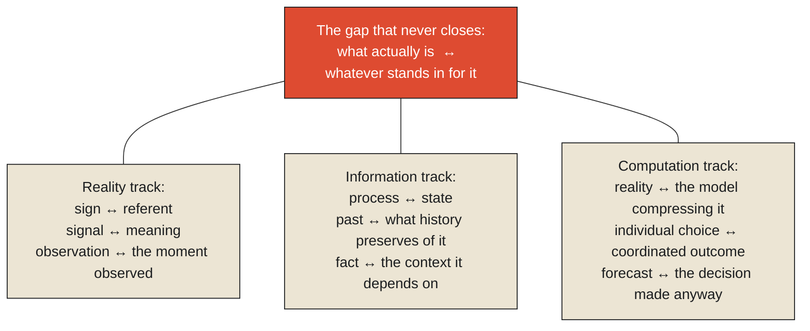

Say the word "fire" out loud, in an empty room. Nothing burns. Nothing warms. Nothing lights up the dark. This is the first sentence of the first article this entire series ever published, and it is worth returning to now, at the very end, because everything written between that sentence and this one has been, in a real sense, a single, sustained argument about exactly why saying "fire" doesn't burn anything — an argument that took forty-nine articles, eleven monographs, and three tracks to make in full, and that can now, finally, be stated in one place, end to end.

**The word and the flame are different kinds of thing. That was the claim this series opened with. Everything since has been an account of exactly how much has to happen, and how much can go wrong, in the space between the two — between a sign and what it signifies, between a system and the reality it's trying to hold onto, between a decision and the world it's meant to change.**

<Callout type="architectural-tension">
This series never claimed to be about software. It used software constantly, because software is where these constraints are currently easiest to observe and name. But the constraints themselves — that representation is never the thing represented, that information arrives late, that observation has a cost, that coordination among independent parts is expensive, that every model is a deliberate compression built for a purpose — were never really about code. They were about what it takes for anything, anywhere, to know something about the world and act on it. That is what makes this a book about physics, and only incidentally a book about computers.
</Callout>

## Retracing the arc, once, in full

It's worth walking the whole structure one final time, because each piece was built to be understood on its own, and the real argument only becomes visible once they're seen together.

The Reality track established the ground everything else stands on. Information is never reality itself — a sign, however fast or accurate, is categorically different from its referent, the way a banknote is not gold and a diagnosis code does not wheeze. Every representation is a chosen compression, shaped by the purpose it serves, the way a nautical chart happily omits inland roads and a Mercator projection happily distorts Greenland's size in exchange for a bearing a sailor can actually steer by. And whatever a representation discards does not simply vanish — complexity, once removed from view, relocates, the way a washing machine's one dial hides an entire mechanical system behind it, and someone, somewhere, has agreed to hold what the dial no longer shows.

The Information track picked up from there and asked what a system actually does with signals once they exist. It captured them, at a cost that is never zero — a sampling rate is a decision about which frequencies of reality a system can even see, and noise is never an objective fact but a label for whatever nobody yet has a theory to explain. It held them as state, a compressed residue of a process rather than the process itself, and it discovered that even a perfectly kept state has to reckon with historical truth being harder than current truth, because what was believed at the time and what's understood now are not always the same claim. It built memory deliberately narrow and fast, forgetting on purpose because a cache that never forgets becomes indistinguishable from the slow, complete record it existed to avoid consulting. And it closed on context, and the hardest claim the whole track was building toward: meaning is never stored inside a single piece of state, waiting to be found by looking harder. It emerges only from a relationship — a hieroglyph beside a name already known, a number beside the unit that determines what it's actually claiming — and a fact separated from that relationship is not incomplete. It's ambiguous in a way that can be silently, catastrophically wrong.

The Computation track took every one of these constraints and asked what happens once they're put to use. A model is never a neutral copy of reality — it's a deliberate compression built around a decision, the way Beaufort's thirteen wind categories captured only what a sailor needed to decide whether to shorten sail. Every abstraction has a real cost, paid by whoever uses it slightly outside the question it was built to answer, the way a tourist rides the Tube between two stations they could have walked in five minutes. Coordination among independent parts — a software team, a nation drafting its founding document, a power grid, a city's own traffic — is never free, and consensus, when it's genuinely needed, can be not just expensive but structurally, provably unguaranteed. And finally, decisions: the entire reason any of the rest of this was ever worth building. Information that never connects to a decision, however accurate, has not yet finished doing the one thing information exists to do.

## What was actually being tracked the whole way through

There is a single thread running underneath all three tracks, visible only now that the whole structure is in view, and it's worth naming plainly: **this series has been the story of a gap that never closes, examined from every angle available.** Reality and the sign that stands for it. The event and the observation that arrives after it. The process and the state that survives it. The past and the history that has to choose what to preserve of it. The full complexity of a thing and the model that compresses it for a purpose. The individual, locally rational choice and the coordinated outcome it may or may not add up to. The forecast and the decision that has to be made anyway, before the forecast can ever be confirmed true. Every one of these is the identical structural gap — between what actually is, and whatever stands in for it well enough to be used — examined at a different scale, in a different domain, with a different name attached to the same underlying shape.

This is why the title of this series was never a metaphor. Physics, as a discipline, is the study of the constraints reality imposes regardless of which tool anyone uses to work within them — you cannot exceed the speed of light no matter how the spacecraft is engineered; you cannot violate conservation of energy no matter how clever the machine. This series has tried to make the identical claim about information: you cannot make a representation identical to its referent no matter how good the sensor; you cannot make an observation arrive with zero delay no matter how fast the network; you cannot get more than two of consistency, availability, and partition tolerance no matter how clever the protocol; you cannot make a compressed model capture everything the full reality contains no matter how many dimensions you add. These are not limitations of current technology, waiting for a sufficiently brilliant engineer to finally overcome them. They are the actual shape of the problem, underneath whatever tool happens to be fashionable for approaching it this decade — which is exactly why a series built on library card catalogs, Formula 1 sensors, cholera maps, and constitutional conventions turned out to explain modern distributed computing at least as well as, and in places rather better than, a series built entirely from computing examples ever could have. The mechanism was never really about computers. Computers were simply where it happened to be easiest to see clearly, this century.

<Figure n={1} title="One Gap, Examined from Every Angle" caption="Three tracks, eleven monographs, forty-nine articles — and every one of them, seen from here, is the identical gap between what actually is and whatever stands in for it, examined at a different scale.">

</Figure>

## What this leaves the reader with

It would be a disservice to close a series this long with a tidy, false promise that these constraints can be engineered away with enough cleverness or enough scale. They cannot, and the honest, useful takeaway is not a set of tricks for evading them, but a discipline for working inside them deliberately, with eyes open, rather than being repeatedly surprised by the same underlying gap wearing a new name in a new domain. A system that treats its dashboard as an autopsy rather than a live feed, that treats its cache as a deliberately narrow and forgetful convenience rather than a source of truth, that treats its model as a purpose-built compression rather than a complete description, that treats consensus among its parts as a real and sometimes unaffordable cost rather than an assumed default — that system is not immune to the constraints this series has spent forty-nine articles naming. It is simply the rarer kind of system, built by people who already knew the constraints were there, and designed around them on purpose, rather than discovering them for the first time in the middle of an incident.

That, in the end, is what this series was actually for. Not a manual for eliminating the gap between reality and information — no such manual could exist, for the same reason no manual exists for exceeding the speed of light. A way of seeing the gap clearly enough, in whatever form it takes next, to make a better decision about it than you would have made blind. Reality exists before information. It still does, right now, as this sentence ends. Everything in between was always the only part anyone ever actually got to build.