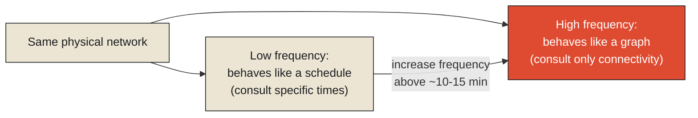

The transit planning consultant Jarrett Walker has spent much of his career articulating a distinction that sounds almost too simple when stated plainly, and turns out to have enormous practical consequences once a transit agency actually takes it seriously: the difference between a frequent network and a coverage network. A coverage network runs infrequently enough — a bus every thirty, forty-five, sixty minutes — that a rider genuinely needs to consult a printed or digital schedule before leaving home, plan their trip around specific departure times, and treat a missed bus as a real, costly setback measured in the length of the wait for the next one. A frequent network runs often enough — Walker's own rough benchmark is roughly every ten to fifteen minutes or better, throughout the day — that a rider can simply walk to a stop without checking anything in advance, confident that a vehicle will arrive soon regardless of exactly when they show up.

**This is the precise, practical line this chapter's title is drawing, and it's worth stating exactly why the distinction is structural rather than merely a matter of convenience. A coverage network behaves like a schedule: a fixed, chronological sequence of specific departure times that a rider has to consult and plan around, where the relevant question is "when does the next one leave." A frequent network behaves like a graph: a structure of connections between places, where the relevant question is "which stops connect me to my destination," with the exact timing becoming almost irrelevant because the wait, whenever it happens, stays short enough not to matter. The moment a rider stops needing to check a schedule and starts simply trusting that the network will get them somewhere soon, the system has functionally stopped being a timetable and started being a graph.**

<Callout type="architectural-tension">
A transit network's underlying topology — which stops connect to which, how those connections overlap and interchange — doesn't change based on frequency. What changes is whether a rider needs to consult the network's timing at all before using its structure. High enough frequency makes the schedule functionally disappear from the rider's decision-making, even though the schedule, underneath, never actually stopped existing.
</Callout>

## What this looks like when it's working

The Tokyo metropolitan rail network, combining the Tokyo Metro, Toei Subway, and JR East's dense urban lines, is frequently cited as one of the clearest large-scale examples of a transit system riders genuinely navigate as pure topology rather than chronology. Trains on the busiest lines run frequently enough throughout most of the operating day — often every two to five minutes at peak times — that a regular rider planning a cross-city trip through several interchanges thinks almost entirely in terms of which lines connect to which stations, and barely at all in terms of specific departure times, because the wait at any single interchange is short enough to be functionally irrelevant to the overall journey. The system's actual timetable is, in a formal sense, exactly as real and precise as any coverage network's — every train still has a scheduled departure time, published and adhered to with real precision. It simply stops mattering to the rider's actual decision-making, because the graph's connectivity, not its chronology, is what the rider is genuinely navigating.

This has a precise mathematical description worth making explicit, because it's the same core computational problem underneath both a frequent metro network and a page of driving directions. Finding the best route through a network of connected stops — the one requiring the fewest transfers, or the shortest total travel time, or some other optimized criterion — is a [shortest-path problem](#shortest-path), and the general technique for solving this class of problem efficiently is dynamic programming: breaking a large optimization problem into smaller, overlapping subproblems, solving each smaller subproblem once, and reusing those solutions rather than recomputing them repeatedly. A well-known formalization of this specific idea for transit networks, called the Connection Scan Algorithm, works by processing a network's actual connections in a particular order and progressively building up the best-known way to reach every stop from a starting point — arriving, in the end, at an optimal route through the network's topology, without ever needing to treat any single train's specific scheduled time as more important than its role in the overall connective structure.

<Callout type="unresolved">
A transit network's timetable and its graph structure are not competing representations of the same system — one is not simply a more detailed version of the other. The timetable captures precise, individual departure times; the graph captures which connections are structurally available at all. A sufficiently frequent network can make the timetable functionally invisible to a rider's actual decision-making, without that timetable ever ceasing to exist, or ceasing to matter to the people actually operating the trains on it.
</Callout>

## Why this distinction matters for anyone designing decision support

It's worth drawing out the practical consequence of this distinction for anyone building a system meant to help riders, or operators, make good decisions about a transit network. A system built around the schedule — surfacing specific departure times, specific platform assignments, specific minute-by-minute countdowns — is implicitly treating the network as a coverage system, even if the underlying network is actually frequent enough to be navigated as a graph. This can genuinely make a good network feel worse to use than it actually is, by forcing a rider's attention onto chronological details that, on a sufficiently frequent line, were never the thing that actually mattered to their trip. A system built around connectivity — which lines get you from here to there, how many transfers are involved, which routes remain viable if one connection is disrupted — is treating the network as what it structurally is: a graph, whose topology is the real object worth reasoning about, with specific timing serving as one input to that reasoning rather than the primary lens through which the whole system gets understood.

*A note on where this chapter currently stands: Jarrett Walker's frequency-versus-coverage framework and the Tokyo network's real, observable behavior establish the underlying principle independently of any one project. Transit Intelligence, built explicitly around modeling transit as a graph of connections rather than a chronology of scheduled times, is expected to provide direct, first-hand findings that will sharpen and extend this chapter considerably once the project has results to draw on.*

This raises the sharper, harder question the next chapter takes up directly. If a well-functioning frequent network lets a rider stop worrying about specific timing because the graph's connectivity absorbs small variations gracefully, what happens at the exact moment that graceful absorption fails — when one specific, local delay doesn't get absorbed, and a single missed connection cascades into a genuinely disrupted trip? That failure has its own precise anatomy, and it's worth dissecting carefully.

<Figure n={1} title="Schedule vs. Graph, Same Network" caption="The timetable never stops existing underneath. What changes is which representation a rider actually needs to consult before the trip stops requiring any consultation at all.">

</Figure>

<FormalNote>

**Shortest path via dynamic programming.** The general recurrence underneath algorithms like
Dijkstra's, and specialized transit variants like the Connection Scan Algorithm, is a relaxation
rule: the best known arrival time at stop $v$ improves whenever a connection from some already-reached
stop $u$ beats it —

$$\text{arrival}(v) \leftarrow \min\bigl(\text{arrival}(v),\ \text{arrival}(u) + \text{time}(u \to v)\bigr)$$

Applied once per connection, in a single pass ordered by departure time, this converges to the
optimal arrival time at every stop from a given start — the dynamic-programming principle at work
being that the best route to $v$ only ever needs the best-known route to whichever stop directly
precedes it, never the full history of how that predecessor was reached. This is exactly why the
computation doesn't need to treat any one train's specific scheduled time as more important than its
role in the overall connective structure: the recurrence only ever asks "does this specific
connection improve on what I already know," stop by stop, connection by connection.
</FormalNote>

## Elsewhere in this series

<Callout type="note">
This relaxation rule is the deterministic special case of the Bellman equation introduced one chapter
earlier in
[Designing for Delay Propagation Analysis](./designing-for-delay-propagation-analysis#mdp) — a
shortest-path problem is a Markov decision process where every transition is certain and every
reward is just travel time to minimize. The next chapter,
[The Anatomy of a Missed Connection](./the-anatomy-of-a-missed-connection), takes up what happens
once this graph's ordinary resilience to small delays runs out.
</Callout>