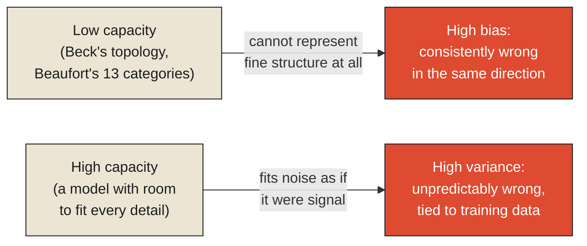

Harry Beck's 1933 London Underground map, examined in the previous chapter as a triumph of deliberate abstraction — trading geography for topology, on purpose, to make the network's connections legible — has a well-documented and genuinely amusing real-world cost attached to it, one that has outlived Beck himself by decades. Bank station and Mansion House station, both served by lines running through the City of London, sit close enough together on the actual street grid to be a short, three-to-five-minute walk apart. On Beck's map, following the diagram's clean topological layout, the two stations appear separated by enough distance and enough intervening stops that tourists relying on the map alone frequently choose to ride the Tube between them — descending into a station, waiting for a train, riding one or two stops, and re-emerging — rather than simply walking the short, direct route above ground that the map's own distortion has made invisible.

**Nobody involved made an error here. Beck's map is doing exactly what it was designed to do — showing connections clearly — and it is, by that measure, an excellent map. The cost isn't a flaw in the abstraction. It's the abstraction working correctly, and simply not being the tool for a question it was never built to answer: not "how do these stations connect," but "how far apart are these two specific points, in the real world, right now."** This is the sharper claim this chapter needs to make, and it's worth stating plainly: an abstraction's cost isn't necessarily a sign that the abstraction was poorly made. It's often the unavoidable price of the very thing that makes the abstraction useful in the first place — and that price gets paid, real time and real inconvenience, by whoever uses the abstraction for a question outside the specific one it was built to answer.

<Callout type="architectural-tension">
An abstraction's cost is not evidence that it was built badly. It is the necessary shadow cast by whatever the abstraction chose to make clear — and the cost falls hardest on whoever uses the abstraction for a purpose slightly outside the one it was actually optimized for, often without realizing the abstraction was ever narrower than it looked.
</Callout>

## Measuring how much an abstraction can actually bend before it breaks

It's worth asking, formally, how much complexity a given abstraction is even capable of capturing before it either fails to represent something important or becomes so complicated it stops being usable at all — and this turns out to have a precise mathematical answer in a concept called [VC dimension](#vc-dimension), named for Vladimir Vapnik and Alexey Chervonenkis. VC dimension measures, roughly, the richness of the range of patterns a given model or abstraction is structurally capable of representing at all — how complex a distinction it can draw, before running out of representational capacity entirely. A model with very low capacity, like Beck's purely topological diagram, simply cannot represent real-world distance at all, by design; it isn't failing at that task, it structurally lacks the capacity to attempt it. A model with very high capacity could, in principle, represent almost anything — including, troublingly, patterns in its training data that are pure coincidence rather than genuine structure, a problem this chapter will return to directly.

This connects to a second, closely related formal idea that names the specific cost every abstraction pays for choosing a given level of capacity: the [bias-variance tradeoff](#bias-variance). A model with low capacity, deliberately simplified — Beaufort's thirteen categories, Beck's topological lines — tends to have high bias: it systematically misses certain kinds of real structure, consistently, because it was never built with the capacity to represent them at all. A model with high capacity, capturing far more detail, tends to have high variance instead: it becomes extremely sensitive to the specific quirks of whatever data or situation it was built from, potentially performing brilliantly on the exact case it was tuned to and considerably worse on anything slightly different. There is no abstraction that escapes this tradeoff entirely — every choice of how much to compress trades some amount of one kind of cost for the other, and the honest engineering question is never "which is zero," because neither ever is, but which specific balance actually serves the situation the abstraction will be used in.

<Callout type="unresolved">
Increasing an abstraction's capacity does not simply make it "more accurate" in some unqualified sense. It shifts the balance from one kind of error to another — from a model that's systematically, predictably wrong in the same direction every time, to a model that's unpredictably, specifically wrong in ways tied tightly to whatever data happened to build it. Neither direction is free, and past a certain point, adding capacity can make a model worse in practice even while making it, on paper, more expressive.
</Callout>

## Where the cost actually lands, beyond any single tourist

It's worth widening the lens beyond Beck's specific, charming example, because the same structural cost shows up, less visibly but far more consequentially, in essentially every simplified model an organization relies on. A hidden cost of any dimensional model — Beaufort's scale, an actuarial table, any simplified operational dashboard — is that the dimensions it chose not to include don't announce their own absence. Someone using the model for a decision slightly outside its intended scope, the way a tourist used Beck's map for a question about walking distance rather than train connections, has no built-in signal warning them the model was never built to answer that particular question. The cognitive cost of an abstraction, in other words, isn't primarily the effort of learning to use it. It's the much subtler, much more persistent cost of remembering, every single time, exactly which questions it was and wasn't built to answer — a discipline that erodes over time in exactly the way earlier chapters in this series described context decaying, as the people who understood a model's original, narrower scope move on and the model itself keeps being used, confidently, for questions it was quietly never built to handle.

This leaves an important question this chapter has deliberately left open, because it's the deepest one this monograph can ask, and the next chapter takes it up directly. If every abstraction pays some cost in exchange for the clarity it buys, what is it actually buying that clarity *for*? It would be easy to assume a model's purpose is simply to describe reality more conveniently than reality describes itself — a smaller, cleaner picture of what's already true. That assumption, it turns out, gets the actual purpose of most models backward, and untangling exactly how is where the next chapter begins.

<Figure n={1} title="Capacity's Two Failure Modes" caption="Low capacity misses the same structure every time, predictably. High capacity chases whatever specific noise happened to be in its training data. Neither failure disappears — capacity only trades one for the other.">

</Figure>

<FormalNote>

**VC dimension.** A hypothesis class $H$ *shatters* a set of points if, for every possible way of
labeling those points, some hypothesis in $H$ gets the labeling exactly right. The VC dimension of
$H$ is the largest number of points it can shatter — a precise measure of how rich a family of
patterns $H$ is structurally capable of representing, independent of any specific dataset. It matters
because it bounds the gap between how well a model fits the data it was built from and how well it
will actually perform on new data, with probability at least $1-\delta$:

$$\text{true error} \;\leq\; \text{training error} \;+\; O\!\left(\sqrt{\frac{\text{VCdim} \cdot \log(n/\text{VCdim}) + \log(1/\delta)}{n}}\right)$$

Read plainly: the gap shrinks as the amount of data $n$ grows, and widens as VC dimension grows. A
model with unbounded capacity has no such guarantee at all — it can fit its training data perfectly
and still say almost nothing reliable about anything new, which is the formal version of "capable of
representing almost anything, including pure coincidence."

**Bias-variance decomposition.** For a model's expected squared prediction error, the error splits
cleanly into three additive terms:

$$\mathbb{E}[(\hat{f}(x) - f(x))^2] = \underbrace{\left(\mathbb{E}[\hat{f}(x)] - f(x)\right)^2}_{\text{bias}^2} + \underbrace{\mathrm{Var}[\hat{f}(x)]}_{\text{variance}} + \underbrace{\sigma^2}_{\text{irreducible noise}}$$

Bias is the error a model makes *on average*, across every dataset it could have been trained on — a
low-capacity model like Beck's diagram has high bias because it's structurally incapable of
representing real distance, no matter what data it sees. Variance is how much the model's predictions
would swing if it had been trained on a different sample of the same underlying data — a high-capacity
model has high variance because small differences in training data produce noticeably different
fitted models. $\sigma^2$ is the noise floor no model can remove. The three terms trade against each
other as capacity changes; they cannot all shrink at once past a certain point, which is exactly why
"more expressive" and "more accurate on new data" are not the same claim.
</FormalNote>

## Elsewhere in this series

<Callout type="note">
The bias-variance split is the same tradeoff
[Observability Is a Budget](../../reality/observations/observability-is-a-budget) draws with precision
and recall — moving a detection threshold doesn't eliminate error, it only decides which kind you get
more of, exactly as capacity does here. The cognitive cost this chapter names — a model's absent
dimensions never announcing themselves — decays over time the way
[Context Decays](../../information/context/context-decays) describes for any organizational
knowledge nobody is actively maintaining. The next chapter,
[Models Predict More than They Describe](./models-predict-more-than-they-describe), turns from what an
abstraction costs to what it was actually built to buy in the first place.
</Callout>