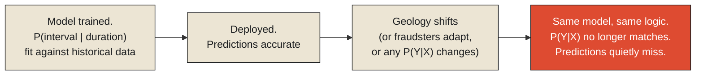

Old Faithful, the geyser in Yellowstone National Park, earned its name for a real, measurable reason: park rangers have long been able to predict its next eruption within a fairly narrow window, using a genuine statistical relationship between how long an eruption lasts and how long the interval will be until the next one — longer eruptions reliably followed by longer waits, shorter eruptions by shorter waits. This relationship isn't folklore. It's a real predictive model, refined over decades of careful observation, and for a long stretch of that history, it worked about as well as any model in this series has worked.

It has also required real, periodic recalibration over time, because the relationship it depends on isn't fixed. Geological activity beneath Yellowstone — seismic events, shifts in the underground plumbing that actually produces the eruption — has, at points in the geyser's recorded history, measurably altered the statistical relationship between eruption duration and interval length that the predictive model depends on. A model calibrated against one era's underlying geology doesn't necessarily hold once the geology itself has shifted, even slightly, and park scientists have had to revisit and adjust the predictive relationship as this happens, rather than trusting a single, permanently fixed formula to keep working indefinitely.

**This is the plainest possible statement of the claim this final chapter exists to make: a model is not a timeless truth about the system it describes. It is a claim about a relationship that held, reliably, over the specific period of data used to build it — and that relationship can change, sometimes slowly, sometimes suddenly, for reasons that have nothing to do with any flaw in how the model was originally built. Old Faithful's model wasn't wrong when it was made. The ground it was modeling simply stopped holding still.**

<Callout type="architectural-tension">
A model going wrong over time is not, by itself, evidence that the model was built poorly. It is evidence that the relationship the model captured was a real, accurate description of the system for as long as the system itself stayed the same — and systems, left alone for long enough, rarely stay the same forever, no matter how carefully the original model was constructed.
</Callout>

## The name this failure mode already has

Machine learning, as a discipline, has a specific, well-established term for exactly this phenomenon: [concept drift](#concept-drift), describing the situation where the statistical relationship a model was trained on genuinely, measurably changes over time in the real-world system the model is meant to predict, degrading the model's accuracy not because anything about the model's internal logic broke, but because the target it was aimed at has quietly moved. A fraud-detection model trained on last year's transaction patterns will drift as fraudsters adapt their tactics specifically to evade that model — a particularly sharp version of drift, since here the underlying system is actively, adversarially reacting to the model's own existence. A geyser's eruption-interval model drifts for a gentler, non-adversarial reason: the physical plumbing beneath it shifts on its own geological timescale, with no intent behind the change at all, but the practical consequence for the model's accuracy is structurally identical either way.

This connects directly back to the [bias-variance tradeoff](./every-abstraction-has-a-cost#bias-variance) examined two chapters earlier in this monograph. A model with low capacity, deliberately simple, tends to degrade slowly and predictably as drift occurs, because it was never chasing fine-grained detail in the first place — its errors grow gradually as the underlying reality diverges from its simplified assumptions. A model with high capacity, tightly fit to the specific historical data it was trained on, can degrade far more sharply and unpredictably once drift sets in, precisely because that tight fit was capturing detailed patterns specific to the old regime, patterns that may no longer correspond to anything real once the underlying system shifts. Neither kind of model is immune. They simply fail differently, on different timescales, in ways that are worth anticipating before drift actually arrives rather than discovering only once the predictions have already started quietly missing.

## Deciding when it's actually worth fixing

This raises a genuinely practical question every organization running a long-lived predictive model eventually has to confront, and it's one [decision theory](./models-predict-more-than-they-describe#decision-theory), introduced in the previous chapter, turns out to answer directly: recalibrating a model has a real cost — new data collection, retraining effort, the risk of introducing new errors in the process — and that cost has to be weighed honestly against the cost of continuing to operate with a model that's drifted, becoming gradually less accurate but not yet catastrophically so. This is rarely an obvious call. Recalibrate too eagerly, in response to noise rather than genuine drift, and you spend real effort chasing statistical fluctuations that would have resolved themselves; recalibrate too rarely, and a model can drift substantially before anyone notices, quietly degrading the quality of every decision made using it in the meantime. Park scientists monitoring Old Faithful's predictions face a version of this exact calculus: deciding when an observed shift in eruption patterns represents genuine, lasting geological change worth updating the model for, versus ordinary short-term variability that doesn't yet justify revising a formula that has otherwise served visitors well for generations.

<Callout type="unresolved">
There is no fixed rule for how often a model should be recalibrated that applies equally to every system. The right cadence depends entirely on how quickly the underlying reality actually changes, how costly a stale prediction is if it goes uncorrected, and how costly recalibration itself is to perform — the same three-way tradeoff, in different clothing, that governed how often a sensor should sample and how large an observability budget a system could actually afford.
</Callout>

## Closing the Models monograph

This closes the arc this monograph has traced from its first chapter to its last, and it's worth stating the full shape of it plainly. Every model is a deliberate compression of reality into a small number of chosen dimensions, the way Beaufort compressed wind into thirteen categories built around what a sailor actually needed to decide. That compression is never a neutral simplification — it's a designed trade, optimizing for a specific purpose at the cost of everything outside it, the same trade a life table and the London Underground's map both made deliberately and well. Every such trade carries a real cost, one that lands hardest on whoever uses the model outside the narrow question it was actually built to answer. And the entire reason to build a model in the first place, more than any of this, is to predict what hasn't happened yet — description was never the point, only a convenient byproduct of a model good enough to anticipate the future accurately. Which makes this final chapter's claim the necessary, sobering coda to everything the rest of the monograph established: even a model built with every one of these lessons applied correctly will, eventually, still go wrong, not from any flaw in its construction, but simply because the reality it was built to predict never signed a permanent agreement to stay the way it was when the model was made.

The next monograph in this series turns from a single model's relationship to a single, changing reality toward a harder problem still: what happens when many such models, many such systems, many such independent pieces of a larger whole, all have to act together, coherently, without any one of them having complete visibility into what all the others are doing. That is the subject of Coordination, and it begins with the observation that scale, in any sufficiently large system, is rarely the real problem. Getting the parts to agree with each other is.

<Figure n={1} title="Two Lines Diverging, Named Differently" caption="The model's own logic never changes. What changes is the relationship between X and Y it was built to describe — the same shape as context decaying, now happening to a statistical relationship instead of organizational knowledge.">

</Figure>

<FormalNote>

**Concept drift.** Every predictive model implicitly assumes the relationship it learned during
training keeps holding after deployment: $P_{\text{train}}(Y \mid X) \approx P_{\text{deploy}}(Y \mid
X)$. Drift is exactly the failure of that assumption over time — for a model observed at times $t$
and $t'$,

$$P_t(Y \mid X) \neq P_{t'}(Y \mid X)$$

It's worth distinguishing this precisely from a milder, related failure called covariate shift, where
only the *inputs'* distribution changes, $P_t(X) \neq P_{t'}(X)$, while the underlying relationship
$P(Y\mid X)$ itself stays fixed — a model can often tolerate covariate shift reasonably gracefully,
because what it learned about how $X$ produces $Y$ is still true, just being asked about a slightly
different range of $X$ than before. Concept drift is the harder failure, because the thing the model
actually learned is no longer true, regardless of what $X$ it's given.

Detecting drift, formally, is the same hypothesis-testing shape this series names in
[The Cost of Remembering Everything](../../information/history/the-cost-of-remembering-everything)
for a change point: monitor the model's error over a rolling window and test $H_0$: no change in the
underlying relationship, against $H_1$: a genuine, sustained shift — flagging drift only when the
evidence favors $H_1$ by enough to justify the real cost of recalibrating, exactly the
[decision theory](./models-predict-more-than-they-describe#decision-theory) calculation the
surrounding prose describes for Old Faithful's own park scientists.
</FormalNote>

## Elsewhere in this series

<Callout type="note">
This closes the Models monograph by returning, formally, to a pattern this series names twice
already: the undetected, silent divergence in
[Context Decays](../../information/context/context-decays), and the change-point hypothesis test in
[The Cost of Remembering Everything](../../information/history/the-cost-of-remembering-everything) —
concept drift is that same test, run continuously against a model's own predictions instead of a
particle detector's readings. The next monograph, Coordination, has not been written yet.
</Callout>