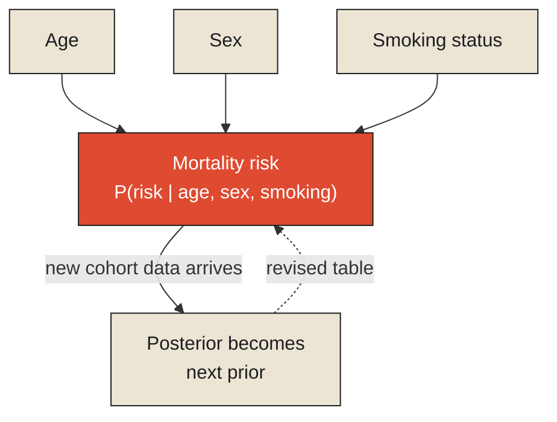

This series has already used this chapter's title once, in a different form, a great many articles ago: "The Territory Exists Before the Map." That earlier argument established something ontological — that a representation is always downstream of the reality it describes, and that loss, in some form, is unavoidable the moment reality gets compressed into anything smaller than itself. This chapter is not that argument restated. It is the harder, more specific version the earlier one was setting up, and it deserves to be read as a deliberate return rather than a coincidence: the same underlying claim, now examined at the level where it actually gets built, on purpose, by someone making a real, consequential decision about exactly what to discard.

An actuarial life table prices mortality risk — the basis for every life insurance premium ever calculated — using a strikingly small number of dimensions: typically age, sex, and smoking status, sometimes supplemented with a handful of others depending on the product. A human life, obviously, involves an almost unimaginable number of factors bearing on how long it will last — genetics, occupation, diet, family history, accident risk, mental health, geography, hundreds of others, most of them at least somewhat relevant, none of them included in the basic table. The insurer building this table isn't failing to notice all this missing complexity. They are choosing, deliberately, that these three or four dimensions capture enough of the real signal to price risk fairly and profitably across a large pool of people, and that adding the rest would cost more, in complexity, data-collection burden, and underwriting time, than the marginal accuracy it would buy.

**This is the harder version of the map/territory claim: the life table is not merely lossy because loss happens to every representation. It is lossy by deliberate, calculated design, in service of a specific commercial purpose — and the specific dimensions it kept were not chosen because they were easy to measure, but because someone determined, using real mortality data, that they were the dimensions carrying the most predictive weight for the least cost of collection.**

<Callout type="architectural-tension">
A model that discards information is not automatically a worse model than one that keeps more of it. The question that actually matters is whether the specific information it kept is the information its purpose actually needed — and a model built around the right small set of dimensions can genuinely outperform, in practice, a model drowning in dimensions that add cost without adding decision-relevant signal.
</Callout>

## What the table's structure actually encodes

The specific way a life table conditions its risk estimate on age, sex, and smoking status is, in formal terms, a small [Bayesian network](#bayesian-network): a graph in which mortality risk is explicitly represented as conditionally dependent on a small, named set of other variables, with the dependency structure itself made visible and deliberate rather than left as an unstated assumption. This matters for a reason this series has already established directly, in the Mars Climate Orbiter's failure: a model that leaves its conditioning variables implicit invites exactly the kind of silent mismatch that destroyed that spacecraft. A life table that stated a mortality rate without specifying which age and smoking-status bracket it applied to would be almost useless, and dangerously so, in exactly the same structural way a thruster performance figure without its unit was dangerously useless. The table's entire actuarial value comes from making its conditioning explicit — this rate, for this age, this sex, this smoking status — rather than leaving the context to be assumed.

Tables like this are not fixed forever, either, and the mechanism by which they change is itself a real, ongoing instance of Bayesian reasoning at institutional scale. As new mortality data accumulates — a new cohort of policyholders aging through the tracked period, new medical and lifestyle trends emerging — actuaries revise the tables, updating the estimated risk associated with each bracket in light of the new evidence, in essentially the same spirit as any [Bayesian update](#bayesian-updating): a prior belief about mortality risk, revised in a specific, principled direction by new observations, without needing to discard and rebuild the entire model from scratch each time.

## Losing geography, gaining topology

There is a second, equally important insurance-adjacent example worth bringing in here to sharpen the same point from a different angle, because it makes visible something the life table's example doesn't fully surface on its own: that a deliberate loss is not the same thing as a degradation, and the two get confused constantly. Harry Beck's 1933 map of the London Underground famously abandoned real geographic accuracy — actual compass bearings, actual relative distances between stations — in favor of a purely topological diagram, showing only which stations connect to which, along clean vertical, horizontal, and 45-degree lines, with real distances distorted freely wherever doing so made the diagram clearer. Two stations that are, in reality, a short and perfectly walkable distance apart on the actual street grid can appear on Beck's map to be several stops apart, simply because that's what best serves clarity of the *connection structure*, which was the map's actual purpose.

It would be a mistake to describe this map as simply "worse at describing London." It didn't lose geography and fail to gain anything in exchange. It lost geography and gained topology — a genuinely different, and for its specific purpose, genuinely more useful kind of information: not where things physically are, but how they connect, which is precisely the question a rider planning a journey through the network actually needs answered, and precisely the question a geographically accurate map, cluttered with real-world curves and distances, would answer far less clearly. This is the same tradeoff this series examined once already, in an entirely different domain, when it looked at the Mercator projection's decision to sacrifice true relative landmass size in exchange for reliable compass bearings — a chart that lost accurate geography and gained something a sailor needed more: straight lines that could actually be steered by. Beck's diagram and Mercator's chart, four centuries apart, made structurally identical trades: neither is a degraded version of a more complete map. Each optimized deliberately for a different question than "how is this place actually shaped," and each was right to.

<Callout type="unresolved">
"Lossy" and "worse" are not synonyms, and treating them as synonyms is exactly the mistake this chapter exists to correct. A model that discards one kind of information in order to make a different kind of information dramatically clearer has not failed at representing reality. It has succeeded at representing a specific, chosen aspect of reality — and the failure only occurs if someone mistakes the model's chosen aspect for the whole of what it claims to represent.
</Callout>

## What determines whether a trade like this was the right one

This leaves a genuinely important question that neither the life table nor the Underground map answers by simply existing and being useful: how would you know, in advance, whether a given set of discarded dimensions was the right set to discard? The honest answer is that this is rarely obvious ahead of time, and it's precisely the discipline the previous chapter's [information criteria](./dimensions-are-compression-algorithms-for-reality#aic-bic) exist to formalize — testing whether a model's chosen dimensions actually carry the predictive or functional weight they're being trusted with, rather than assuming a smaller, cleaner-looking model is automatically the correct trade just because it's simpler to use.

This sets up the sharper, more uncomfortable question the next chapter has to confront directly. Beck's map and the life table both made their trades well, by the standards of what they were actually built to do. Not every abstraction is built this carefully, and even a well-built one carries real, ongoing costs that don't show up simply by looking at the finished model — costs in performance, in hidden complexity someone still has to manage, in the cognitive burden placed on whoever has to use the abstraction without fully understanding what it's quietly not telling them. That is the subject of the next chapter, and it begins with the specific, well-documented cost Beck's own famous map turned out to impose on tourists who trusted it a little too literally.

<Figure n={1} title="A Life Table as a Bayesian Network" caption="Mortality risk isn't a free-floating number. It's a node with explicit parents — remove any one of the edges and the number stops meaning anything determinate, the same way a thruster value with no unit-system edge doomed a spacecraft.">

</Figure>

<FormalNote>

**Bayesian networks.** A Bayesian network represents a joint distribution over many variables not as
one intractable block, but as a product of small, local conditional pieces, one per node, each
depending only on its explicit parents in the graph:

$$P(X_1, \ldots, X_n) = \prod_{i=1}^{n} P\!\left(X_i \mid \text{Parents}(X_i)\right)$$

For the life table, this is $P(\text{risk} \mid \text{age}, \text{sex}, \text{smoking})$ — a single
factor, not the full joint distribution over every conceivable risk factor. The formal payoff is exact
and load-bearing: a variable's distribution is *only ever defined relative to its stated parents*.
Query the risk node without supplying age, sex, and smoking status, and the model has no answer to
give — it structurally cannot silently substitute the wrong context the way the Mars Climate
Orbiter's thruster values did, because the dependency is data, not an assumption held in someone's
head.

**Sequential Bayesian updating.** Revising a life table as new cohort data $D_t$ arrives is one
application, repeated, of Bayes's rule, with each posterior becoming the next prior:

$$P(\theta \mid D_1, \ldots, D_t) \;\propto\; P(D_t \mid \theta)\, P(\theta \mid D_1, \ldots, D_{t-1})$$

$\theta$ here is the table's risk parameters. What this buys concretely: the table never has to be
discarded and rebuilt from a blank slate when new mortality data comes in. Each update is a
principled nudge away from what was believed before, in the direction the new evidence actually
supports, and the size of that nudge is itself governed by how much the new data actually disagrees
with the old belief — a large, surprising cohort effect moves $\theta$ further than a small,
expected one.
</FormalNote>

## Elsewhere in this series

<Callout type="note">
The Bayesian network's explicit-parents requirement is the formal fix for exactly the failure
[Facts Require Context](../../information/context/facts-require-context) diagnoses in the Mars
Climate Orbiter: a value with no edge to the context it depends on. Sequential updating is the same
mechanism [Observability vs. Analytics](../../reality/observations/observability-vs-analytics) walks
through case by case for John Snow's map, now running continuously across cohorts instead of
individual deaths. The next chapter,
[Every Abstraction Has a Cost](./every-abstraction-has-a-cost), takes up what a well-built model like
this one still costs the people who use it slightly outside its intended scope.
</Callout>