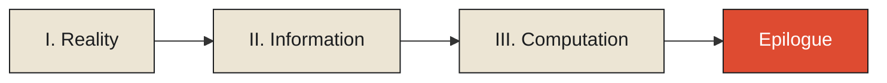

# Overview

Every information system — a database, a sensor network, a ledger, a distributed cache — stands
between two things that are never the same: the reality it is trying to describe, and the signs it
stores in its place. This publication starts from that gap and works outward, one monograph at a
time, toward the architectural consequences of never being able to close it.

This is not only a series about what is written in the sentences themselves. Underneath the essays
sits a second, more formal layer — measurement theory, information theory, signal processing,
Bayesian inference, queueing theory, distributed-systems theory — that the prose gestures at but
rarely states outright. That formal layer is made explicit chapter by chapter: each one carries the
actual equations it depends on, a diagram of its central mechanism, and links to the specific
chapters elsewhere in the series that depend on it or that it depends on. The prose is never
changed by this; what's added is everything standing next to it.

<Observation n={1}>
  A system never stores reality. It stores signs — symbols, tokens, encodings — that a community of
  use has agreed to treat as standing for reality. Every downstream architectural decision inherits
  the consequences of that substitution.
</Observation>

The series is organized into three tracks, each several monographs deep, and closes with a short
epilogue that stands outside all three. All three tracks — **Reality**, **Information**, and
**Computation** — are now complete.

<Figure n={1} title="The Shape of the Series" caption="Reality traces the gap between a thing and its representation down to the physics of time. Information asks what a system does with what it has observed once the moment of watching has passed. Computation asks what a system is allowed to do with what it holds. The epilogue closes the loop across all three.">

</Figure>

<Callout type="note">
  For the full track-by-track, monograph-by-monograph breakdown — every published chapter, what it
  argues, and where the series is headed next — see the **[Series Guide](./series-guide)**.
</Callout>

---

## How to Navigate This Series

- Use the **Table of Contents** on the right to jump between sections within an essay.
- Use the **Publication Navigation** on the left to move between tracks, monographs, and articles.
  The Epilogue sits at the very end of that list, outside the three tracks, as the series' own
  closing synthesis rather than another chapter of the final monograph.
- Each chapter carries its own **formal notes** — the equations and named theorems its argument
  rests on — and a set of **cross-references** to the specific chapters elsewhere in the series that
  bear on the same mechanism from a different angle. Neither changes the chapter's argument; both
  make explicit what the prose was already assuming.

---

*Begin reading with **[Reality Exists Before Information](./reality/reality/reality-exists-before-information)**, or jump to the **[Series Guide](./series-guide)** for the full map.*
