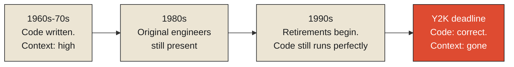

By the mid-to-late 1990s, organizations around the world discovered they had a genuine, deadline-bound crisis on their hands, and the strange thing about it was that nothing had actually broken yet. Decades-old software, much of it written in COBOL during the 1960s, 70s, and 80s, was still running exactly as designed — processing payroll, managing pension calculations, tracking insurance policies, doing its job correctly, day after day, without complaint. The problem was a specific, widespread convention embedded throughout that code: dates stored using only two digits for the year, a deliberate choice made decades earlier to save a scarce and expensive resource — storage space — at a time when every byte genuinely mattered to a system's cost and performance. As the year 2000 approached, this shortcut threatened to make "00" ambiguous between 1900 and 2000, with cascading, unpredictable consequences for any calculation involving dates.

What made the Y2K remediation effort genuinely difficult, in a huge number of real cases, wasn't rewriting the two-digit fields themselves — that part was often mechanically straightforward. The difficulty was that the original engineers who had written the code, understood exactly why the two-digit shortcut had been chosen, and knew precisely which parts of a sprawling, decades-old system depended on that assumption in ways that weren't obvious just from reading the code, had frequently retired, moved to other companies, or in some documented cases passed away, taking that understanding with them. Organizations spent enormous, well-documented real effort simply trying to reconstruct *why* their own systems worked the way they did, before they could safely change anything — hunting down former employees, cross-referencing whatever documentation had survived, sometimes resorting to painstaking reverse-engineering of code that had been quietly, correctly doing its job for thirty years, entirely unexamined, because it had never needed fixing before now.

**This is context decay in its purest, most consequential form: the artifact itself — the code — was completely intact and functioning exactly as it always had. What had eroded away, silently, over the decades in between, was everything surrounding it: the reasoning, the documentation, the people who understood the tradeoffs, the organizational memory of why a specific decision had been made and what depended on it. The code hadn't changed at all. Its meaning, in the sense of "why this exists and what it's actually safe to do with it," had quietly stopped being knowable, well before anyone realized the gap had opened.**

<Callout type="architectural-tension">
An artifact can remain perfectly correct and perfectly functional while the context that once made it comprehensible erodes completely away around it. Correctness and comprehensibility are not the same property, and a system can lose the second entirely while never once failing the first — until the day someone actually needs to change it, and discovers there's no longer anyone who can say why it works the way it does.
</Callout>

## The distinction the Y2K crisis makes precise

It's worth naming the exact formal distinction this situation illustrates, because it clarifies something easy to conflate. Information theory, in its classical form, is concerned almost entirely with a message's fidelity as a pattern of bits — whether a signal was transmitted and received correctly, with the meaning of those bits treated as entirely outside the theory's scope. This is deliberately, usefully narrow: it lets engineers guarantee that a message arrives byte-for-byte identical to how it was sent, without needing to know or care what the message actually means to anyone. But a body of work generally grouped under semantic information theory pushes further, asking a genuinely different and much harder question: not merely whether a message was transmitted correctly, but whether its meaning has been preserved for whoever needs to interpret it, which turns out to depend on facts entirely outside the message itself — specifically, whether the receiver still has the surrounding knowledge needed to interpret it correctly at all.

The Y2K-era COBOL systems were a perfect, unplanned demonstration of this exact distinction, playing out at organizational scale over decades. The code was bit-perfect — every instruction executed exactly as originally written, with zero transmission error, zero corruption, zero degradation of the artifact itself. And its meaning — in the semantic-information sense of "can whoever now needs to work with this correctly interpret why it does what it does" — had degraded almost completely, not because anything about the code had changed, but because the surrounding organizational knowledge needed to interpret it had quietly, gradually, walked out the door one retirement and one departed team at a time.

## Why decay is quiet, and why that's the actual danger

It's worth being precise about the specific danger this pattern presents, because it's genuinely different from the failure modes examined in most of this series so far. A signal that's lost is lost visibly — there's a gap, a missing reading, an obvious silence where data should be. Context decay produces no such visible gap. The code kept running. The documentation, where it existed at all, often kept sitting in a folder, technically present, simply increasingly disconnected from the reality it once accurately described as the system around it evolved without the documentation being updated to match — a pattern usually called documentation drift, where the written record and the actual system slowly diverge, neither one announcing that the divergence is happening. Nothing breaks during this process. Nothing alerts anyone. The decay is only discovered, almost always, at the exact moment someone actually needs the context that's already quietly gone — needing to change a system whose original reasoning nobody present can any longer explain, precisely the situation an entire generation of engineers found themselves in, all at once, on an externally imposed deadline, as the year 2000 approached.

<Callout type="unresolved">
Context decay produces no error message, no failed test, no visible symptom of any kind, for as long as nothing requires the missing context to be consulted. This is exactly what makes it dangerous: the cost of the decay is deferred, invisibly, until precisely the moment — often the worst possible moment, under time pressure, during an incident, against an external deadline — when the missing context turns out to be exactly what's needed and is discovered not to be there anymore.
</Callout>

## What this means for anything meant to last

The uncomfortable lesson the Y2K crisis leaves behind, for any system expected to remain comprehensible for years or decades rather than merely functional, is that correctness alone is not a sufficient goal, and neither, on its own, is documentation written once and never revisited. Organizational memory — the living, distributed understanding of why a system works the way it does, held across the people who built and maintain it — decays continuously and silently unless something actively works against that decay: documentation genuinely kept current rather than written once and abandoned, knowledge deliberately transferred before the people holding it leave rather than after, decisions recorded with their reasoning attached rather than just their outcome. None of this is free, and none of it produces any visible benefit most of the time — which is precisely why it's so often the first thing organizations quietly stop doing under time or budget pressure, right up until a deadline like Y2K arrives and reveals, all at once, exactly how much had already been lost.

This leaves the final, hardest question this monograph has been building toward across all three of its previous chapters. If context can be silently lost even from artifacts that never change, and if meaning depends on context in ways a message's own bits can never fully carry by themselves — where, precisely, does meaning actually live? Not in the state alone, which the Mars Climate Orbiter proved can be perfectly correct and still catastrophically ambiguous. Not in the context alone, which this chapter has just shown can decay away while leaving the artifact untouched. The answer, and the argument that closes not just this monograph but the entire Information track this series has been building since State, begins with a stone, buried for over a millennium, that turned out to need something more than either of its two inscriptions alone to finally say what it had been saying the whole time.

<Figure n={1} title="Two Lines, Diverging Silently" caption="The artifact's own correctness never dips. What decays, unannounced, is everyone's ability to say why it works — and the gap between the two lines is invisible until someone actually needs to cross it.">

</Figure>

<FormalNote>
Organizational context behaves like a quantity decaying over time rather than an asset that simply
sits still once written — informally, $C(t) \approx C_0 e^{-\lambda t}$, availability declining
continuously unless something actively works against $\lambda$, the decay rate: current
documentation, deliberate knowledge transfer, decisions recorded with their reasoning attached. The
artifact's own correctness is a separate quantity entirely, and nothing about this curve touches it.
</FormalNote>

## Elsewhere in this series

<Callout type="note">
This chapter's silent, undetected loss is a organizational-scale version of
[Signal Loss Is Permanent](../../reality/signals/signal-loss-is-permanent) — both describe a category
of loss with no error message, discovered only at the moment someone needs what's already gone. The
retention discipline that could have slowed $\lambda$ is the same one
[The Cost of Remembering Everything](../history/the-cost-of-remembering-everything) names as a
budget: deciding, in advance, what's worth the real cost of actively maintaining. The final chapter,
[Meaning Is Never Stored Directly](./meaning-is-never-stored-directly), takes up where this leaves
off — if context decays and state alone was never enough, where does meaning actually live?
</Callout>