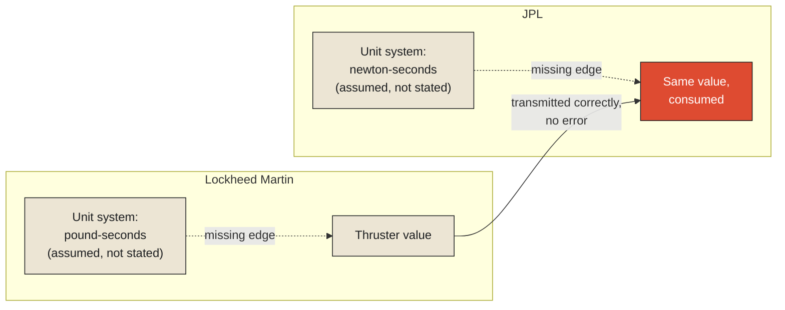

In September 1999, NASA's Mars Climate Orbiter disintegrated in the Martian atmosphere, arriving at an altitude roughly 100 kilometers lower than planned — close enough to the planet that atmospheric friction destroyed the spacecraft outright. The subsequent investigation found no failed sensor, no corrupted transmission, no hardware malfunction of any kind. The software built by Lockheed Martin, responsible for calculating the small thruster firings needed to correct the spacecraft's trajectory, output its figures in pound-seconds — a unit of force over time based on the imperial pound. The navigation software at NASA's Jet Propulsion Laboratory, receiving those figures and using them to model the spacecraft's actual trajectory, expected newton-seconds — the equivalent metric unit. Every individual number that passed between the two systems was internally correct, precisely calculated, transmitted without error. And because one side's numbers meant something roughly 4.45 times larger than the other side assumed they meant, the spacecraft's calculated trajectory diverged from its actual one by exactly enough to send it too deep into the atmosphere to survive.

**This is the sharpest possible illustration of this chapter's claim: a fact is not something that can be correct or incorrect in isolation. It can only be correct or incorrect relative to the surrounding conditions — in this case, a unit of measurement — that determine what it actually means. Strip a number away from its units, and it isn't merely a fact with something missing. It's a different, ambiguous, silently dangerous claim, indistinguishable in form from the true one, that can pass every check a system has for catching errors, because from the system's perspective, nothing has gone wrong at all.**

<Callout type="architectural-tension">
A number without its unit is not an incomplete fact waiting to be filled in. It is a fully-formed, syntactically valid, silently wrong claim — and no amount of double-checking the number's arithmetic will ever catch an error that lives entirely in the missing context around it, because the number itself never claimed to be wrong.
</Callout>

## Why this failure is worse than a typo

It's worth being precise about why this kind of error is so much harder to catch than an ordinary mistake. A transposed digit, a miscalculated sum — these produce a number that's simply wrong, and a sufficiently careful review, or a sanity check against an expected range, has a real chance of catching it, because the error shows up as an anomaly somewhere in the number itself. The Mars Climate Orbiter's numbers showed no such anomaly. Every value Lockheed Martin's software produced was the correct answer to the question it was actually being asked, and every value JPL's software consumed was treated exactly as its own internal logic specified. The systems agreed, completely, on every number that passed between them. What they disagreed on, silently and catastrophically, was what those numbers were even claiming to describe — and disagreement at that level, about the meaning of a fact rather than its value, doesn't announce itself as an anomaly anywhere, because from inside either system, nothing looks wrong at all.

## Making the missing context explicit

The formal tools built to prevent exactly this kind of failure work by making a fact's dependence on its surrounding conditions explicit, structural, and impossible to silently drop — rather than leaving it as an unstated assumption everyone on a project is simply expected to share. A Bayesian network represents this dependence directly: a graph of variables where each one's actual meaning or probability is explicitly conditioned on specific other variables it depends on, with those dependencies drawn as edges connecting them rather than left as background knowledge nobody wrote down. Applied to the Orbiter's situation, a thruster-performance value wouldn't simply be a number; it would be a number explicitly conditioned on a unit-system variable, with the dependency itself represented as a first-class part of the model — meaning any system trying to use that value would be structurally forced to also specify, or inherit, the conditioning variable it depends on, rather than being able to quietly assume one and move on.

Graphical models generalize this same idea beyond probability specifically, into a broader visual and mathematical language for representing exactly which variables in a system depend on which others, and how. The core discipline both bring to a problem like the Orbiter's is the same: treat context — units, reference frames, assumptions about scale — not as ambient, unstated background that everyone is trusted to already share, but as an explicit node in the model, with explicit edges connecting it to every fact that depends on it. A fact with no explicit edge to the context it actually depends on isn't a simplified version of the correct model. It's a broken one, waiting for exactly the kind of silent mismatch that doomed the Orbiter.

<Callout type="unresolved">
Two systems can each be entirely internally consistent, pass every test either one runs on its own data, and still disagree catastrophically the moment their outputs meet — because internal consistency only checks whether a system agrees with its own assumptions, never whether those assumptions are the same ones the other system is making.
</Callout>

## What "surrounding conditions" actually means, made precise

It's worth generalizing beyond units specifically, because the Orbiter's failure is a clean instance of a much broader category of context every fact depends on somewhere. A timestamp is ambiguous without a time zone. A financial figure is ambiguous without a currency and a reporting period. A patient's lab result is ambiguous without knowing which assay, which reference range, which lab performed it — different labs can report the identical measured quantity against different normal ranges, meaning a "normal" result from one lab could represent a genuinely concerning result read against another lab's baseline. In every one of these cases, the pattern is identical to the Orbiter's: the number itself carries no internal signal of ambiguity. It looks exactly as confident and complete whether the surrounding condition it depends on is present, correctly shared, or silently mismatched.

This is the reason this chapter has to open the entire Context monograph rather than sit somewhere in its middle. Every remaining chapter in this monograph — how metadata operationalizes context, how context decays over time, how meaning ultimately emerges only from the relationship between a fact and what surrounds it — depends on first taking seriously the claim this chapter has tried to make as sharply as the Orbiter's own history makes it: a fact separated from its surrounding conditions is not a smaller, purer version of the truth. It is a different, silent, and sometimes catastrophic claim, wearing the same numerals as the one that was actually true.

This raises an immediate practical question the Orbiter's own investigation had to answer, and it's where the next chapter picks up directly: if a fact needs its surrounding conditions made explicit rather than assumed, what does the actual discipline of doing that, systematically, across an entire organization's data, actually look like? That discipline already has a name, and it predates computing by more than a century — it's called metadata, and long before it appeared in any database schema, it appeared, fully formed, in the small printed card sitting in a library's card catalog drawer.

<Figure n={1} title="A Missing Edge, Not a Wrong Number" caption="Both systems' numbers were internally correct. Neither had an explicit edge to the unit-system it assumed — which is exactly why nothing about either number looked wrong.">

</Figure>

<FormalNote>
A Bayesian network makes this failure structural rather than incidental: every variable's meaning is
explicitly conditioned on the specific other variables it depends on, drawn as an edge rather than
left as shared background knowledge. A value with no edge to the unit system it assumes isn't a
simplified model — it's a broken one, missing exactly the dependency that turned out to matter.
</FormalNote>

## Elsewhere in this series

<Callout type="note">
The missing edge this chapter names is the same structure
[History Is Not a Database](../history/history-is-not-database) formalizes as a provenance graph —
both insist that a dependency has to be represented explicitly, as data, rather than assumed and left
unstated. It also extends
[Reality Exists Before Information](../../reality/reality/reality-exists-before-information)'s
categorical gap one level further: even granting that a number is a sign standing for something real,
the chapter shows the same sign can silently stand for two different real things at once. The next
chapter, [Metadata Is Operational Context](./metadata-is-operational-context), takes up what it looks
like to make that dependency explicit, systematically, across an entire organization.
</Callout>