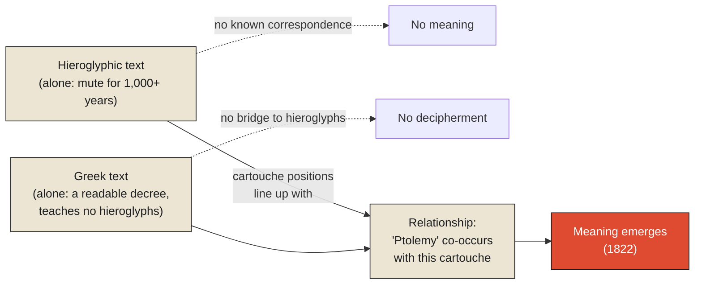

The Rosetta Stone, carved in 196 BCE and rediscovered by French soldiers near the Egyptian town of Rosetta in 1799, carries the same decree written out three times, in three different scripts: Egyptian hieroglyphs, Egyptian Demotic script, and Ancient Greek. For over a thousand years before its rediscovery, the hieroglyphic writing system had been unreadable to anyone alive — the knowledge of how to interpret it had died out completely, leaving an enormous body of inscriptions across Egypt that were, for all practical purposes, pure, uninterpreted state: marks unmistakably placed with intent, by people who clearly meant something specific by them, and yet meaningless to every single person who could actually look at them.

The stone's hieroglyphic inscription, on its own, remained exactly this kind of mute state for over two decades after its rediscovery — scholars could see it, copy it, study its individual symbols, and still couldn't reliably say what any of it meant. What eventually broke the impasse, in 1822, was the French scholar Jean-François Champollion's specific method of reading the stone not as one inscription, but as a relationship between two. Champollion noticed that a particular repeated cluster of hieroglyphic symbols, enclosed in an oval loop called a cartouche, appeared at points in the hieroglyphic text that lined up, positionally, with occurrences of the name "Ptolemy" in the stone's known, readable Greek text. The hieroglyphic symbols, entirely on their own, had told him nothing. The Greek text, entirely on its own, told him about a Greek-language decree but nothing whatsoever about how to read hieroglyphs. It was only the correspondence *between* the two — the fact that a specific hieroglyphic pattern reliably co-occurred with a specific, already-known Greek word — that let meaning emerge at all, for the first time in over a thousand years.

**This is the claim this chapter, and this entire monograph, has been building toward from its first page: meaning is never a property residing inside a single piece of state, waiting to be extracted by looking closely enough. It emerges only from a relationship — a correspondence, a correlation, a structural connection — between a piece of state and something else, some context, that lets one illuminate the other. Neither the hieroglyphs nor the Greek text contained the decipherment by themselves. The relationship between them did.**

<Callout type="architectural-tension">
No amount of staring harder at an isolated piece of state will reveal meaning that was never going to be visible from that state alone. Meaning is not hidden inside data, waiting for sufficiently careful inspection. It exists only in the relationship between data and something else — a second signal, a known reference, a surrounding structure — and without that second term, the first one stays exactly as mute as a hieroglyph carved by someone whose language no longer has any living speakers.
</Callout>

## Measuring the relationship itself, precisely

What Champollion did informally, by careful, patient noticing, has a precise formal counterpart in information theory: mutual information, a measure of exactly how much knowing the value of one variable tells you about another. Two variables with zero mutual information are, informationally, strangers to each other — learning one tells you nothing whatsoever about the other, the situation the hieroglyphs and the rest of the world had been stuck in for a millennium, with no known correspondence connecting them to anything readable. Two variables with high mutual information are tightly linked — learning one lets you predict a great deal about the other, which is exactly the relationship Champollion discovered between a specific cartouche's recurring pattern and the specific positions where "Ptolemy" appeared in the parallel Greek text. The mutual information wasn't a property of the hieroglyphs alone, and it wasn't a property of the Greek text alone. It was a property of the *pairing* — precisely the reason meaning, in this case, only became available once both pieces of state were considered together rather than examined separately, exactly as isolated inscriptions.

## What "meaning" turns out to require, structurally

It's worth pressing further into why a relationship, rather than a single artifact, is structurally necessary for meaning to exist at all, and a formal discipline called type theory offers a genuinely useful way to state this precisely. In type theory, an expression's type is not a property inherent to the raw symbols making it up — it's a constraint, imposed by context, determining what that expression is even allowed to mean within a given system. The same string of digits, "07," means something different depending on whether its surrounding context types it as a day-of-month, an hour on a 24-hour clock, or a two-digit year — the exact ambiguity this monograph's third chapter examined at organizational scale during the Y2K crisis. The digits alone carry no type. The type comes entirely from context, imposed as a constraint from outside the raw symbol, and the meaning of the symbol only becomes determinate once that external constraint is applied to it.

This is precisely the structural role the Greek text played for Champollion, formalized: the Greek inscription functioned as a type system for the otherwise untyped hieroglyphic symbols, constraining what a given repeated pattern was allowed to mean by anchoring it to a known, already-typed reference — a name, in a language already understood. Remove that external constraint, and the hieroglyphic state reverts to exactly what it had been for a thousand years: symbols with no determinate meaning, because nothing outside them was constraining what they were permitted to mean.

<Callout type="unresolved">
A piece of state with no external context constraining its interpretation does not have an unknown meaning waiting to be discovered. It has no determinate meaning at all, in the same sense that "07" has no determinate meaning until something outside the digits themselves specifies whether it's a day, an hour, or a year. Meaning is not hidden inside isolated state. It doesn't exist yet, structurally, until a relationship to something else supplies it.
</Callout>

## Why this had to be where the Information track ends

This chapter closes not just the Context monograph but the entire arc this series has been tracing since it first introduced the idea of state, and it's worth naming that full arc plainly, because each monograph turns out to have been examining one facet of a single, larger claim this final chapter can now state in full.

Signals showed that reality emits information before anyone understands it. Observations showed how systems first capture it. State showed how they retain it. History showed how they preserve its evolution. Memory showed how they retrieve it efficiently. Context has shown why none of those, by themselves, are enough. **Information is never meaningful in isolation. It becomes meaningful only as part of a larger structure of relationships** — a hieroglyph beside a name in a language already known, a number beside the unit that determines what it's actually claiming, a fact beside the surrounding conditions that make it interpretable at all rather than merely present.

This is why the Mars Climate Orbiter's failure, a few chapters ago, wasn't a failure of state — every number involved was calculated correctly. It was a failure of relationship: two systems' numbers, considered in isolation, each internally consistent, and never properly related to each other's assumed context. It's why a card catalog's small printed card matters as much as the book it describes — the book alone, without that relational structure connecting it to a schema, a classification, a cross-reference network, is nearly as unreachable as a hieroglyph with no Greek text beside it. And it's why context, once built, cannot simply be left alone to persist — the Y2K crisis showed that the relationship between an artifact and its meaning decays actively, continuously, the moment nobody is maintaining the connection anymore, in exactly the way a language dies the moment nobody living still speaks it, leaving its written record intact and its meaning gone.

## Where this leaves the series

The next track in this series turns from how systems capture, hold, and contextualize information toward a harder and more consequential question: what happens once that information is used to build something — a model, a decision, a coordinated action among many independent parts — that has to act on the world rather than merely describe it. Every idea this Information track has built, from a signal's first capture through a fact's dependence on context it cannot supply for itself, becomes the raw material the Computation track now has to reckon with directly: not simply how meaning emerges from relationship, but what it costs, and what it risks, when that meaning is compressed into a model, coordinated across systems that cannot fully see each other, and finally, irreversibly, acted upon.

<Figure n={1} title="Neither Inscription Alone" caption="The hieroglyphs, examined alone, were mute for a thousand years. The Greek text, examined alone, described a decree but taught no hieroglyphs. Meaning appeared only in the correspondence between the two.">

</Figure>

<FormalNote>
Mutual information gives Champollion's discovery its exact form — a property of the *pairing*, never
of either variable alone:

$$I(X; Y) = \sum_{x \in X} \sum_{y \in Y} p(x, y) \log \frac{p(x, y)}{p(x)\,p(y)}$$

$I(X;Y) = 0$ exactly when $X$ and $Y$ are independent — informationally strangers, the hieroglyphs'
condition for a thousand years. Type theory names the same requirement in a different register: a
typing judgment $\Gamma \vdash e : \tau$ says an expression $e$ has type $\tau$ only *relative to* a
context $\Gamma$ supplying the constraint — never as a property of $e$ alone, in exactly the sense
"07" has no type until something outside the digits says which one.
</FormalNote>

## Elsewhere in this series

<Callout type="note">
This closes the Information track by giving formal shape to a relationship every prior monograph
depended on without naming it: the Bayesian conditioning in
[Facts Require Context](./facts-require-context), the knowledge-graph triples in
[Metadata Is Operational Context](./metadata-is-operational-context), and the Bayesian updating in
[Observability vs. Analytics](../../reality/observations/observability-vs-analytics) are all instances
of the same underlying claim — that meaning is a property of a relationship, never of an isolated
term. The next track, Computation, has not been written yet.
</Callout>