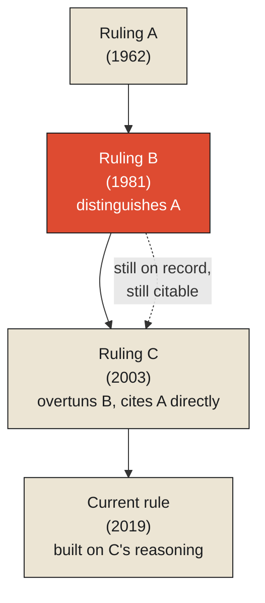

A statute book will tell you, at any given moment, exactly what the current law says. Look up the relevant section, and you have your answer — current, authoritative, complete for the question "what is the rule right now." In this narrow sense, a statute book is a database in the fullest sense this series has used the word: a structure optimized to answer "what is currently true," with essentially no interest in how that current truth came to be.

Case law does something else entirely, and it's worth being precise about what. In common-law systems, a judge deciding a case doesn't simply apply the current rule in isolation. They write an opinion that explicitly engages with prior rulings — following one precedent, distinguishing another as inapplicable to different facts, occasionally overturning a previous decision outright while explaining exactly why the earlier reasoning no longer holds. Crucially, an overturned ruling is not deleted from the body of law. It remains, permanently, on the record — cited, discussed, sometimes still relevant to a narrower set of facts than the ones that led to its overturning. A modern court explaining why an old precedent no longer applies has to reference that precedent directly, by name, to make the argument at all. The old ruling isn't a discarded, superseded value the way a database silently overwrites yesterday's stock price with today's. It's a permanent link in a causal chain of reasoning that the current rule cannot be fully understood without.

**This is the exact distinction this chapter is named for. A database answers "what is true now." A historical record answers "how did what's true now come to be true, and what did we believe before that, and why did we stop believing it."** The two questions look similar enough to blur together, right up until you ask what happens to yesterday's answer once today's arrives. A database overwrites it. A historical record keeps it, deliberately, because the causal chain connecting yesterday's answer to today's is the entire point of keeping the record in the first place.

<Callout type="architectural-tension">
A database that "remembers everything" by never deleting old rows is still not a historical record, if it has no way of expressing which old rows caused which new ones. History is not merely the absence of deletion. It is the explicit preservation of causal links between one state and the next — and a system can retain every value it has ever held while still having no history at all, in this sense, if it never records why one value gave way to another.
</Callout>

## Why the causal link is the part that's actually valuable

It's worth dwelling on why this distinction matters practically, rather than treating it as a semantic nicety. A lawyer arguing a case today doesn't just need to know the current rule — a statute book could tell them that in seconds. They need to know *why* the rule is what it is, because that reasoning is exactly what determines whether the current rule actually applies to a new, slightly different set of facts that no prior case has addressed directly. If the rule against a certain kind of contract exists because of a specific historical concern — fraud, coercion, an imbalance of bargaining power — a lawyer arguing that a new, unusual contract structure falls outside that rule has to engage with the *original reasoning*, not merely the *current wording*, to make the argument credibly. The reasoning, preserved permanently across the chain of decisions that built and refined it, is doing real, load-bearing work that the current rule alone, stripped of its lineage, cannot do by itself.

This is a genuine, formal structure, and it has a name in the discipline of tracking data lineage: a provenance graph, in which every node represents a piece of information — here, a ruling — and every edge represents an explicit causal or evidentiary dependency connecting it to the information that produced or justified it. A body of case law is, quite literally, a citation graph of exactly this kind: every opinion a node, every citation to a prior case an edge, and the entire structure preserving not just what was decided at each point but precisely which earlier decisions each new one depended on, built from, or explicitly rejected. Tracing a modern legal rule back through this graph to its origin isn't an academic exercise. It's how a lawyer determines whether the rule was ever really about the situation currently in front of them, or only looks that way once its original reasoning has been stripped away.

## What the temporal database gets right, and what it still can't do

It's worth being fair to the database side of this comparison before dismissing it, because a well-designed temporal database — one that tracks, for every record, both when a fact was valid in the world and when the system came to know it, the bitemporal structure the previous monograph covered in detail — genuinely can answer "what did the rule say on this specific past date," which is no small achievement, and considerably more than a statute book alone ever attempts. What even a well-built temporal database still structurally cannot supply, without an explicit provenance layer added deliberately on top of it, is the *reasoning connecting* one recorded value to the next. It can tell you the rule changed on a specific date. It cannot, on its own, tell you which specific prior case, argument, or piece of reasoning caused that change, unless something was designed, on purpose, to capture that causal link as its own first-class piece of information — which is precisely what a body of case law does as a matter of professional practice, and what most ordinary databases, temporal or otherwise, simply were never asked to do.

<Callout type="unresolved">
Knowing when a value changed is not the same as knowing why it changed, or what earlier value it depended on. A temporal database gives you the first, reliably. Giving you the second requires a deliberate decision to record causal or evidentiary links as data in their own right — a decision most systems that "keep history" never actually make.
</Callout>

## What history is actually for

This is the ground the rest of this monograph builds on. A record that preserves values without preserving the causal links between them is not yet history in the sense this chapter means — it's closer to an archive of snapshots, valuable in its own way, but silent about the reasoning that connects one snapshot to the next. Genuine historical preservation requires something more deliberate: recording not just that a value changed, but what it changed *from*, and — wherever it can be captured — *why*. That deliberateness has a cost, and a specific practice built around paying it honestly, which is where the next chapter begins: with a tradition, centuries old, that governs exactly how a ship's logbook is allowed to handle a mistake once it's already been written down in ink.

<Figure n={1} title="A Citation Graph Doesn't Delete Overturned Rulings" caption="The overturned ruling stays in the graph, still cited, still load-bearing — a database would have already overwritten it with whatever's current.">

</Figure>

<FormalNote>
A provenance graph names this structure simply: $G = (V, E)$, where $V$ is the set of recorded facts
and $E$ the set of explicit causal or evidentiary dependencies connecting each one to whatever
produced or justified it. A body of case law is a provenance graph in exactly this sense. Bitemporal
data, covered in the previous monograph, tells you *when* a value changed; the graph is the separate,
deliberate layer needed to say *what it depended on* — the second is not a byproduct of the first.
</FormalNote>

## Elsewhere in this series

<Callout type="note">
This chapter's provenance graph is the missing layer
[Why Historical Truth Is Harder Than Current Truth](../state/historical-truth-is-harder-than-current-truth)
names but doesn't build: bitemporal tracking gives a record two clocks, but neither clock says which
earlier fact caused the next one. That causal-link structure is also what
[State Reconstruction from Immutable Logs](../state/state-reconstruction-from-immutable-logs) relies
on implicitly — a chess log's moves are already a provenance chain, just one where every edge happens
to be deterministic. The next chapter, [Immutable Histories](./immutable-histories), takes up what it
takes to make that chain itself tamper-evident.
</Callout>