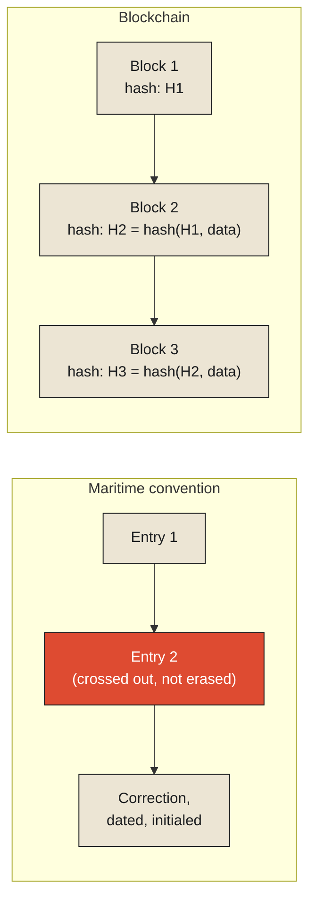

Under long-standing maritime convention, a ship's deck log is governed by a rule that sounds almost quaint until you notice how completely it anticipates a problem most modern record-keeping systems are still trying to solve. If an officer makes an entry and later realizes it was wrong — a miscalculated position, a misheard order, a simple slip of the pen — the correction is not made by erasing the mistake. Convention calls for a single line drawn through the incorrect entry, leaving it fully legible underneath, initialed by whoever made the correction, with the corrected information entered afresh, as a new line, immediately after. The wrong entry never disappears. It sits there, permanently, crossed out but still readable, sitting right next to its own correction, for as long as the logbook survives.

This is worth taking seriously as a deliberate, load-bearing design decision rather than old-fashioned fussiness. A ship's log exists, in large part, to be trusted by people who weren't there — a court of inquiry investigating a collision, an insurer assessing a claim, a maritime authority reviewing a captain's conduct months or years after the voyage ended. None of those readers were on deck when the entry was made. All of them need some way of trusting that what they're reading is what was actually written, at the time, without wondering whether it's been quietly altered since to look better in hindsight. **The rule against erasure doesn't just record history. It makes a specific, verifiable claim about the record itself: nothing here has been rewritten after the fact to say something different from what was originally believed true.** A crossed-out, legible mistake is not a flaw in the log. It is the evidence that makes the rest of the log trustworthy.

<Callout type="architectural-tension">
A record that can be silently edited after the fact can never fully prove, to someone reading it later, that it hasn't been. A record that can only be appended to — where every correction is itself a new, dated, attributed entry, and nothing already written can ever be quietly changed — carries its own proof of integrity built directly into its structure, without needing anyone to simply trust the record-keeper's word for it.
</Callout>

## What "append-only" actually buys, beyond honesty

It would be easy to treat this purely as a matter of professional integrity — sailors shouldn't lie, so don't let them erase things — but the practical benefit runs deeper than trustworthiness alone. An append-only record, where every entry is added in sequence and nothing already written is ever removed or altered, has a second, independent property that turns out to matter just as much: it is reproducible. Anyone reading the log from the beginning, in order, can reconstruct exactly what the ship's crew believed to be true at every point along the voyage, including every mistaken belief they later corrected — not just the final, corrected picture, but the actual, sometimes wrong, sequence of understanding as it unfolded in real time. This is precisely the property that makes a log genuinely useful for an investigation: a court examining a collision doesn't only want to know what actually happened. They want to know what the crew believed was happening, moment by moment, as they made the decisions that led to the collision — decisions that were reasonable, or weren't, based on what was actually known at each instant, not on what turned out, later, to have been true.

This is the same structure computing later adopted, formally, under the name event log — a record where every change to a system is appended as a new, immutable entry, and the system's current state, whatever it happens to be, is always something derived from replaying the log rather than something stored and edited directly. The chess notation examined in the previous monograph is a pure event log in exactly this sense. So, properly understood, is a well-kept deck log: a sequence of dated, attributed, append-only entries, from which the ship's entire understood history — corrections and all — can always be reconstructed exactly, no matter how many mistakes were made and corrected along the way.

## The version with no captain to trust

It's worth naming a real limitation of the maritime convention before moving on, because the limitation is exactly what the next development in this idea had to solve. A ship's log is append-only by *discipline* — by professional convention, enforceable after the fact if a court of inquiry catches a violation, but not enforceable in the moment by anything other than the honesty of whoever is holding the pen. A sufficiently determined captain, in principle, could tear out a page and rewrite the voyage from scratch, and unless someone else had already read and remembered the original, there would be no independent way to prove it had happened. The convention makes tampering *dishonorable* and *detectable after the fact if compared against other evidence*. It does not make tampering *structurally impossible*. The system still ultimately rests on trusting the person who holds the record.

This is the exact gap a blockchain is built to close, and it's worth being precise about the mechanism rather than treating the word as a buzzword standing in for "very secure." Each new block of recorded transactions includes, as part of itself, a cryptographic hash — a short, fixed-length fingerprint computed from the *entire contents of the previous block*. Change so much as a single character in an old, already-recorded entry, and its hash changes completely and unpredictably, which means every subsequent block's stored reference to it no longer matches — the tampering isn't just dishonorable, it's mathematically detectable by anyone, instantly, without needing to trust the record-keeper at all. And because many independent participants across a network each hold their own full copy of the chain, altering the past would require simultaneously rewriting and re-hashing every affected block *and* convincing a majority of independent, mutually distrustful parties to accept the forged version over the one everyone else already has — the digital equivalent of not just rewriting the logbook, but somehow also convincing every other ship that witnessed the voyage to rewrite theirs identically, in agreement, all at once.

<Callout type="architectural-tension">
The maritime convention makes the past auditable by making tampering dishonorable and, if compared against other records, detectable. A blockchain makes the past auditable by making tampering mathematically self-evident, the instant it happens, to anyone holding a copy — replacing trust in a single record-keeper's integrity with a structure where integrity no longer has to be trusted at all, only checked.
</Callout>

This is the throughline worth carrying forward: the underlying principle — a corrected past permanently visible beside its correction, never quietly replaced — is exactly the same in both cases. What changed, six centuries later, was who has to be trusted for that principle to actually hold. A ship's log needs an honest officer. A blockchain needs nothing but arithmetic and enough independent parties paying attention.

## The cost this buys nothing for free

None of this comes without a real cost, and it's worth being honest about what that cost is before the next chapter takes it up directly. An append-only record, by construction, never gets smaller. Every mistake, once made, stays in the record permanently — crossed out, corrected, but never removed — which means a sufficiently long voyage, or a sufficiently long-running system, accumulates an ever-growing record that has to be stored, preserved, and, if anyone wants to actually use it, eventually read through in its entirety. A ship's logbook fills up, physically, and has to be archived and replaced with a new one; a digital event log, left running indefinitely, grows without bound in exactly the same way, just without the physical reminder a full logbook provides.

<Callout type="unresolved">
Immutability guarantees that nothing already recorded can be silently changed. It does not, on its own, answer a separate and increasingly urgent question: how much of this permanently growing record can any real system actually afford to keep, forever, without the keeping itself becoming the harder problem?
</Callout>

## What auditability is actually worth

It's worth closing on why this tradeoff has been judged worth making, across so many domains that have converged on some version of the same append-only discipline independently — maritime logs, accounting ledgers, and, much later, distributed computing systems that use event logs as their fundamental unit of record. The common thread is that all of them exist in situations where being trusted by someone who wasn't present matters enormously, and where the alternative — a record that could, in principle, have been quietly edited after the fact — would undermine the entire reason for keeping a record at all. A ship's log that could be silently rewritten wouldn't be useless exactly, but it would no longer be *evidence* in the sense a court, an insurer, or a maritime authority needs it to be. Immutability is what converts a simple record into something strong enough to bear the weight of being trusted by someone who has no other way of verifying it.

This leaves the practical question the previous section already surfaced, and it's the one the next chapter takes up directly and without flinching: if a record genuinely never gets smaller, and if keeping absolutely everything forever is, in enough real systems, simply not physically or economically possible, what actually happens when an organization — or an entire field of science — has to admit, honestly, that it cannot remember everything, and has to decide, in advance, what gets kept and what gets thrown away the instant it happens?

<Figure n={1} title="Two Ways to Make Tampering Visible" caption="Both close the same gap — a corrected past permanently visible beside its correction — by different means. One needs an honest officer; the other needs nothing but arithmetic.">

</Figure>

<FormalNote>
A block's hash is computed from the entire contents of the block before it, $H_i =
\text{hash}(H_{i-1}, \text{data}_i)$. Changing anything in an already-recorded block changes its hash
unpredictably, which breaks every later block's stored reference to it — tampering becomes detectable
by anyone holding a copy, without needing to trust whoever wrote the record.
</FormalNote>

## Elsewhere in this series

<Callout type="note">
The append-only discipline this chapter names is the event-sourcing principle
[State Reconstruction from Immutable Logs](../state/state-reconstruction-from-immutable-logs) and
[Event Sourcing vs. Temporal Snapshots](../state/event-sourcing-vs-temporal-snapshots) already
established — chess notation and a document's keystroke history are both append-only in this exact
sense, just without the tamper-evidence a hash chain adds on top. The unbounded growth this chapter
closes on is the same relocation named in
[Complexity Never Disappears](../../reality/reality/complexity-never-disappears): nothing about
immutability makes storage cost disappear, it only decides where that cost is allowed to be denied.
The next chapter, [The Cost of Remembering Everything](./the-cost-of-remembering-everything), takes
up what happens once that growth stops being affordable.
</Callout>