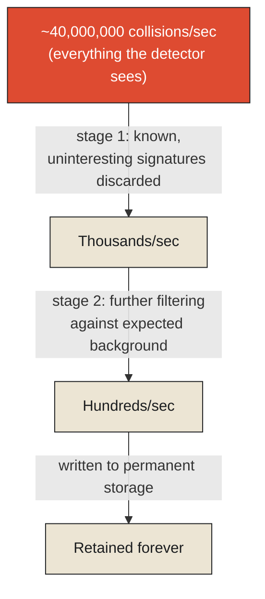

The Large Hadron Collider, buried beneath the border of France and Switzerland, smashes protons together at close to the speed of light roughly forty million times per second inside each of its major detectors, and each of those collisions produces a shower of particle debris that the detector's sensors capture as raw data. If every one of those forty million collisions per second were recorded in full, the resulting stream of raw data would run to something on the order of a petabyte per second — a volume so large that no storage system built or conceivably buildable could archive more than a small fraction of it for more than a brief window of time. This isn't a matter of the physicists at CERN being unwilling to remember everything. It is a matter of it being, in the most literal engineering sense, impossible.

What the LHC's experiments actually do about this is the sharpest, most extreme real answer available anywhere to this chapter's title. Before almost any of that raw data is ever written to permanent storage, dedicated real-time hardware systems called triggers make an immediate, largely irreversible decision, collision by collision, milliseconds after it happens: is this specific event worth keeping, or should it be discarded, permanently, right now, because keeping everything is not an option on the table. A multi-stage trigger pipeline whittles that initial deluge of forty million events per second down to a final rate, actually written to disk, of only a few hundred events per second — discarding the overwhelming majority of everything the detector ever sees, in real time, forever, the instant it decides an event isn't interesting enough to be worth the storage.

**This is the honest, unavoidable core of this chapter's question, stated as plainly as any real system anywhere has ever had to state it: remembering everything is not always merely expensive. Past a certain scale, it is not physically or economically possible at all, and a system built to operate at that scale has no choice but to decide, in advance and in real time, what to keep and what to lose forever, permanently, the instant it happens.**

<Callout type="architectural-tension">
The LHC's trigger systems are not a compromise reluctantly accepted because building enough storage would be difficult. They are an acknowledgment that no such storage could exist at any plausible cost — which means the actual scientific discipline here is not "how do we remember everything," but "how do we decide, correctly and in real time, what the tiny fraction of everything we can keep should actually be."
</Callout>

## Deciding what's worth keeping, in milliseconds

The trigger systems don't discard randomly, and the basis on which they decide is worth examining directly, because it's a real, working instance of a much more general problem this chapter is named for. The earliest, fastest stage of the trigger pipeline looks for simple, well-understood signatures — a certain pattern of energy deposits, a particular kind of particle track — that physicists already have good reason to expect might be interesting, discarding, immediately, the vast background of ordinary, already-understood collision events that happen constantly and would tell researchers nothing new even if kept. This is, formally, a real-time change point detection problem: distinguishing a genuinely unusual, statistically significant departure from the expected, well-modeled background rate of ordinary events, worth flagging and keeping, from the ordinary, expected noise of everything else — a discontinuity in an otherwise well-understood pattern, exactly the structural question change point detection is built to answer, here running at a scale of tens of millions of decisions per second.

Once an event survives this filtering and is actually written to storage, the analysis that follows is fundamentally a time-series problem: physicists examining sequences of retained collision events over time — across an experimental run, across a full year of data-taking, across the full multi-year lifetime of the machine — looking for patterns, trends, and rare, statistically significant deviations that only become visible once enough retained events have accumulated to distinguish a genuine signal from ordinary statistical fluctuation. The famous 2012 discovery of the Higgs boson, to take the most well-known example, wasn't visible in any single collision event. It emerged only as a statistically significant bump, accumulated gradually across an enormous number of retained events over time — a discovery that depended, entirely, on the trigger systems having correctly kept enough of the right kind of event, over a long enough period, for the pattern to become visible at all.

<Callout type="unresolved">
A trigger's discard decision, once made, is permanent. If a trigger system is ever slightly miscalibrated — set to look for a pattern that turns out not to be the interesting one — the events it discarded are not recoverable later by any means, no matter how important they later turn out to have been. The cost of retention isn't only storage. It's the permanent, irreversible risk of discarding, in real time, the one event that would have mattered most.
</Callout>

## What every retention decision is actually trading away

It's worth stepping back from the LHC's extreme scale to name the general shape of the tradeoff plainly, because every system that keeps a history — a company's log retention policy, a hospital's record-archiving schedule, a personal decision about which old emails to delete — is making some smaller, less dramatic version of the identical decision the trigger systems make automatically, forty million times a second. Storage costs money and grows without bound if nothing is ever discarded, the direct consequence of the previous chapter's immutability principle taken to its logical extreme. Replaying a very long history to answer a question — reconstructing state from an event log stretching back years, rather than a checkpoint stretching back hours — costs real computational time, and that cost grows with every additional year nothing gets summarized or discarded. And archival trade-offs, in the driest but most practically important sense, are simply the deliberate policy decisions organizations make about which of these costs they're willing to bear, for which parts of their history, and for how long — a spectrum running from the LHC's near-total, real-time discarding of almost everything, to a maritime logbook's principled refusal to erase anything at all, with most real systems living somewhere in the considerable space between the two.

## Closing the question this chapter opened

The honest lesson the LHC's trigger systems teach, at a scale most systems will never approach, is that "remembering everything" was never actually the goal worth aiming for, even where it's technically possible. The real goal, always, is remembering *enough of the right things* — a judgment call, made in advance, about which parts of a system's history are worth the real, unavoidable cost of keeping, and which parts can be allowed to vanish, permanently, the instant they occur, because the alternative of trying to keep everything would either be impossible outright or would bury the genuinely important signal under an ocean of ordinary, unremarkable noise. This is not a failure of ambition. It is the same discipline this series named, several chapters ago, as an observability budget — now applied not to what a system watches in the moment, but to what it's willing to carry forward, permanently, into its own past.

This leaves one question this monograph has been building toward from its very first chapter, and it's the sharpest one left to ask. Once a history — however selectively retained — actually exists, what is it *for*? Is its purpose to explain what happened, after the fact, to people who need to understand why an outcome occurred the way it did — or is a system's job, in the moment, something else entirely, closer to simply acting, correctly, on whatever the present situation demands, with no interest in explanation at all? That is the distinction the final chapter of this monograph takes up directly, across a pit wall, a cockpit, a mission control room, and a hospital bedside, all at once.

<Figure n={1} title="The LHC's Trigger Funnel" caption="Each stage discards, permanently and irreversibly, the overwhelming majority of what it sees — not because storage is merely expensive, but because no storage at any plausible cost could hold what came in.">

</Figure>

<FormalNote>
The trigger's earliest stage is a real-time change point detection problem, formally a test between
two hypotheses about the distribution an incoming reading $x_t$ is drawn from:

$$H_0: x_t \sim P(x \mid \theta_1) \qquad \text{vs.} \qquad H_1: x_t \sim P(x \mid \theta_2), \quad \theta_1 \neq \theta_2$$

Flag the event when the evidence favors $H_1$ — a genuine departure from the expected background —
over $H_0$, ordinary noise. This is the same test, run tens of millions of times a second, as
recognizing that a persistent hiss might not be interference at all.
</FormalNote>

## Elsewhere in this series

<Callout type="note">
The trigger's irreversible discard decision is the sharpest version yet of
[Signal Loss Is Permanent](../../reality/signals/signal-loss-is-permanent)'s data processing
inequality — nothing downstream of a discarded collision can ever recover it, no matter how the
analysis afterward improves. The retention judgment this chapter names explicitly as "an
observability budget" is the same budget formalized in
[Observability Is a Budget](../../reality/observations/observability-is-a-budget), now spent on what
a system carries forward into its own past rather than what it watches in the moment. The next
chapter, [History Explains; State Executes](./history-explains-state-executes), asks what a retained
history is actually *for*, once it exists.
</Callout>