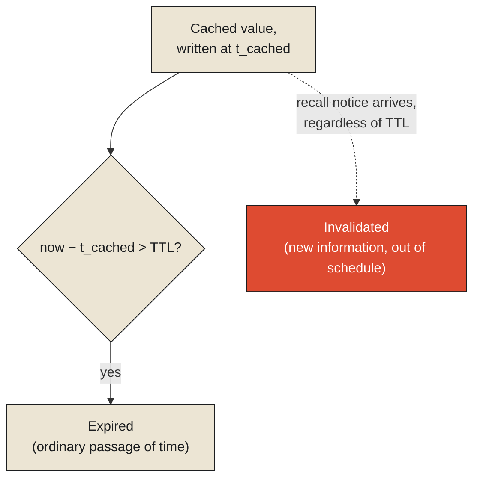

Walk into almost any grocery store and watch how the milk gets stocked, and you'll see a small, deliberate piece of engineering most shoppers never think twice about: newer cartons go to the back of the shelf, older ones get pushed to the front, and every carton carries a printed date past which it's expected to be pulled regardless of how it looks or smells. This is a genuine, working forgetting policy, applied to a physical inventory, and it's worth taking seriously as exactly that rather than as a mundane retail habit. **A cache that never forgets anything eventually becomes indistinguishable from the slow, complete record it was built to avoid consulting — it grows without bound, fills with material nobody needs quickly anymore, and stops being fast for the same reason a warehouse stops being fast: there's simply too much of it to search through quickly. Forgetting, done deliberately and on purpose, is not a failure of a cache. It's the mechanism that keeps a cache small enough to still be worth having.**

## Two different reasons something has to go

The grocery shelf actually runs two genuinely distinct forgetting mechanisms side by side, and it's worth separating them clearly, because most computing systems reach for the same two mechanisms under different names. The printed expiration date is a pure, passive countdown: nothing external has to happen, nothing has to be checked or verified, the date simply arrives and the product is expected to be pulled, on a schedule decided in advance, regardless of its actual current condition. This is precisely what computing systems call a time-to-live, or TTL — a cached value that expires automatically after a fixed duration, whether or not anything about the underlying reality it describes has actually changed in the meantime.

A product recall is a completely different mechanism, and the difference matters. A recall happens because someone, somewhere, has discovered — often well before any printed date would have triggered removal — that a specific batch is actually unsafe, and it has to be pulled immediately, out of the normal schedule entirely, based on new information rather than the simple passage of time. This is what computing systems call invalidation: an explicit, external signal declaring that a specific cached value is now known to be wrong, right now, regardless of how much of its nominal freshness window remains. A product could be recalled the same day it was stocked, long before its printed date would ever have removed it on its own — the recall doesn't wait for the countdown; it interrupts it.

<Callout type="architectural-tension">
Expiration handles the ordinary, expected case: things become stale simply because time has passed, and a fixed schedule for removing them, decided in advance, is good enough. Invalidation handles the case expiration cannot: something has become wrong *before* its scheduled expiration, and only an explicit signal — a recall, an update, a notification — can catch it in time. A cache that relies on expiration alone has no way to react to the second case at all, and will keep serving a known-wrong value confidently until its clock runs out.
</Callout>

## Deciding what to remove when there simply isn't room

Expiration and invalidation both answer "when does something specific need to go." A separate, equally important question is what to remove when the shelf, or the cache, is simply full, and something has to make way for something new, without any specific item having expired or been recalled at all. This is the actual, formal problem an eviction policy solves, and different policies make genuinely different bets about what's likely to be needed again.

A strict first-in-first-out shelf-rotation policy — the classic grocery approach — evicts whatever arrived earliest, on the reasonable assumption that older stock, all else equal, is more likely to be approaching its own natural end regardless of demand. Least-recently-used, or LRU, a different and extremely common policy in computing caches, evicts instead whatever hasn't actually been accessed in the longest time, on a different and often sharper assumption: that something nobody's touched recently is less likely to be touched again soon, regardless of how long it's physically been sitting there. A grocery store could, in principle, run an LRU-style policy instead of strict rotation — keeping whichever items customers are actually still buying regularly on the shelf longer, and pulling slower-moving stock sooner even if it arrived more recently — but almost none do, because food safety and shelf-life concerns make simple time-based rotation the safer, simpler default. Least-frequently-used, or LFU, makes a third, subtly different bet: rather than asking when something was last touched, it asks how often it's been touched overall, evicting whatever has the lowest total usage count, which behaves differently from LRU specifically when something was used constantly for a long stretch and then suddenly stopped — LRU would evict it quickly once it goes quiet; LFU, still crediting its earlier heavy use, would hold onto it longer.

None of these three policies is simply better than the others in the abstract. Each makes a different bet about what pattern of future access is most likely, and the right choice depends entirely on which bet actually matches how the specific system's real usage behaves — the same underlying question the previous chapter raised about locality, now applied specifically to the question of what to throw away rather than what to keep close.

<Callout type="unresolved">
Choosing an eviction policy is a bet about the future, made using only patterns from the past. LRU bets that recent behavior predicts near-future behavior. LFU bets that accumulated total usage is the better predictor. Strict rotation bets that age alone, independent of usage, is what matters most. There is no eviction policy that is correct regardless of the access pattern it's actually being run against — only policies that happen to match, or fail to match, the real pattern of a specific system.
</Callout>

## What happens when more than one shelf exists

There's a further complication worth naming before this chapter closes, because it sets up a problem the next chapter has to confront directly. A single grocery store's shelf is one copy of the truth about what's currently in stock — awkward when it's wrong, but at least there's only one version to get wrong. Many real systems, computing systems especially, run multiple caches simultaneously, in different locations, each holding its own copy of the same underlying data for speed. The moment there is more than one copy, a new question opens that a single shelf never has to face: if the underlying truth changes, and one cache learns about it before another does, the two caches now disagree with each other, both confidently, at the same time — a coherence problem, not merely a freshness problem, and one this chapter has deliberately left to the side.

This closes the specific question this chapter set out to answer: a cache stays useful only by forgetting, deliberately and on a schedule it controls, rather than by accident or by simply running out of room. Expiration handles the ordinary passage of time; invalidation handles the cases time alone can't catch; an eviction policy decides what goes when space runs short, based on a bet about what pattern of future use is most likely to hold. The next chapter turns to a different, closely related question this one has left open: not how a cache decides what to forget, but how much any single mind or system can actually hold onto, actively, at once — and what happens once more than one actor needs to agree on what's currently true in that small, active, working space.

<Figure n={1} title="Two Reasons Something Leaves the Shelf" caption="Expiration is a countdown decided in advance. Invalidation interrupts it, based on new information the schedule never anticipated.">

</Figure>

<FormalNote>
Expiration is a simple countdown: a cached value is stale once $\text{now} - t_{\text{cached}} >
\text{TTL}$, checked passively, on a schedule fixed in advance. Invalidation isn't governed by this
inequality at all — it's an external signal that can fire at any $t_{\text{cached}} + \varepsilon$,
arbitrarily close to the write itself, which is exactly why a cache relying on expiration alone has no
way to catch it.
</FormalNote>

## Elsewhere in this series

<Callout type="note">
The coherence problem this chapter closes on — multiple caches disagreeing, both confidently, at the
same time — is the same structural fact
[What Time Means in Distributed Systems](../../reality/time/time-in-distributed-systems) names for
separated clocks: without a shared "now," two copies can each be locally consistent and still
disagree. The eviction bet this chapter describes is also a smaller-scale version of
[Signal Loss Is Permanent](../../reality/signals/signal-loss-is-permanent) — once evicted without a
durable copy elsewhere, a cached value is gone the same way an unrecorded signal is, not merely stale.
The next chapter, [Working Memory in Information Systems](./working-memory-in-information-systems),
takes up exactly that coherence problem directly, through a kitchen order rail.
</Callout>