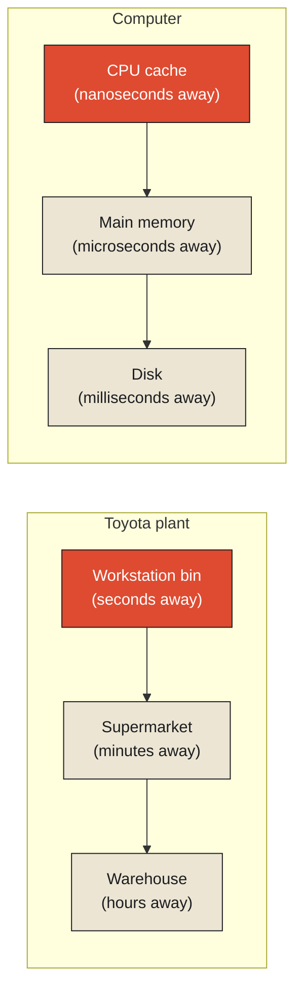

Walk along an assembly line at a Toyota plant and you'll find, at each individual workstation, a small bin holding a modest number of the specific parts that station needs — bolts, brackets, a particular subassembly — restocked continuously as they're used. This bin is never the authoritative record of how many of that part the factory actually has. Somewhere else entirely, an inventory ledger tracks the true count, reconciled against purchase orders, supplier deliveries, and production plans. The bin's job has nothing to do with being correct about the factory's total inventory. Its entire purpose is narrower and more urgent: making sure the worker standing at that station never has to stop, walk to a warehouse, and wait for someone to check the true count, every single time they need another bolt.

This system — kanban, developed by Taiichi Ohno at Toyota starting in the 1950s as part of what became the Toyota Production System — is staged in layers, each one deliberately trading completeness for speed. The workstation bin holds only what's needed for the next short stretch of work. A "supermarket" area nearby holds a somewhat larger buffer, restocked from the main warehouse on a regular cycle. The warehouse itself holds considerably more, restocked on a slower cycle from suppliers. Each layer, moving away from the worker, holds more inventory and takes longer to consult and restock; each layer, moving toward the worker, holds less but can be accessed instantly, without a trip anywhere. **None of these layers, except perhaps the last, claims to be the truth about the factory's total inventory. Each one exists purely to make the layer above it faster to work with — and that tradeoff, made deliberately and repeatedly at every layer, is the entire idea this chapter is about.**

<Callout type="architectural-tension">
A cache is never built to be more accurate than the system it's caching. It is built to be faster to consult, at the deliberate, accepted cost of sometimes being slightly behind, slightly incomplete, or slightly wrong about the thing it's a faster version of. Truth and speed are not the same design goal, and a system that tries to make its cache perfectly truthful at all times has usually, quietly, stopped getting the speed benefit that justified building a cache at all.
</Callout>

## Why the small bin has to stay small

It's worth asking directly why the workstation bin isn't simply made larger — why not stock enough parts at every station to last a full week, removing the need for frequent restocking trips entirely? The answer is a genuine, unavoidable tradeoff, and it has a formal name: a space-time tradeoff, the general principle that reducing the time needed to access something usually requires spending more space to hold it closer at hand, and that space is never free. A workstation stocked with a week's worth of every part it might need would require an enormous amount of floor space at every single station, most of it sitting unused most of the time, occupying room that could otherwise go toward production itself. The small bin isn't a design limitation grudgingly accepted. It's the correct answer to a real cost equation: keep just enough close by to cover the short stretch of time before the next restock is easy to arrange, and let the warehouse — slower to reach, but vastly larger — absorb the burden of holding everything else.

This layered structure — small and fast nearest the point of use, larger and slower further away — is a physical, entirely non-computational instance of what's formally called a memory hierarchy, and the same structure governs how every modern computer is actually built, whether or not most people using one ever think about it. A processor's own tiny, extremely fast cache sits closest to the arithmetic actually being performed, holding only the small amount of data currently in active use. Main memory sits one layer further out — larger, slower, holding considerably more. Long-term storage — a hard drive or solid-state disk — sits further still, larger again, slower again, holding nearly everything the system owns but far too slowly to consult for every single calculation. External memory algorithms are the formal discipline of designing computation specifically around this hierarchy — deliberately organizing work so that the fastest, smallest layer holds whatever's about to be needed next, and the slower, larger layers are only consulted when absolutely necessary, in exactly the spirit of a kanban bin holding only this hour's bolts and leaving next month's supply safely, slowly, in the warehouse.

## The pattern that makes small bins actually work

None of this would function if a workstation's parts usage were completely random and unpredictable — if a worker might need any of ten thousand different parts at any moment, no small bin could possibly anticipate the right one to stock. What makes the whole system work is a real, exploitable pattern in how parts actually get used: a given workstation performs a narrow, repetitive set of tasks, needing largely the same handful of parts over and over, in tight clusters of time. This pattern — that whatever was needed a moment ago is disproportionately likely to be needed again very soon, and that things needed together tend to be needed together repeatedly — has a formal name in the discipline built around it: locality, the foundational assumption underneath cache theory generally. A cache built without this assumption holding true, even approximately, provides no benefit at all — if literally any of ten thousand parts might be needed next with equal probability, a small bin holding a handful of them helps almost none of the time, and the entire kanban system would collapse into being no faster than walking to the warehouse for everything.

<Callout type="unresolved">
A cache is only ever as good as the locality of the thing it's caching. Kanban works because a workstation's real, physical task genuinely does repeat a narrow set of parts in tight clusters. A cache built for a system whose access pattern is genuinely random, with no exploitable locality at all, buys almost nothing — the speed benefit was never really coming from the cache's cleverness, but from a real pattern in the underlying reality that the cache happened to be positioned to exploit.
</Callout>

## What this means for anything built to be fast rather than exhaustive

The deeper lesson kanban teaches, stated plainly, is that speed and completeness are genuinely different design goals, and building a system that's fast almost always means deliberately, knowingly, building something that is not the whole truth — a small, current, locally-relevant slice of it, positioned exactly where it's needed, backed by something larger and slower that holds the real, complete account further away. This is not a compromise reluctantly tolerated. It's the entire mechanism by which speed is achieved anywhere in a system with real physical or computational constraints, which is to say, in practice, everywhere.

This leaves an obvious, pressing question this chapter has deliberately not answered yet: a small bin holding a handful of parts is useful only as long as what it's holding stays relevant to what's actually needed next. What happens when the parts in the bin stop being the right ones — when the line changes over to build a different product, or a part gets superseded by a redesigned version, and the bin is still, stubbornly, holding the old inventory? Something has to notice, and something has to clear the bin out, deliberately, before it starts actively getting in the way rather than helping. That is the subject of the next chapter, and it turns out most grocery stores have already solved a very close cousin of exactly this problem.

<Figure n={1} title="The Memory Hierarchy, Physical and Computational" caption="The same shape, twice: small and fast nearest the point of use, larger and slower the further away, each layer existing only to make the layer above it faster to work with.">

</Figure>

<FormalNote>
The space-time tradeoff names the cost this hierarchy is built around: reducing access time generally
requires spending more space to hold something closer at hand, and that space is never free. Locality
is the separate, empirical bet that makes any of it worth building at all — that whatever was needed a
moment ago is disproportionately likely to be needed again soon. Without locality holding true, even
approximately, a small bin near the point of use buys nothing.
</FormalNote>

## Elsewhere in this series

<Callout type="note">
The tradeoff this chapter names is the same relocation
[Complexity Never Disappears](../../reality/reality/complexity-never-disappears) describes in
general: speed at one layer is purchased by spending space and coordination at another, never for
free. It also depends on the same conservation Little's Law makes explicit in
[Every Queue Is a Negotiation with Time](../../reality/time/queue-time-negotiation) — a smaller,
faster buffer trades capacity for wait time, the same way a smaller bin trades floor space for
restocking frequency. The next chapter, [Caches Forget on Purpose](./caches-forget-on-purpose), takes
up what happens once the bin is holding the wrong parts.
</Callout>