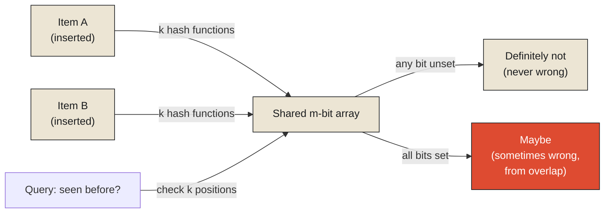

In 1956, the psychologist George Miller published a paper with a title that has since become one of the most quoted phrases in cognitive science: "The Magical Number Seven, Plus or Minus Two." Miller synthesized a range of experimental findings on human short-term memory and arrived at a strikingly consistent limit: people can reliably hold onto only about seven discrete items — a string of digits, a list of unrelated words — in active, immediately accessible memory at once, with the number dropping to around four or five once the items get more complex. This isn't a limit on how much a person can know in total; it says nothing about the vast, durable store of long-term memory, which holds a lifetime's worth of facts, faces, and skills. It's a hard, measured limit on how much can be held *actively*, ready for immediate use, at any single moment — a completely different kind of capacity from the near-limitless capacity of long-term storage.

**This is the exact distinction this chapter's title is built around, stated first by a psychologist studying human minds decades before it became a formal concern for anyone designing information systems: working memory is not a smaller version of durable knowledge. It is a genuinely different kind of storage, small on purpose, fast on purpose, holding only what's immediately relevant to the task in front of you right now — and everything this monograph has covered so far, the kanban bin, the grocery shelf, has really been describing a version of exactly this same small, fast, deliberately limited space, just built out of parts and dairy products instead of neurons.**

<Callout type="architectural-tension">
Working memory and long-term memory are not the same store at two different speeds. They are structurally different kinds of storage, optimized for opposite goals — one for immediate, active use with a hard capacity limit; the other for durable retention with no meaningful ceiling — and a system, biological or computational, that tries to make one behave like the other usually loses whatever made the original valuable.
</Callout>

## Miller's number, and what it names in a computer

This same structural idea, that only a small, active subset of everything a system knows is worth keeping immediately at hand, has a formal name in computing: working set theory, developed by Peter Denning in the 1960s to describe exactly the set of memory pages a running program is actively using at a given moment — not everything the program could theoretically access, but the specific, usually small, subset it's genuinely touching right now, in this stretch of execution. [^1] A program's working set, like Miller's seven items, is small relative to everything the program or the person could, in principle, know or hold — and the entire discipline of managing computer memory efficiently rests on correctly identifying that small active subset and keeping it in fast, immediately accessible storage, while everything else waits, further away, in slower memory, exactly the layered structure the kanban bin and the memory hierarchy already established.

## The feeling of "I think I've seen this before"

There's a second, more casual cognitive experience worth examining here, because it maps almost perfectly onto a specific, elegant piece of computing mathematics. Most people have had the experience of encountering something — a face, a phrase, a piece of trivia — and feeling a fast, immediate sense of "I think I've seen this before," without being able to say where or when. This feeling has a specific, asymmetric error pattern worth noticing precisely: it can mislead you into thinking you've seen something you actually haven't — a false positive, a nagging, mistaken sense of familiarity — but it essentially never does the reverse. If you feel completely certain you've never encountered something before, you're very rarely simply wrong about that in the other direction; genuine, confident unfamiliarity is a much more reliable signal than a vague sense of déjà vu.

This exact asymmetry — possible false positives, no false negatives — is precisely, formally, what a Bloom filter guarantees, and it's worth explaining the actual mechanism rather than leaving it as an analogy. A Bloom filter is a compact data structure that can answer "have I definitely never seen this item before, or might I have?" using a small, fixed amount of memory, dramatically less than would be needed to store every item it's checking against directly. It works by running each item through several independent hash functions and flipping specific bits in a shared array; checking whether an item might have been seen before means checking whether all the corresponding bits are already flipped. Because different items can, by coincidence, flip an overlapping set of bits, the filter can occasionally report "maybe seen before" for something it's actually never encountered — a false positive, exactly like a mistaken feeling of familiarity. But it can never report "definitely never seen" for something it actually has seen, because that specific item would have already flipped exactly those bits itself — a false negative is structurally impossible, given how the mechanism works. This is why systems that need a fast, cheap, memory-efficient first check — before paying the real cost of consulting a slower, complete, authoritative record — reach for a Bloom filter specifically: it can save you the expensive lookup whenever it says "definitely not," and only costs you an occasionally wasted lookup when it says "maybe," never the far worse mistake of confidently denying something that was actually there.

<Callout type="unresolved">
A Bloom filter's entire value comes from being allowed to be wrong in exactly one specific, bounded direction and never the other. A structure built to eliminate even that bounded uncertainty would need to store every item in full, which defeats the reason for building a compact filter in the first place — the usefulness and the imperfection are not in tension. The imperfection, carefully shaped to fall only one way, is what makes the compactness possible at all.
</Callout>

## When more than one mind has to agree on what's active right now

Miller's experiments, and a single Bloom filter, both describe one mind or one system holding its own working set. A busy restaurant kitchen raises a genuinely harder version of the same problem: several cooks, working different stations, all needing a consistent, shared, real-time understanding of exactly which orders are pending, which have been started, and which are complete — an active, working memory that has to be shared correctly across multiple independent actors at once, not held privately inside just one of them. The order rail — the physical or digital ticket system running along the pass in most professional kitchens — exists to solve exactly this: a shared, continuously updated representation of the kitchen's current working set, where a ticket being marked complete has to become visible, reliably, to every cook and the expediting chef, in an order and a timing that everyone can trust to reflect what actually happened.

This is a real instance of what computing formalizes as a memory model: a set of guarantees about which changes to shared, actively-used state are guaranteed to become visible to which other parties, and in what order, when more than one independent actor is reading from and writing to the same working memory simultaneously. A kitchen where two cooks might each believe, based on a slightly stale view of the order rail, that they're responsible for starting the same ticket — or where nobody is sure whether a ticket already fired or not, because the update hasn't become visible to everyone yet — is experiencing exactly the failure a formal memory model exists to prevent: a shared working set where different actors, each locally consistent with what they've personally seen, disagree with each other about the actual current state, simply because updates didn't propagate to everyone at the same trustworthy moment.

## Closing the Memory monograph

This closes the arc this monograph set out to trace, from a kanban bin's small stock of parts through a grocery shelf's deliberate forgetting to Miller's seven items and a kitchen's shared order rail — and it's worth stating the throughline plainly, because it runs underneath every example in all three chapters. Memory, at every scale this monograph has examined, is never built to be the truth. It is built to be a small, fast, deliberately limited working space, holding only what's immediately relevant, forgetting on purpose what's no longer needed, and — whenever more than one actor has to share that working space — requiring real, explicit guarantees about whose view of "what's currently active" can actually be trusted to match everyone else's.

The next monograph in this series turns from memory's deliberately narrow, fast-moving present back to a question the History monograph raised but didn't fully resolve: not how a system remembers or forgets, but how it comes to understand what any of its remembered facts actually *mean* — the subject of Context, and the question of what a number, a record, or a working memory entry is missing the instant it's read without the surrounding conditions that gave rise to it.

<Figure n={1} title="A Bloom Filter's One-Way Error" caption="Checking an item sets or reads k bit positions across an m-bit array. Overlap from other items can cause a false 'maybe' — but an item's own bits, once set, can never cause a false 'definitely not.'">

</Figure>

<FormalNote>
A Bloom filter's false-positive rate has a named, closed form. For an $m$-bit array, $k$ hash
functions, and $n$ items already inserted, the probability that a never-seen item is wrongly reported
as "maybe seen" is approximately

$$p \approx \left(1 - e^{-kn/m}\right)^{k}$$

The false-negative rate is exactly zero, by construction: an item's own bits, once set by insertion,
can never later read as unset. $p$ trades off against $m$ and $k$ — more bits or better-tuned hashing
lowers it, but it never reaches zero without storing every item outright.
</FormalNote>

## Elsewhere in this series

<Callout type="note">
The Bloom filter's one-sided error is the same asymmetric bet
[Noise Is Not Failure](../../reality/signals/noise-is-not-failiure) describes for a detection
threshold: signal detection theory's $d'$ and a Bloom filter's $p$ are both prices paid, deliberately,
in one direction to keep the check cheap. The memory model this chapter closes on — several actors
needing a trustworthy, shared view of an active working set — is the same coordination problem
[History Explains; State Executes](../history/history-explains-state-executes) names for a pit wall
mid-race: acting correctly on shared state under time pressure is a different discipline from
reconciling it afterward. This closes the Memory monograph. The next monograph, Context, has not been
written yet.
</Callout>

---

[^1]: **Modern just-in-time (JIT) compilers, such as Java's HotSpot JVM, rely on the same principle.** The runtime profiles execution to identify "hot" methods and loops, then recompiles only those regions into aggressively optimized native machine code. Code that is rarely executed remains interpreted or only lightly optimized, because spending optimization effort on inactive code would waste both time and memory. The optimization budget is concentrated on the program's current working set.