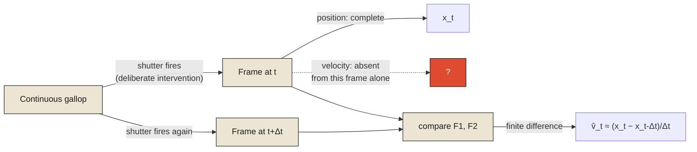

In the 1870s, a genuine, unsettled argument circulated among horsemen and artists alike: when a horse gallops at full speed, is there ever a moment when all four of its hooves leave the ground at once? Painters had depicted galloping horses for centuries with front and back legs stretched outward in an elegant, fully-extended sprawl — an image everyone recognized, and nobody had actually verified, because a galloping horse's legs move far too fast for the human eye to resolve individual positions. The question sat, unresolved, purely because nobody had a way to stop the motion long enough to look.

The photographer Eadweard Muybridge settled it, in 1878, with a setup that was ingenious mostly for how directly it attacked the actual problem: a row of cameras lined up along a track, each one triggered by a tripwire the horse's legs would break as it galloped past. Rather than trying to capture the horse's motion, Muybridge captured a sequence of individual, frozen instants — a rapid series of separate exposures, each one a complete, static description of exactly where every part of the horse's body was at one precise moment, with no motion at all inside any single frame. Laid out side by side, the sequence showed, conclusively, that yes — during part of the gallop, all four hooves do leave the ground simultaneously, though not in the sprawled, legs-outstretched pose centuries of paintings had assumed. The real moment of full suspension happens with the legs gathered close beneath the horse's body, nothing like the popular image at all.

**This is state, captured in its most literal, visible form: a continuous, unbroken process — a horse's gallop — deliberately stopped at one instant and reduced to a complete description of that instant alone.** Muybridge's photographs didn't record the gallop. They recorded a sequence of frozen consequences of the gallop, each one sufficient, entirely on its own, to answer "where was every part of this horse's body at this exact moment" — the same way an odometer's single number is sufficient to answer "how far has this car traveled," without needing the process that produced it.

<Callout type="architectural-tension">
A photograph does not capture motion. It captures the complete absence of motion at one instant, extracted from a process that never actually stopped moving. Every snapshot of state does exactly this, whether it's a photograph, a database read, or a balance sheet — reality kept moving the entire time; the snapshot simply stopped looking at the right instant to describe it as though it hadn't.
</Callout>

## What the individual frame cannot tell you

Here is the part of Muybridge's experiment that matters most for anything built afterward to represent state: any single frame from his sequence, examined completely on its own, tells you nothing whatsoever about whether the horse is accelerating, decelerating, mid-stride, or about to stumble. A frame showing all four hooves gathered beneath the body looks, by itself, almost like a horse standing still with its legs tucked — it is only by comparing that frame to the ones immediately before and after it that the motion, direction, and speed of the gallop become visible at all. This is a genuinely important limitation, not a solvable inconvenience: a single instant of state, no matter how completely it's captured, structurally cannot contain information about a rate of change, because rate of change is, by definition, a comparison between at least two instants, and no single instant is two instants.

This is the reason systems that need to reason about motion, not just position, formalize state using something richer than a single snapshot. A state-space model represents a system not by one static value but by a small set of variables together — for a moving horse, something like position, velocity, and gait phase simultaneously — precisely because position alone, frozen at one instant, throws away exactly the information needed to say anything about where the horse is heading next. Muybridge's individual photographs each capture position with total fidelity and velocity with none at all; a proper state-space representation of the same gallop would carry both, deliberately, as separate variables tracked together, so the frozen instant doesn't lose the one thing a single photograph structurally cannot hold onto.

## Why this has to be a deliberate act, not an accident

It's worth noticing that nothing about Muybridge's setup happened passively. He didn't wait for a convenient moment when the horse happened to be still. He built an apparatus specifically engineered to force a continuous, otherwise unobservable process to yield discrete, examinable instants — tripwires, precisely spaced cameras, a purpose-built mechanism whose entire function was converting motion into snapshots on demand. This is the honest shape of every act of capturing state, in any system: nothing captures a frozen instant by accident. Some mechanism — a camera shutter, a database transaction, a sensor's read cycle — has to deliberately intervene on an ongoing process at a chosen moment and extract a complete description of that moment, at the direct cost of everything about the process that was happening in between one capture and the next.

This connects directly back to a fact this series has already established from a different direction. A snapshot of state is not merely incomplete because it discards motion — it is also, by the argument earlier chapters made about observation and delay, already describing a moment that has passed by the time anyone examines it. Muybridge's photographs were, by the time developed and viewed, images of a horse that had long since finished galloping past that particular stretch of track. State doesn't just freeze time. It freezes a moment that, from the perspective of whoever eventually reads it, already belongs to the past.

## What gets carried forward from a frozen instant

None of this makes snapshots a poor design choice — Muybridge's photographs settled a genuine, centuries-old disagreement precisely because they froze time cleanly enough to be examined at leisure, something no amount of staring at a live, moving horse could ever have allowed. The lesson here isn't that state should be avoided in favor of somehow preserving the continuous process directly — that's rarely possible and, per the previous chapter's ledger, rarely even desirable. The lesson is that a snapshot's value depends entirely on being honest about what it is: one complete, static instant, useful for exactly the questions a single instant can answer, and silent about everything — velocity, trend, cause — that requires comparing instants to each other.

This raises a natural next question, and it's the one the rest of this monograph exists to answer. If a single frozen instant can't, by itself, reconstruct the process that produced it, is there any way to get the process back at all — not by guessing at it from one photograph, but by keeping something more deliberate than a snapshot in the first place? That is the subject of the next chapter, told through a much older and, in its own way, far more complete kind of record than any photograph: the plain, immutable sequence of moves written down after a game of chess.

<Figure n={1} title="What One Frame Holds, and What It Can't" caption="Position survives a single exposure perfectly. Velocity requires at least two — the frame's silence on gait and speed isn't a defect in the camera, it's what 'one instant' means.">

</Figure>

<FormalNote>
A state-space model represents a system not by one scalar but by a vector carrying every variable
needed to reason about what happens next — for the gallop, position, velocity, and gait phase
together. A single frame captures position with total fidelity and the rest with none: formally, a
projection onto one coordinate, discarding the others by construction. Velocity is structurally a
comparison between two instants, which is exactly why no single frame, however sharp, can contain it.
</FormalNote>

## Elsewhere in this series

<Callout type="note">
This chapter's state-space vector is the same object the Kalman filter carries forward in
[Every Observation Is Already History](../../reality/observations/every-observation-is-already-history)
— $\hat{x}_{k\mid k-1}$ there is exactly this $\mathbf{x}_t$, propagated by known physics between
observations. The observation that a snapshot is already describing a passed moment by the time it's
read connects directly to
[Reality Arrives Late](../../reality/time/reality-arrives-late), which establishes that delay as
structural rather than a property specific to photography. The next chapter,
[State Reconstruction from Immutable Logs](./state-reconstruction-from-immutable-logs), asks whether
the discarded process can be recovered a different way — not from one frame, but from a complete log
of transitions.
</Callout>