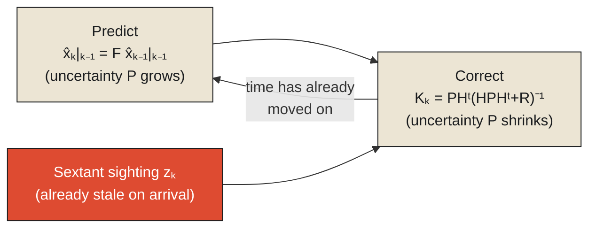

The Apollo spacecraft, on its way to the Moon, had no continuous, real-time way of knowing exactly where it was. Ground-based tracking helped, but it wasn't constant or instantaneous, and the spacecraft's own onboard guidance needed a way to maintain a running estimate of its position and velocity between fixes — because waiting passively for the next fix to arrive before making any decision at all was not an option a crewed spacecraft on a translunar trajectory could afford. The solution, adapted for this exact problem by Stanley Schmidt at NASA's Ames Research Center from a method the mathematician and electrical engineer Rudolf Kálmán had published in 1960, was a technique now known as the Kalman filter — and it is built, from the ground up, around the exact fact this chapter is about: **every observation, by the time it arrives, is already describing a moment that has passed.**

The filter works in a continuous two-step cycle. First, predict: using the spacecraft's known physics — its last known velocity, the pull of gravity, any thrust applied — project forward to estimate where it should be right now, this instant, even with no new information at all. Second, correct: when an actual observation arrives — for the Apollo missions, this often meant an astronaut manually sighting a specific star through a sextant built into the spacecraft, measuring its angle against the visible edge of the Earth or Moon — use that observation to nudge the predicted estimate closer to what the real world appears to say. Then, immediately, predict again from this corrected position, because time has kept moving during the correction itself, and the newly corrected estimate is already, by the time it's computed, describing a moment slightly behind the present.

<Callout type="architectural-tension">
A Kalman filter never treats an observation as the current truth. It treats an observation as a correction to a prediction — evidence about a moment that has already passed, used to adjust a running estimate of a present the filter can never directly touch, only continuously re-predict toward.
</Callout>

## The loop that never actually closes

It's worth naming the shape of this cycle plainly and early, because the entire filter is nothing more than this loop, repeated without end: predict, correct, predict, correct, forever, for as long as the spacecraft is in flight. There is no step in this cycle where the filter ever catches up to the present and simply rests there, holding a value it can trust as final. The moment a correction is applied, using a sextant sighting that was already slightly stale by the time the astronaut finished the reading and the computer finished the calculation, the spacecraft has already moved further along its trajectory than the newly corrected estimate accounts for — so the very next step has to be another prediction, filling the gap between "the last moment we had real evidence about" and "right now," using nothing but physics and an educated guess. The loop doesn't fail to close because of some flaw in Kálmán's or Schmidt's engineering. It doesn't close because closing it would require an observation that arrives with zero delay, describing the exact present instant — precisely the thing an earlier chapter in this series already established cannot exist for any signal traveling through any physical medium, sextant sightings very much included.

This is worth connecting explicitly to the uncertainty running quietly through this whole monograph. Before a correction arrives, the filter's estimate of the spacecraft's position carries real, quantified uncertainty — a spread of plausible positions the spacecraft could actually be in, wider the longer it's been since the last good observation. A sextant sighting doesn't hand the filter a single perfect number. It narrows that spread — collapses part of the space of plausible positions down toward a tighter range, the same underlying act the Ellis Island doctor performed on a person's possible conditions, and Snow performed on cholera's possible causes, now happening continuously, moment by moment, in a spacecraft's guidance computer instead of a border-crossing line or a hand-drawn map. Then, as soon as the correction is made, time passes again, the spread widens again, and the next sighting is needed to narrow it back down. Uncertainty never goes to zero. It only gets pushed back down, repeatedly, by observations that are themselves always describing a moment slightly behind the one the filter actually needs.

## When the clean version stops working

The Kalman filter, in its original form, depends on some convenient mathematical assumptions — that the system's behavior is reasonably linear, and that its uncertainty is well described by a simple, symmetric bell-curve distribution. Many real systems don't cooperate with either assumption: a robot navigating a cluttered, unpredictable room, or a financial model tracking a market prone to sudden discontinuous jumps, can have genuinely lopsided, multi-peaked uncertainty that no single bell curve can honestly capture — several distinct, separately plausible explanations for where the system actually is, rather than one estimate with a margin of error around it.

For these harder cases, a different technique, the particle filter, takes a more brute-force approach: instead of tracking one estimate and a tidy mathematical description of its uncertainty, it tracks a large population of individual guesses — "particles" — each representing one possible state the system could be in, scattered across the space of possibilities. As real observations arrive, particles that turn out to be consistent with the new evidence are kept and multiplied; particles that turn out to be inconsistent are discarded. Over many rounds of this process, the surviving population of particles converges toward the states that are actually plausible, even when that plausible region is oddly shaped, split into separate clusters, or otherwise resistant to the clean, single-curve treatment a Kalman filter assumes. The underlying problem the particle filter is solving is identical to the one Apollo's guidance computer faced: every observation is already history, uncertainty grows in the gaps between observations, and something has to be done to keep a running, corrected estimate of a present that can never be directly touched — the particle filter is simply the version built for situations too messy for the clean, elegant version to handle honestly.

## What this means beyond spacecraft

The reason this matters well beyond orbital mechanics is that the exact same two-step structure — predict from what you last knew, correct when new evidence arrives, immediately predict again because time didn't wait for you — describes every system that has to act continuously while only receiving information intermittently, which is to say, in practice, nearly every system that matters. A hospital's understanding of a patient between rounds of vital-sign checks. A company's understanding of its own cash position between the moments its accounting systems reconcile. A self-driving car's understanding of nearby vehicles between radar sweeps. None of these systems get to wait for a perfectly current observation before acting, because reality does not pause on their behalf while they wait — the lesson the very first chapter of this series established with starlight, now showing up again as the literal engineering discipline built to survive it.

This leaves one question this chapter has deliberately left open: how much of this predicting and correcting a system can actually afford to do depends entirely on how much observation it can afford in the first place — how many sextant sightings, how many sensor readings, how much telemetry a system can actually collect, store, and act on before the cost of watching becomes its own problem. That cost, and the deliberate choices organizations make about how to spend it, is the subject of this monograph's final chapter.

<Figure n={1} title="The Loop That Never Closes" caption="Predict projects the estimate forward through time it doesn't yet have evidence for. Correct nudges it toward an observation that, by the time it arrives, describes a moment already behind the newly corrected estimate.">

</Figure>

<FormalNote>
The Kalman filter's two named steps, for a state estimate $\hat{x}$ and its error covariance $P$:
predict projects both forward using known physics, $\hat{x}_{k\mid k-1} = F\hat{x}_{k-1\mid k-1}$;
correct folds in a new observation $z_k$ through the Kalman gain $K_k$,
$\hat{x}_{k\mid k} = \hat{x}_{k\mid k-1} + K_k(z_k - H\hat{x}_{k\mid k-1})$. The term
$z_k - H\hat{x}_{k\mid k-1}$ is the *innovation* — the gap between what the sighting showed and what
the prediction expected — and $K_k$ decides how much of that gap to trust. $P$ never reaches zero: it
shrinks at each correction and grows again during every predict step.
</FormalNote>

## Elsewhere in this series

<Callout type="note">
This chapter is the operational proof of [Reality Arrives Late](../time/reality-arrives-late) — a
system built explicitly around the fact that no observation can describe the present, only correct a
prediction about it. It generalizes the case-by-case Bayesian update in
[Observability vs. Analytics](./observability-vs-analytics) into a continuous loop, and the "how many
sextant sightings can we afford" question it closes on is answered directly in the next chapter,
[Observability Is a Budget](./observability-is-a-budget).
</Callout>