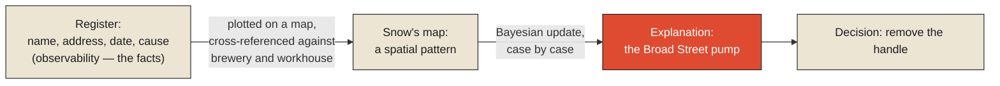

In late August 1854, a severe cholera outbreak struck the Soho district of London, killing more than 500 people within roughly two weeks. The city's General Register Office was, by that point, already collecting exactly the kind of record this series' previous chapter described: a name, an address, a date of death, a recorded cause. Hundreds of these records existed for this outbreak alone — real, individually accurate, dutifully filed. And by themselves, they explained almost nothing. A pile of addresses and dates is telemetry in its purest form: visibility into the fact that people were dying, with no account whatsoever of why, or what connected one death to the next.

The physician John Snow took those same individual records — the ones already sitting in the registers, nothing new collected — and did something nobody had yet done with them: he plotted each death by location on a street map of the neighborhood. What emerged, once the addresses stopped being rows in a ledger and became points on a map, was a dense, unmistakable cluster centered on a single water pump on Broad Street. Snow didn't need new data to make this discovery. He needed a different relationship to the same data — a way of asking the records a question no single record could answer on its own: not "did this person die," which any one entry already told him, but "is there a pattern connecting all of them together." He convinced local officials to remove the pump's handle. New cases in the immediate area declined sharply afterward, and Snow's map is now credited as one of the founding moments of modern epidemiology.

**This is the exact shape of the distinction between observability and analytics: observability is having the individual records — the telemetry, the raw visibility that something happened. Analytics is the additional act of relating those records to each other in a way that produces an explanation for why they happened, and what to do about it.** The register already had observability. London had been recording cholera deaths for years. It took Snow's map to convert that visibility into actual understanding.

## Reasoning with uncertainty, one case at a time

Snow's map is also, without ever using the language, an early and vivid demonstration of a formal reasoning process now known as Bayesian inference: the practice of holding a belief about the world as a probability, and deliberately updating that belief as each new piece of evidence arrives, rather than waiting for total certainty before acting. Before Snow started plotting, several competing theories about cholera's cause circulated, the dominant one being "miasma" — the idea that foul air itself carried the disease. Each new death Snow plotted was, in effect, a fresh piece of evidence bearing on which theory was more plausible. A death near the pump made the water-source theory slightly more probable and the airborne theory slightly less. A death far from the pump, in a location that didn't fit the pattern, would have pulled probability the other way. By the time enough cases were plotted, the water-pump explanation had become, in the language this framework makes precise, overwhelmingly more probable than its rivals — not proven with the certainty of a laboratory experiment, but confident enough, updated case by case, to justify removing a pump handle immediately rather than waiting for further confirmation.

This same act — combining several individually incomplete signals into one coherent picture that none of them could produce alone — has a name in its own right: sensor fusion. Snow wasn't working from the pump alone. He cross-referenced deaths against a nearby brewery whose workers, who drank beer rather than water and were largely spared, and against a workhouse with its own private well, whose residents were also largely spared. Each of these was a separate, individually weak signal — a workforce's unusual survival rate, a cluster of deaths, a well's proximity — and none of them alone would have been decisive. Fused together, cross-checked against each other, they made a case strong enough to act on.

<Callout type="architectural-tension">
Telemetry answers "what happened, where, and to whom." Analytics answers "why does this keep happening, and what do we do about it." The second is never a faster or more detailed version of the first. It requires relating separate observations to each other in a way no single observation, however precise, can supply by itself.
</Callout>

## A second answer to a related question

It's worth noting, briefly, that Snow's map was not the only major public-health breakthrough of that decade built on exactly this same move. A few years later, working on an entirely different crisis, Florence Nightingale applied the same underlying logic to mortality data from British military hospitals during the Crimean War. Where Snow's question had been essentially spatial — *where* is this pattern concentrated — Nightingale's question was structural and recurring: *why does this keep happening*, across time, across hospitals, regardless of location. Her famous polar area diagrams, still referenced today as an early landmark in data visualization, made visible something the raw hospital mortality records alone never revealed on their own: that far more soldiers were dying of preventable disease from poor sanitation than of wounds sustained in combat. Different question, different visual form, same underlying act — raw records, already sitting in a ledger somewhere, turned into an explanation only once someone related them to each other in the right way.

## Why organizations keep confusing the two

Given how clean this distinction is in principle, it's worth asking why it gets muddled constantly in practice — dashboards labeled "insights" that are really just lists of individually accurate records, with no relationship drawn between them at all. Part of the answer is that observability is genuinely the easier achievement. Logging that an event happened — a death, a server error, a failed transaction — is a well-understood, mechanical task: capture it, timestamp it, store it. Explaining *why* a pattern of such events is occurring requires a model, a hypothesis, a willingness to relate scattered records to each other and risk being wrong about the relationship, the way Snow risked being wrong about the pump before the data was in. Building the second capability is harder than building the first, and it's tempting, having built the first, to present it with enough polish that it starts to feel like the second.

The honest test, borrowed directly from the shape of Snow's own achievement, is to ask of any dashboard or reporting system: does this tell me *that* something happened, or does it tell me *why it keeps happening and what to do differently*? A system can answer the first question extremely well and the second question not at all, and mistaking one for the other is exactly the confusion this chapter exists to name — the same confusion, in a different guise, as mistaking a historical autopsy for a live vital-signs monitor.

## What neither Snow nor the register could avoid

There is one thing worth being honest about before moving on, because it sets up the next chapter directly. Even Snow's map, brilliant as it was, was built from records of people who had already died by the time their address was logged. However fast the analysis, however sharp the insight it produced, it was still, structurally, working with observations of a reality that had already moved forward past the moment those observations described. This isn't a flaw specific to 1854 London — it is a property of observation itself, one that no amount of analytical skill, however good the model, can engineer around. That is the subject the next chapter takes up directly, through a spacecraft, a sextant, and a filter that had to be invented because there was no other way to navigate somewhere no signal could reach in real time.

<Figure n={1} title="Telemetry vs. Analytics, on the Same Register" caption="The register already had every fact analytics needed. What analytics added was a relation between the facts — the register never claimed to supply one.">

</Figure>

<FormalNote>
Bayes's theorem, for a hypothesis $H$ (the water-pump theory) updated against evidence $E$ (a newly
plotted death):

$$P(H \mid E) = \frac{P(E \mid H)\, P(H)}{P(E)}$$

Each new plotted case is one application of this update, turning a prior belief into a posterior in
light of the evidence. Run case by case, the posterior from one update becomes the prior for the
next — which is why Snow didn't need to wait for a controlled experiment; each death was already
evidence.
</FormalNote>

## Elsewhere in this series

<Callout type="note">
This chapter's sensor fusion — cross-referencing the pump, the brewery, and the workhouse — is the
same combining of independently weak signals that reappears formally as the Kalman filter's
correction step in [Every Observation Is Already History](./every-observation-is-already-history),
where the update happens continuously instead of case by case. The telemetry/analytics line drawn
here is the same line [Operational Intelligence vs. Business Intelligence](../time/operational-intelligence-vs-business-intelligence)
draws for decisions instead of records — both distinguish "having the data" from "the data still
being able to change what happens next."
</Callout>