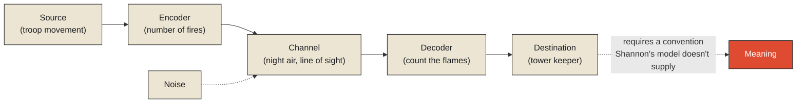

A newborn cries, and two exhausted parents, standing in the same room, hearing the exact same sound, arrive at two different conclusions. One reaches for a bottle. The other checks a diaper. A grandmother in the doorway suggests the baby simply wants to be held. All three are responding to the identical physical event — vibrating vocal cords, air forced through a narrow passage, a pressure wave spreading through the room at the speed of sound — and all three are disagreeing, sometimes sharply, about what it means. None of them are disagreeing about what happened acoustically. The cry itself is not in dispute. What's in dispute is entirely downstream of it.

This is worth taking seriously as a structural fact rather than a cute observation about parenting, because it's the cleanest possible illustration of where every information system — technical, biological, civilizational — actually begins. **A signal is a physical event: a pressure wave, a beam of light, a chemical trace, a voltage change. It exists, completely, before anyone or anything assigns it meaning.** Meaning is not a property the signal carries inside itself, waiting to be unpacked correctly or incorrectly. It's a layer built afterward, by whoever or whatever receives the signal, using a framework — instinct, convention, training, agreement — that the signal itself contains no trace of.

## The fire that means nothing until someone decides it does

Long before telegraphs, long before radio, the builders of the Great Wall of China had already solved a version of the problem every modern communication system still has to solve: how do you send meaning across a distance, using only a physical signal that, by itself, carries none? Their solution was a chain of beacon towers stretching for thousands of miles, each one visible to its neighbors, each one capable of producing exactly two kinds of signal — smoke during the day, fire at night. On its own, smoke is nothing but combustion byproduct: carbon particles and water vapor rising because hot air is less dense than cold air. It is indifferent to human affairs in every respect. It doesn't know about troop movements, doesn't care about invasions, and would rise from a cooking fire in precisely the same physical manner as it would rise from a deliberate warning.

What turned smoke into a message was a convention, built by people, sitting entirely outside the physics of combustion: a specific number of fires, lit in a specific sequence, at specific towers, meant a specific number of approaching soldiers. Historical accounts describe systems where the count of fires lit corresponded directly to troop strength — a code, agreed in advance, that had to be learned and remembered by every tower keeper along the wall, because nothing about the smoke or flame itself would ever reveal what it stood for to someone who hadn't been told. Remove the convention, and you are left with exactly what the newborn's cry is without the assumption of hunger or pain: a raw physical event, entirely real, and entirely mute.

<Callout type="architectural-tension">
A signal is real independent of interpretation. Meaning is never independent of interpretation. Confusing the two — treating a signal as though it already contained its own meaning — is one of the oldest mistakes an information system can make, and one of the easiest to make without noticing.
</Callout>

## Meaning is a convention, and conventions can disagree

Once meaning is understood as something assigned rather than something inherent, an uncomfortable but useful consequence follows immediately: two equally competent observers, looking at the identical signal, can assign it different meanings without either one being objectively wrong about the signal itself. The three adults responding to the crying newborn aren't making an error of perception — none of them mishear the cry. They're applying different interpretive frameworks — different accumulated experience about what crying usually indicates at this time of day, at this age, after this particular feeding schedule — to a signal that, by itself, underdetermines the answer. The disagreement isn't a bug in anyone's hearing. It's an accurate reflection of the fact that the signal alone was never going to be enough to settle the question.

This has a sharp implication for anything built to interpret signals systematically, whether it's a beacon tower keeper trained to count flames or a sensor network built to detect an anomaly: the interpretive layer — the convention, the model, the trained assumption about what a given pattern usually means — has to be built, agreed upon, and maintained separately from the business of simply detecting that a signal occurred at all. Detecting that smoke is rising is comparatively easy; deciding what that smoke *means*, in this specific context, is a separate achievement entirely, resting on a convention that has to be established in advance and can, in principle, be wrong, contested, or simply different from one observer to the next.

## Why this has to be the monograph's starting point

It might seem almost too obvious to warrant its own chapter — of course a cry means nothing on its own; of course smoke needs a code to become a message. But this is precisely the fact that gets forgotten most easily once systems get sophisticated enough to feel authoritative. A sensor reading, a log line, a spike on a graph — these have a way of arriving dressed in the appearance of meaning, as though the number itself were announcing what it signifies, when in fact every one of them is doing exactly what the newborn's cry does: emitting a raw physical event and leaving the harder, separate work of interpretation to whatever receives it.

This is the ground the rest of this monograph is built on. If a signal exists before and independent of meaning, then a genuinely important question opens up immediately: how, exactly, does anything go about *capturing* that signal in the first place — and what happens to the parts of it that don't get captured, simply because nobody, or nothing, was watching closely enough, or often enough, at the moment it occurred? That is a question about sampling, and it is where the next chapter begins.

<Figure n={1} title="Shannon's Channel, and the Meaning It Doesn't Carry" caption="The engineering problem — did the signal arrive intact — and the interpretive problem — what does the arrived signal mean — are solved by different layers, and only one of them is a wiring diagram.">

</Figure>

<FormalNote>
Claude Shannon's 1948 model of communication names the diagram above: a *source* produces a message,
an *encoder* turns it into a signal, a *channel* carries it while *noise* is added, a *decoder*
recovers a message, and a *destination* receives it. The model covers getting a signal from one place
to another intact — and says nothing about whether the destination assigns the same meaning the
source intended. That silence isn't an omission; meaning was never this model's question to answer.
</FormalNote>

## Elsewhere in this series

<Callout type="note">
The signal/meaning split this chapter opens with is the same categorical gap
[Reality Exists Before Information](../reality/reality-exists-before-information) names for signs in
general — a signal is simply what a sign is made of before a convention has been agreed on top of it.
The next chapter, [Sampling Reality](./sampling-reality), picks up the encoder's other job: not just
carrying a signal, but catching enough of it, often enough, to have anything to encode at all.
</Callout>