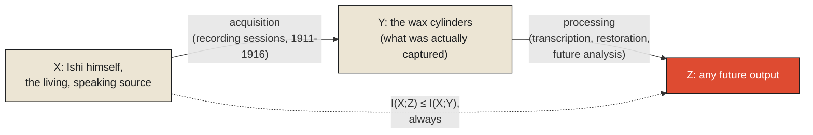

In August 1911, a man walked out of the foothills near Oroville, California, starving, alone, and utterly without a community. He had spent roughly three years in hiding after the rest of his people, the Yahi — reduced over decades by settler violence and disease to a handful of survivors, then fewer, then none but him — had died. He was the last speaker of his language. Anthropologists at the University of California, unsure at first what they had found, gave him a name to use publicly, Ishi — a word in his own language that simply means "man" — because the Yahi custom of never speaking one's own name aloud to strangers meant he never gave them his.

Alfred Kroeber and the linguist Edward Sapir understood immediately what was at stake, and they moved as quickly as they reasonably could. Over the roughly five years Ishi lived afterward, largely at the University's museum in San Francisco, they recorded him extensively — wax cylinder recordings of his speech, word lists, grammatical notes, stories he was willing to tell. This was not negligence. It was, by the standards of the time and the resources available, a genuinely serious, well-intentioned effort to preserve as much of a disappearing language as humanly possible, undertaken by people who understood exactly how much was at risk. Ishi died of tuberculosis in 1916.

What makes this the hardest example in this monograph, and the right one to close it with, is precisely that nobody involved was careless. Kroeber and Sapir were racing an unambiguous, known deadline, doing meaningful, careful work the entire time. And it was still not enough to capture everything. Whatever Ishi might have said in a different conversation, on a day nobody thought to bring the recording equipment, in a context that never happened to arise before he became too weak to speak at length — none of that is sitting, unheard, in some archive waiting for a better technique to recover it. It was never a signal that existed anywhere for anyone to capture. It is not merely lost. It never became information in the first place, and there is no processing method, however advanced, that can produce information about an acquisition that never occurred.

<Callout type="unresolved">
This is not a story about carelessness. Careful, well-resourced, urgent effort still could not capture everything. That is the point. The limit here was never a matter of trying harder. It was a matter of what a finite acquisition process can capture from an unrepeatable source, in the time that source has left.
</Callout>

## The choice that has to be made at the moment of capture, not after

Every act of recording — a wax cylinder, a written word list, a modern audio file — has to make decisions, at the moment of capture, about what level of detail to preserve. Kroeber and Sapir, working with the recording technology of 1911 and a limited number of hours they could reasonably ask a dying man to spend in a recording session, had to decide, again and again, where to spend their effort: broad vocabulary coverage, or fine grammatical detail; formal narrative, or the informal speech patterns that only emerge in unstructured conversation; the sounds that Yahi shared with related languages, or the sounds that were distinctively, irretrievably its own.

This is precisely the kind of decision a mathematical tool called wavelet analysis is built to formalize, though the tool itself came decades later. Unlike a Fourier transform, which decomposes a signal into frequencies present across its *entire* duration, a wavelet transform can examine a signal at multiple resolutions simultaneously and *localized in time* — capturing fine detail in the specific moments where it matters, while representing longer, slower-changing stretches more coarsely, deliberately spending the limited "budget" of detail wherever it will do the most good rather than spreading it evenly and thinly across everything. This is, in formal terms, exactly the kind of choice every act of documentation makes intuitively and under pressure: not "record everything at maximum resolution," which is rarely possible and never free, but "decide, deliberately, what deserves fine resolution and what can survive at a coarser one" — knowing, the whole time, that whatever gets assigned a coarser resolution, or no resolution at all, is a choice that cannot be revisited once the source is gone.

<Callout type="architectural-tension">
A finite recording effort against a finite, unrepeatable source is never a question of whether something will be left out. It is only a question of which resolution decisions get made, deliberately, in advance — and those decisions, once the source is gone, become permanent, whether or not anyone intended them to be.
</Callout>

## Why no later processing can undo it

There is a precise, provable reason no future technique — no clever restoration algorithm, no advanced linguistic reconstruction method, however sophisticated — can recover what was never captured, and it comes from information theory rather than linguistics. It's called the data processing inequality, and it states something that sounds almost too simple to be as consequential as it is: if information passes through a chain of processing steps, the amount of information any later step in that chain can contain about the original source can never *increase*. It can be preserved, if the processing is lossless. It can decrease, if information is discarded along the way. It can never go up. Formally, for a chain where an original source X produces some captured signal Y, which is later processed into some further output Z, the mutual information between Z and X can never exceed the mutual information between Y and X — no processing step downstream of acquisition can manufacture information about the source that the earlier captured signal didn't already contain.

Applied plainly: the wax cylinders that survive from Ishi's recordings are the Y in this chain — the actual signal captured at the time. Any linguistic analysis, any restoration, any future computational technique applied to those cylinders is the processing step producing Z. However good that processing becomes — clearer audio, better transcription, more sophisticated grammatical inference — it is mathematically constrained to reveal, at most, what was already present in the original recordings. It cannot recover the specific turns of phrase Ishi never happened to use in front of a recording horn, the words for concepts nobody thought to ask about, the conversational Yahi that existed only in exchanges nobody was documenting. That information was never Y. It has no path into Z, at any point in the future, by any method.

## What this means for everything that captures signals

This is the sharpest form the question in this monograph's title can take, and it deserves to be treated with more weight than a technical footnote: acquisition is not a stage that can be revisited or compensated for later. Whatever detail a system, a sensor, a recording, or a person fails to capture at the moment reality offers it — through insufficient sampling rate, through a noise source misjudged and filtered away, through simply not being present, not asking, not recording — does not remain available somewhere, waiting for improved processing to retrieve it. It is gone in the same sense the previous chapters' examples were, and Ishi's case makes this the sharpest and most human version of the same law running through the entire monograph: reality emits signals, constantly, and every one of those signals exists for exactly as long as it exists and not one instant longer. What gets captured in that window becomes information, subject to everything the rest of this series will say about representation, models, and decisions. What doesn't get captured in that window was never information at all. It was reality, briefly, and then it wasn't there to be captured anymore.

This closes the Signals monograph on its most serious note, and it is worth stating the throughline plainly. A signal exists before anyone assigns it meaning. That signal must be sampled at a rate fast enough to catch what's actually happening, or it will be measured as something false. What survives sampling still has to be separated from noise — and noise, properly understood, is only ever a provisional label for what nobody yet has a theory to explain. And whatever, at any stage of this process, is never captured at all — through an insufficient sampling rate, a real signal wrongly filtered away, or simply a moment that came and went with nobody listening — does not wait somewhere to be recovered. It is permanently, irreversibly gone, the moment the reality that produced it moves on without being observed. The next monograph in this series picks up exactly where this leaves off: once a signal has, in fact, been captured, what does it take for that signal to cross the boundary into something a system can actually reason about — an observation, properly speaking, rather than a raw and still-mute event?

<Figure n={1} title="The Chain Ishi's Recordings Sit On" caption="Everything downstream of the wax cylinders can only reveal what the cylinders already captured. Y is a hard ceiling on Z — not a floor to be improved past.">

</Figure>

<FormalNote>
The data processing inequality, for a chain $X \to Y \to Z$ — an original source $X$, a captured
signal $Y$, and any later processing $Z$ derived only from $Y$:

$$I(X; Z) \leq I(X; Y), \qquad \text{where } I(X; Y) = H(X) - H(X \mid Y)$$

$I(\cdot\,;\cdot)$ is mutual information, defined in terms of entropy $H$: how much knowing one
variable reduces uncertainty about the other. No restoration algorithm, transcription, or future
model applied to $Y$ alone can increase what a later stage carries about $X$ beyond what $Y$ already
held — the inequality is a ceiling on $Z$, fixed the moment $Y$ was captured.
</FormalNote>

## Elsewhere in this series

<Callout type="note">
The data processing inequality is the formal reason "look for where the complexity went" only ever
applies to what got *relocated* — see
[Complexity Never Disappears](../reality/complexity-never-disappears) — and never to what was never
captured in the first place; there is nowhere for that to be relocated from. It closes the Signals
monograph and hands off directly to
[Signals Become Observations](../observations/signals-become-observations), where the chapter's other
tool, wavelet analysis, reappears formally as the measurement-theory question of what resolution a
captured signal is even recorded at.
</Callout>