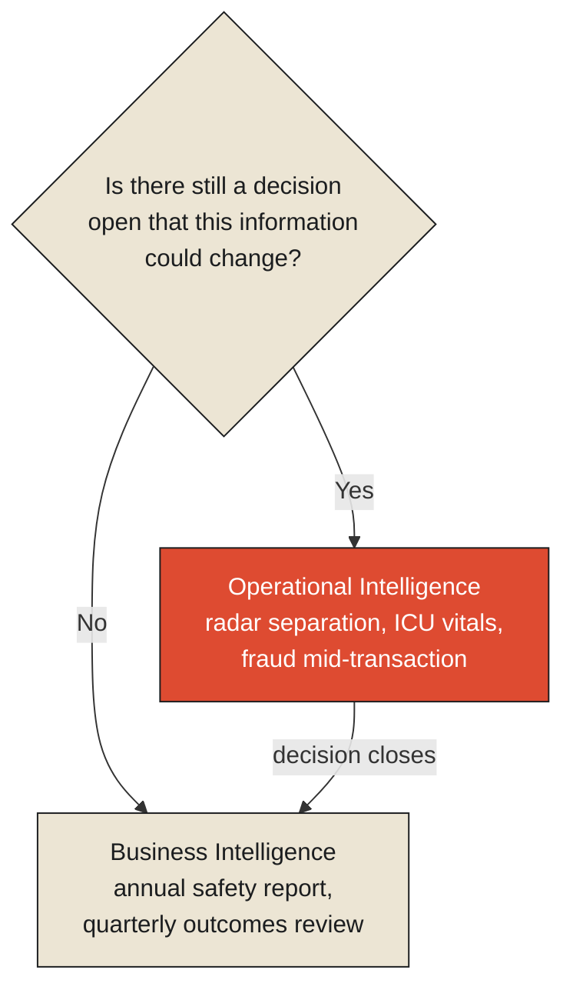

In the control tower at a busy airport, a controller watches a radar display that refreshes every
few seconds, tracking the separation between two aircraft on converging approach paths. If that
separation closes past a threshold, the controller issues an instruction — climb, turn, hold —
within seconds, because the decision only exists for as long as the aircraft haven't already
collided or already safely passed each other. A minute from now, this exact decision will not exist
anymore. It will have resolved itself, one way or the other, with or without the controller's input.

Somewhere else in the same aviation system, a national safety authority publishes an annual report
analyzing several hundred near-miss incidents from the previous twelve months — categorizing causes,
identifying patterns, recommending procedural changes for the year ahead. This report might be
extraordinarily good: rigorous, statistically sound, the product of investigators with far more time
to think than any controller ever gets. And it is, by its very nature, incapable of doing what the
controller did, because the decisions it might have informed — this specific climb, this specific
turn, on this specific afternoon — closed months ago. The report doesn't arrive too slowly for those
decisions. It arrives in an entirely different category of time, addressed to an entirely different
kind of decision: not "what do we do in the next ten seconds," but "what should we build, train, or
require differently before the next similar situation arises."

This is the actual distinction between operational intelligence and business intelligence, and it is
worth being precise about it, because the distinction people usually reach for — "OI is faster, BI
is slower" — is true but not sufficient. Speed is a symptom. The real difference is this:
**operational intelligence exists to inform a decision that is still open. Business intelligence
exists to inform decisions about situations that have already closed.** A report can be made faster
and faster, approaching real time as an asymptote, and it will still be business intelligence if the
decision it addresses isn't waiting for it — and a live feed can be genuinely instantaneous and
still fail to be operationally useful if nobody on the other end has a decision left to make with
it.

## The test that actually separates them

Put a single question to any piece of information reaching a person or a system: *is there still a
decision open that this information could change?* If yes, you are looking at operational
intelligence, however crude the tooling around it. If no — if every choice this information bears on
has already been made, whether well or badly — you are looking at business intelligence, however
sophisticated the tooling around it.

Consider a hospital. A nurse watching a patient's vital signs monitor — heart rate, oxygen
saturation, blood pressure, updating continuously — is consuming operational intelligence in its
purest form. The decision "does this patient need immediate intervention" stays open for as long as
the patient is under observation, and the monitor exists entirely to keep that decision informed
while it's still a decision. Contrast this with the same hospital's annual quality report, comparing
patient outcomes across departments over the past fiscal year to identify where care protocols
should change going forward. Nobody is going to intervene on last year's patients based on this
report. It is not slower vital-signs data. It is a fundamentally different kind of artifact, built
to inform a different, later kind of decision: not "save this patient," but "improve this
department."

<Callout type="architectural-tension">
The line between operational intelligence and business intelligence is not drawn by how current the
data is. It is drawn by whether a decision is still waiting on the other side of it. The same
underlying data can cross that line the moment the decision it once served closes.
</Callout>

## Why organizations blur the two anyway

If the distinction is this clean in principle, it's worth asking why so many organizations build
systems that muddy it constantly — dashboards labeled "live" that are really business intelligence
wearing operational clothing, and genuinely operational needs left to be served, badly, by
end-of-day reports.

Part of the answer is that operational intelligence is expensive and business intelligence is cheap,
in a very specific sense: operational systems have to be *correct while the situation is still
unresolved*, which means tolerating incomplete information, handling contradictions, and updating
conclusions as new signals arrive — a genuinely harder engineering and cognitive problem than
summarizing something that has already finished happening and can be counted with total confidence.
A finished shift, a closed ticket, a completed transaction: these are stable, countable,
unambiguous. An aircraft mid-approach, a patient mid-crisis, a fraud attempt mid-transaction: these
are none of those things, and building a system that stays useful while the situation is still
moving is a categorically harder task than building one that reports on it afterward. Organizations
gravitate toward the cheaper problem and then, often without quite deciding to, start treating its
output as though it answered the harder one.

This is why the test matters as a discipline, not just a definition. Before building or trusting any
information system, the honest question isn't "how fresh is this data?" It's "what decision is this
meant to serve, and is that decision still open by the time the data arrives?" A system can fail
this test while looking extremely fast, and pass it while looking almost embarrassingly slow — a
paper checklist read aloud during a live emergency is operational intelligence; a real-time-looking
dashboard reporting on deals that already closed is business intelligence with better graphics.

## What becomes impossible

This is where the core question of this chapter has its sharpest edge. When information arrives
after the decision it could have informed has already closed, something specific and irreversible
happens: the decision doesn't get made late. It stops being available to be made at all. A
controller who receives separation data one minute after two aircraft have already passed each other
isn't making a delayed version of the same decision — there is no longer any decision there to make,
correctly or otherwise. What remains is a different kind of question entirely: not "what should we
do," but "what happened, and what should we change so that next time, someone still has a decision
left to make when it matters." That second question is a completely legitimate, valuable question.
It is simply not the same question, and mistaking one for a slow version of the other is exactly the
confusion the next chapter takes up directly — because the tools organizations build to answer the
second question have a way of quietly convincing everyone they're still answering the first.

<Figure n={1} title="The Test, Applied" caption="The same underlying data can sit on either side of this line — what moves it is whether a decision is still waiting, not how the data was produced.">

</Figure>

## Elsewhere in this series

<Callout type="note">
The test this chapter proposes — "is a decision still open?" — is the same test
[Observability vs. Analytics](../observations/observability-vs-analytics) applies to records instead
of decisions, distinguishing telemetry from an explanation. The next chapter,
[Most Dashboards Are Historical Autopsies](./most-dashboards-are-historical-autopsies), examines why
so many systems present a closed-decision artifact using the visual grammar of an open one.
</Callout>