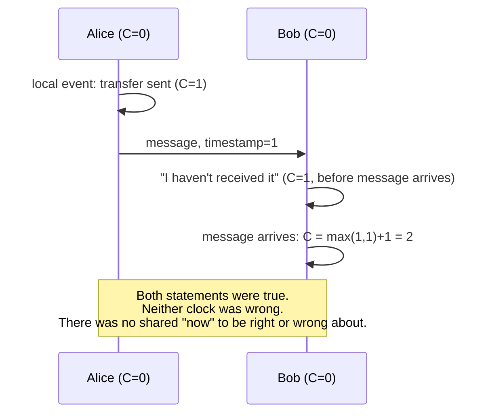

Alice sends Bob a message:

```
"I've transferred the money."
```

Five milliseconds later, before Alice's message has finished traveling, Bob replies:

```
"I haven't received it."
```

Who is correct?

Both of them. Sit with that for a moment, because the discomfort is the whole point. Alice's statement is true — from where she stands, the transfer has genuinely happened, the action is complete, the money has left her account. Bob's statement is also true — from where he stands, nothing has arrived, and as far as his system is concerned, no transfer exists yet. Neither of them is lying. Neither of them is behind on information they should already have. There is simply no single moment, shared between the two of them, at which "the transfer has happened" was universally, unambiguously true for both parties at once. For five milliseconds — and in a poorly designed system, potentially much longer — there exist two separate, entirely correct, mutually contradictory accounts of the present.

Most people's first instinct is to explain this away as a measurement problem: surely there is a real, single, true sequence of events — Alice sent, then some time passed, then Bob received — and the contradiction is only apparent, a side effect of Bob not yet knowing what Alice already knows. Give it a moment longer, though, and a harder version of the question surfaces: is there a fact of the matter about what "at the same moment" even means for two systems that are physically separated? Not "which one of them has better information," but whether a single, shared instant called *now*, spanning both Alice's location and Bob's, is something reality actually provides — or whether it was never really there to be provided in the first place.

## Physics reached this exact wall first

Oddly enough, computer science was not the first discipline to run headfirst into this problem. Physics reached the identical conclusion, by an entirely different road, more than a century earlier — and it turns out to be a genuinely useful place to borrow language from, once the discomfort above has been allowed to fully register rather than explained away too quickly.

In 1905, Albert Einstein described a thought experiment that has since become one of the standard illustrations of special relativity. Picture a long train moving at high speed past a station platform, and imagine two bolts of lightning striking the ends of the train at exactly the moment the train's midpoint passes the midpoint of the platform. A person standing still on the platform, equidistant from both strikes, sees the light from both bolts arrive at the same instant — for that observer, the two strikes were simultaneous. A passenger sitting at the midpoint of the moving train, however, is moving toward the light coming from the front strike and away from the light coming from the rear strike. That passenger sees the front strike's light arrive first. For the passenger, the two events were not simultaneous at all — one genuinely happened before the other.

Here is the part that made this discovery so unsettling to physicists at the time, and worth sitting with now: neither observer is wrong, and neither observer has worse information than the other. Both descriptions are equally correct, in their own reference frame. Simultaneity — the idea that two distant events can be said to happen "at the same time" — is not a fixed, universal fact about reality that observers simply discover with more or less accuracy. It is relative to the observer's own frame of reference, and asking "but which one really happened first, underneath it all?" turns out to be a malformed question, not an unanswered one. There is no view from nowhere available from which to settle it.

<Callout type="unresolved">
Einstein's relativity of simultaneity did not describe a limitation of instruments or measurement. It described the absence of a single, universal "now" as a feature reality actually provides once two observers are separated and in relative motion. This is not a problem to be solved with better clocks. It is a fact about what time is.
</Callout>

## The same wall, built out of network cables instead of trains

Alice and Bob's exchange is the identical structure, translated into a language of servers and network latency instead of trains and lightning. Two computers, physically separated, each recording events according to their own local clock, connected only by messages that take a real, nonzero amount of time to travel between them. There is no shared platform from which both machines' clocks can be checked against a single master reference instantaneously — any attempt to synchronize them has to send a message, and that message itself takes time, and during that time, more events can happen on either side. Wall-clock timestamps, it turns out, are exactly the wrong tool for deciding which of two events on separated machines happened "first," for precisely the reason Einstein's platform observer and train passenger disagreed about the lightning: there is no universal reference frame from which "first" can be judged, only each machine's own local sequence of events, and the delayed, imperfect signals passing between them.

This is not a hypothetical inconvenience. Distributed databases genuinely have to decide, correctly, whether a write on one server happened before or after a write on another, in order to resolve conflicts, maintain consistency, and avoid corrupting data — and for decades, systems that relied on synchronized wall clocks to make that judgment have run into exactly the failure mode Einstein's thought experiment predicts: clocks that drift, network delays that vary unpredictably in each direction, and two servers that each have a perfectly reasonable, locally consistent, mutually contradictory account of which event came first.

## Giving up on "now" and keeping "before"

The breakthrough that let distributed systems actually work, despite this, came from giving up on one goal entirely and replacing it with a more modest, achievable one. Rather than trying to establish a single universal *now* — which the physics above suggests was never available to begin with — engineers focused on a weaker, more useful question: not "did A happen at the same moment as B," but "could A have influenced B?" This is the idea, formalized by the computer scientist Leslie Lamport in a landmark 1978 paper, of a *logical clock*: instead of timestamping events with wall-clock time, each process keeps its own counter, incrementing it with every local event, and attaching its current counter value to every message it sends. When a process receives a message, it updates its own counter to stay ahead of whatever value arrived — guaranteeing that if event A genuinely could have caused event B, A's logical timestamp will always be smaller than B's. Events that never communicated with each other, directly or indirectly, simply have no defined order at all — and, crucially, that lack of order isn't a gap in the system's knowledge. It's an honest admission that no such order exists to know, in the exact same spirit as Einstein's answer to the platform and the train.

Vector clocks extend this same idea further, letting a system distinguish "A definitely happened before B" from "A and B happened independently, with neither able to have influenced the other" — a distinction wall-clock time can never reliably draw, because wall-clock time keeps insisting, falsely, that a single global ordering must exist somewhere, waiting to be measured precisely enough.

## Why the question in the title has a real answer

"Why does now stop existing once systems are separated?" turns out not to be a rhetorical flourish. It has a precise, structural answer, and it is the same answer in both physics and distributed computing: a single, shared *now* was never a property of separated things to begin with. It is an approximation that works well enough when distances and delays are small enough to ignore — which is why ordinary human experience never runs into the problem, and why Alice and Bob's five-millisecond disagreement feels so strange the first time it's actually looked at directly. Once separation and delay become large enough to matter — light-years for stars, milliseconds for servers, it makes no difference to the structure of the problem — the shared *now* quietly stops being available, and the only thing left to build with, honestly, is *before* and *after*, tracked locally, compared through messages that themselves take time, exactly the way logical clocks do it.

This has a direct, practical consequence for anyone building systems that span more than one machine: stop asking what time it is "right now" across the whole system, because that question doesn't have a stable answer to give. Ask instead what could have caused what — a question with a real, buildable answer, and the one every distributed system that actually works correctly has, in one form or another, learned to ask instead.

<Figure n={1} title="Alice, Bob, and a Logical Clock" caption="Wall-clock time can't settle who was 'first.' A logical clock doesn't try to — it only ever certifies what could have influenced what.">



</Figure>

<FormalNote>
A Lamport logical clock names the rule the diagram follows: on receiving a message timestamped $t$,
set $C \leftarrow \max(C, t) + 1$. This guarantees a one-way implication —

$$a \to b \implies C(a) < C(b)$$

— but not its converse: two unrelated events can still land on either side of each other's counters.
Vector clocks close that gap. Each process keeps a full vector $V$, one counter per process, and two
events are provably *concurrent* — genuinely unordered, not merely unmeasured — exactly when neither
vector is componentwise $\leq$ the other:

$$a \parallel b \iff V_a \not\leq V_b \ \wedge\ V_b \not\leq V_a$$
</FormalNote>

## Elsewhere in this series

<Callout type="note">
This chapter is the general case of the two-observer problem
[Every Observation Is Already History](../observations/every-observation-is-already-history) solves
for one spacecraft and one ground station using a Kalman filter's predict-correct loop instead of a
logical clock. It also gives exact mechanism to
[Reality Arrives Late](./reality-arrives-late)'s closing question, and it is the reason the next
chapter, [Every Queue Is a Negotiation with Time](./queue-time-negotiation), treats delay as something
to be deliberately placed rather than a gap to be closed — closing it was never on the table to begin
with.
</Callout>