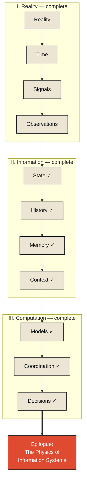

# Series Guide

This publication is organized into three tracks, each made of several monographs, each monograph made
of several chapters, plus a closing epilogue that stands outside all three. The overview page states
the series' central claim in a few paragraphs; this page exists to lay out the full structure
underneath it — what each published monograph actually argues, chapter by chapter.

<Figure n={1} title="Three Tracks, and an Epilogue" caption="All three tracks are complete. The epilogue stands outside the track structure entirely — it isn't another chapter of Decisions, it's the series' own closing synthesis, looking back across all eleven monographs at once.">

</Figure>

---

## Track I — Reality

Reality asks what a system is doing, underneath everything else, when it tries to describe the
world at all: standing in for it with signs, sampling it into signals, forcing those signals into
fixed categories, and receiving all of it late. Four monographs, complete.

### I. Reality

Establishes the ground the rest of the series is built on: a representation is categorically
distinct from what it represents, every representation is a lossy projection of a more complex
territory, and the complexity left out by that projection is redistributed, never eliminated.

- **01. Reality Exists Before Information** — the categorical gap between a sign and its referent.
- **02. The Territory Exists Before the Map** — why representation is always lossy by design.
- **03. Complexity Never Disappears** — the conservation law that closes the monograph.

<Callout type="note">
Start with **[Reality Exists Before Information](./reality/reality/reality-exists-before-information)**.
</Callout>

### II. Time

Takes up the physics underneath everything the other monographs already assume: that information
arrives late, that a shared "now" does not survive separation, and that delay has to be negotiated
with rather than eliminated.

- **01. Operational Intelligence vs. Business Intelligence** — the line is drawn by whether a decision is still open.
- **02. Most Dashboards Are Historical Autopsies** — why a dashboard borrows the visual grammar of a heartbeat monitor.
- **03. Reality Arrives Late** — delay traced to the finite speed of light.
- **04. What Time Means in Distributed Systems** — relativity of simultaneity, Lamport clocks, and the absence of a shared now.
- **05. Every Queue Is a Negotiation with Time** — Little's Law and the deliberate choice of where delay lives.

<Callout type="note">
Start with **[Operational Intelligence vs. Business Intelligence](./reality/time/operational-intelligence-vs-business-intelligence)**.
</Callout>

### III. Signals

Moves one layer down, to the raw physical events every information system starts from before any
of it becomes data.

- **01. Everything Begins as a Signal** — a signal is real before and independent of meaning.
- **02. Sampling Reality** — the Nyquist–Shannon theorem and what a system never sees.
- **03. Noise Is Not Failure** — noise as a provisional label for what nobody yet has a theory to explain.
- **04. Signal Loss Is Permanent** — the data processing inequality: what acquisition misses, no processing recovers.

<Callout type="note">
Start with **[Everything Begins as a Signal](./reality/signals/everything-begins-as-signals)**.
</Callout>

### IV. Observations

Follows a captured signal across the boundary into something a system can reason about: a
structured record, forced into a fixed vocabulary, never neutral, never free, always describing a
moment already past.

- **01. Signals Become Observations** — measurement theory and the six seconds it took to turn a person into a category.
- **02. Observability vs. Analytics** — John Snow's map and the difference between records and understanding.
- **03. Observation Is Never Neutral** — the Hawthorne effect and the cost every act of measurement imposes.
- **04. Every Observation Is Already History** — the Kalman filter's predict-correct loop.
- **05. Observability Is a Budget** — the seven currencies every decision to watch something spends.

<Callout type="note">
Start with **[Signals Become Observations](./reality/observations/signals-become-observations)**.
</Callout>

---

## Track II — Information

Information picks up where Reality leaves off: once a system has observed something, what does it
do with what it observed after the moment of watching has passed? All four monographs — State,
History, Memory, and Context — are complete.

### I. State

A system is the ongoing process that produces change; state is not a smaller copy of that process
but the residue it leaves behind — a compact, current answer to "where do things stand," deliberately
stripped of the process that got there. The monograph traces what that stripping costs and what it
buys, from an odometer to a corporate restatement.

- **01. The Difference Between State and Systems** — an odometer, a Venetian ledger, and what survives once the process stops.
- **02. State Is Frozen Time** — Muybridge's galloping horse and what freezing an instant cannot capture.
- **03. State Reconstruction from Immutable Logs** — chess notation, and how a system reconstructs history from a log of changes alone.
- **04. Event Sourcing vs. Temporal Snapshots** — two complementary strategies for preserving history, not competing ones.
- **05. Why Historical Truth Is Harder Than Current Truth** — bitemporal modeling and the two clocks a correction reveals.

<Callout type="note">
Start with **[The Difference Between State and Systems](./information/state/state-vs-systems)**.
</Callout>

### II. History

Not everything a system has recorded about its own past — specifically the parts of that past worth
preserving on purpose, and what separates a record like that from a database that merely never
deletes old rows.

- **01. History Is Not a Database** — a database answers what's true now; history preserves the causal links connecting today's truth to yesterday's.
- **02. Immutable Histories** — a ship's log's centuries-old rule against erasure, and what a blockchain adds to it.
- **03. The Cost of Remembering Everything** — the Large Hadron Collider's trigger systems and the discipline of deciding, in real time, what's worth keeping.
- **04. History Explains; State Executes** — four professions, the same split: acting on the present versus explaining the past are different jobs, not different speeds of one job.

<Callout type="note">
Start with **[History Is Not a Database](./information/history/history-is-not-database)**.
</Callout>

### III. Memory

The opposite kind of record from History: not built to be trusted and permanent, but small, fast,
and openly allowed to be wrong — a working space that exists to make the next few moments faster,
not to describe the truth.

- **01. Memory Is for Speed, Not Truth** — a kanban bin's small stock of parts, and the space-time tradeoff behind every memory hierarchy.
- **02. Caches Forget on Purpose** — expiration, invalidation, and eviction: a cache stays useful only by forgetting deliberately.
- **03. Working Memory in Information Systems** — Miller's magical number seven, a Bloom filter's one-sided error, and what it takes for several actors to agree on a shared working set.

<Callout type="note">
Start with **[Memory Is for Speed, Not Truth](./information/memory/memory-for-speed-not-truth)**.
</Callout>

### IV. Context

Not how a system remembers or forgets, but how it comes to understand what any of its remembered
facts actually mean — and the argument that closes not just this monograph but the entire
Information track: meaning is never a property of an isolated fact, only of a relationship.

- **01. Facts Require Context** — the Mars Climate Orbiter, lost to two correct numbers that meant different things.
- **02. Metadata Is Operational Context** — a library card catalog doing schema, provenance, ownership, and semantics at once, a century before "metadata" was a word.
- **03. Context Decays** — the Y2K crisis: code that ran perfectly while the reasoning around it quietly disappeared.
- **04. Meaning Is Never Stored Directly** — the Rosetta Stone, mutual information, and why meaning lives only in a relationship, never in either side of it alone.

<Callout type="note">
Start with **[Facts Require Context](./information/context/facts-require-context)**.
</Callout>

---

## Track III — Computation

Computation is the track after Information: once a system holds meaning, what is it allowed to *do*
with it? Models and Coordination are complete. Decisions is planned but not yet written. This track's
formal notes go further than the previous two — the equations are explained in real depth, not just
stated, and each chapter links directly from the point in its own prose where a concept is named to
the exact formal passage that explains it, rather than only gesturing at a named theorem. Not every
chapter needs one: a few rely entirely on a diagram and a cross-reference to a formalism this series
already built elsewhere.

### I. Models

A model is a deliberate compression of reality into a small number of chosen dimensions — never a
neutral simplification, always a designed trade, optimizing for a specific purpose at the cost of
everything outside it. The monograph traces what a model is built to keep, what it costs the people
who use it outside its intended scope, what it's actually for, and why even a well-built one
eventually stops being right.

- **01. Dimensions Are Compression Algorithms for Reality** — the Beaufort scale, regression, and the information criteria that decide when another dimension stops helping.
- **02. The Map Is Not the Territory** — an actuarial life table as a Bayesian network, and the harder, deliberate version of a claim this series already made once.
- **03. Every Abstraction Has a Cost** — tourists riding the Tube between two walkable stations, VC dimension, and the bias-variance tradeoff.
- **04. Models Predict More than They Describe** — a hurricane's forecast cone, optimization theory, and decision theory's bridge from prediction to action.
- **05. Every Model Eventually Becomes Wrong** — Old Faithful, concept drift, and deciding when drift is worth the cost of recalibrating.

<Callout type="note">
Start with **[Dimensions Are Compression Algorithms for Reality](./computation/models/dimensions-are-compression-algorithms-for-reality)**.
</Callout>

### II. Coordination

Not a single model's relationship to a single, changing reality, but what happens when many such
models, many such systems, have to act together — coherently, at a cost that's never zero — without
any one of them having complete visibility into what the others are doing.

- **01. Coordination Is the Real Scalability Problem** — Brooks's Law, why adding people to a late project makes it later, and the quadratic cost of pairwise overhead.
- **02. Consensus Is Expensive** — India's Constituent Assembly, the CAP theorem, Paxos and Raft's quorums, and the FLP impossibility result.
- **03. The Cost of Knowing Why** — the 2003 blackout, and why attribution costs so much more than detection once a dependency chain crosses organizational boundaries.
- **04. The Most Expensive Bug Is the One that Never Crashes** — Knight Capital's $440 million, Byzantine fault tolerance, and why $n \geq 3f+1$.
- **05. Delay Is Contiguous** — the bullwhip effect's exact variance-amplification bound, and why tight coupling can't get responsiveness for free.
- **06. The City Is a Distributed System** — Braess's paradox, Nash equilibrium, mechanism design, and the Price of Anarchy.

<Callout type="note">
Start with **[Coordination Is the Real Scalability Problem](./computation/coordination/coordination-is-the-real-scalability-problem)**.
</Callout>

### III. Decisions

The final monograph of the final track, closing on the series' very first claim: that information
exists to enable action. Every idea this series has built — from a sign's categorical gap from its
referent, through state, history, memory, context, models, and coordination — exists in service of
the single act every chapter here is really about: a decision, made under real uncertainty, that
changes something actually true about the world.

- **01. Information Exists to Enable Decisions** — Eisenhower's D-Day forecast, and why a piece of information that never connects to a decision hasn't yet done its job.
- **02. Designing for Delay Propagation Analysis** — modeling where a disruption is heading, not just where it came from, through a Markov decision process.
- **03. Why Transit Networks Behave Like Graphs, Not Schedules** — frequency versus coverage, and the shortest-path recurrence underneath both.
- **04. The Anatomy of a Missed Connection** — an airline's IROPS cascade, dissected chain by chain, and the multi-armed bandit behind every hold-or-release call.
- **05. Measuring Fragility in Public Infrastructure** — betweenness centrality, and why busy is not the same as critical.

<Callout type="note">
Start with **[Information Exists to Enable Decisions](./computation/decisions/information-exists-to-enable-decisions)**.
</Callout>

---

## Epilogue

**[The Physics of Information Systems](./computation/decisions/the-physics-of-information-systems)**
stands outside all three tracks on purpose. It isn't a sixth chapter of Decisions — it's the series'
own closing synthesis, returning to the first sentence the series ever published ("Say the word
'fire' out loud...") and naming the single gap, examined from a different angle in all eleven
monographs, that the whole publication turns out to have been about the entire time: the gap between
what actually is and whatever stands in for it well enough to be used.

---

*Return to the [Overview](./) for the series' central claim in brief, or begin reading from
**[Reality Exists Before Information](./reality/reality/reality-exists-before-information)**.*
